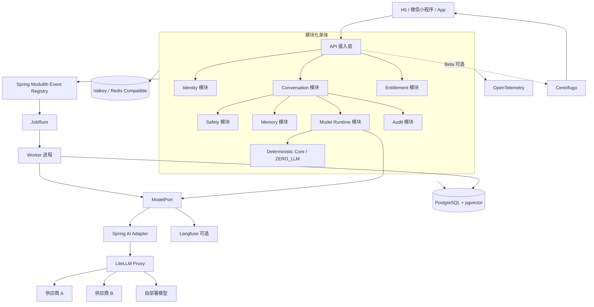
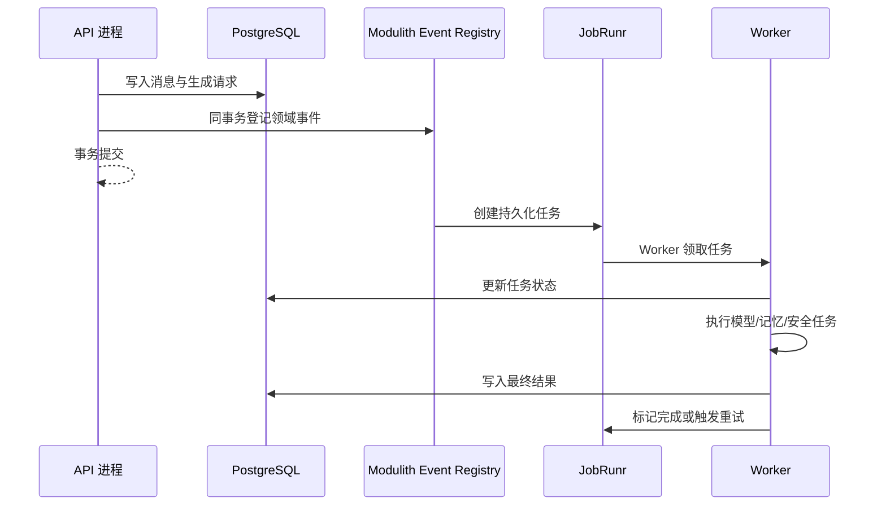
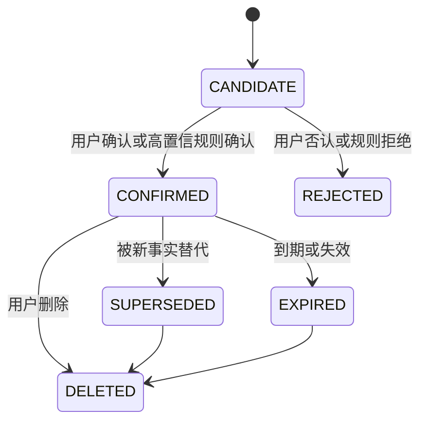
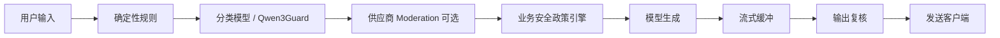
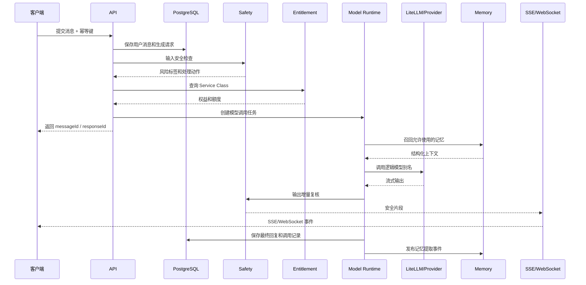

# AI 虚拟陪伴系统技术架构与成熟组件接入方案

> 文档性质：技术架构决策与实施基线  
> 适用项目：AI 虚拟陪伴 / 长期对话 / 个性化记忆系统  
> 基线日期：2026-07-29  
> 目标阶段：产品发现、技术 Alpha、受控 Beta、公开付费版  
> 核心原则：**核心业务语义自研，基础设施机制复用，第三方组件统一置于自有边界之后。**

---

## 1. 文档目的

本项目后续计划以 AI 为主要开发执行者，人负责需求确认、架构决策、边界审批、验收和上线治理。因此，技术架构不仅要满足功能和性能要求，还必须具备以下特征：

1. 技术栈成熟、文档完整、社区活跃，AI 能够稳定检索和生成正确代码。
2. 关键业务边界清晰，避免 AI 在多个框架、供应商和实现方式之间随意切换。
3. 基础能力优先复用成熟开源组件，减少自研调度器、模型网关、实时通信平台、认证中心等高维护成本模块。
4. 用户消息、记忆、安全策略、订阅权益和数据权利等核心语义必须由本项目掌握，不能交给某个模型供应商或第三方记忆框架作为唯一真源。
5. 所有技术决策可通过自动化工具验证，不依赖“开发者记得遵守”或“AI 自述已经完成”。
6. 技术 Alpha、受控 Beta、公开付费版采用不同建设基线，防止在产品价值尚未验证前过度工程化。

本文在原始架构方案基础上，重点回答以下问题：

- 哪些能力应继续自研；
- 哪些能力可以接入成熟开源组件；
- 新项目是否应采用更新版本；
- 组件之间如何划分职责，避免被第三方框架反向绑定；
- AI 全程开发时，仓库和 CI/CD 应增加哪些硬约束；
- 各阶段应接入哪些组件，哪些能力应延后。

---

## 2. 总体判断

原始技术方向总体正确，不需要推翻重做，但需要从“概念方案”进一步收敛为“可执行的技术基线”。

### 2.1 应保留的核心决策

以下决策符合项目特点，应继续保留：

- Java 作为后端主语言；
- Spring Boot 作为主框架；
- 模块化单体作为初期架构形态；
- API 进程与 Worker 进程逻辑分离；
- PostgreSQL 作为业务数据主库；
- PostgreSQL + pgvector 作为初期向量检索方案；
- Canonical Memory 作为结构化记忆真源；
- 模型供应商解耦；
- Entitlement、Service Class、Route Policy、Deployment 分层；
- ZERO_LLM 确定性降级模式；
- 多层内容安全；
- Repository Harness、任务卡、上下文锁和自动门禁；
- 第一阶段仅面向 18 岁以上用户。

### 2.2 应调整的决策

以下部分不建议继续完全自研，应接入成熟组件：

- 模块边界检查：接入 Spring Modulith、ArchUnit；
- 模型供应商统一接入：接入 Spring AI、LiteLLM；
- Outbox、可靠任务和 Worker 调度：接入 Spring Modulith Event Publication Registry、JobRunr；
- LLM 调用追踪和评测：接入 OpenTelemetry、Langfuse；
- WebSocket 集群、断线恢复和消息历史：在 Beta 阶段评估 Centrifugo；
- 身份认证：优先接入 Keycloak 或托管身份服务，不自研认证核心；
- API 类型和客户端：使用 OpenAPI 生成；
- 依赖升级：使用 Renovate、OpenRewrite；
- 静态检查、漏洞扫描和构建证据：使用 Spotless、Checkstyle、SpotBugs、Semgrep、Trivy、SBOM、CI 报告。

### 2.3 必须自研并掌握真源的部分

以下能力没有通用组件能够直接替代，必须由项目定义语义和数据模型：

- Canonical Memory；
- 用户消息和会话真源；
- 记忆确认、纠错、冲突、过期和删除机制；
- Entitlement、Service Class 和 Route Policy；
- ZERO_LLM 的业务行为；
- 情感依赖、排他性表达、情感操纵等安全政策；
- 用户数据导出、删除、撤回和供应商侧清理流程；
- 哪些信息允许发送给哪些模型供应商；
- 18+ 适用范围、年龄识别和未成年人拦截规则；
- Repository Harness 中的项目边界、禁止修改区和审批流程。

---

## 3. 设计原则

### 3.1 核心语义自研，通用机制复用

项目应自研“业务规则”，而不是重复实现“基础设施机制”。

例如：

- 自研“什么时候提取记忆、什么记忆需要用户确认”；
- 不自研“后台任务如何持久化、重试、抢占和恢复”；
- 自研“套餐对应什么服务等级”；
- 不自研“多个模型供应商如何重试、冷却和负载均衡”；
- 自研“ZERO_LLM 状态下允许发送什么内容”；
- 不自研“熔断器、超时器和健康检查器”。

### 3.2 第三方组件必须位于适配器之后

任何第三方组件都不得直接渗透到核心业务模块。

例如：

```text
Conversation / Memory / Safety / Entitlement
                    ↓
              自有领域接口
                    ↓
          基础设施适配器实现
                    ↓
Spring AI / LiteLLM / JobRunr / Langfuse / Centrifugo
```

这样可以保证：

- LiteLLM 可替换；
- 模型供应商可替换；
- pgvector 可替换；
- JobRunr 可替换；
- Langfuse 可关闭；
- Centrifugo 可在兼容性不满足时替换；
- 第三方组件故障不会改变核心业务语义。

### 3.3 数据真源与派生数据分离

必须明确每类数据的权威来源：

| 数据类型 | 真源 | 派生数据 |
|---|---|---|
| 用户原始消息 | PostgreSQL | 搜索索引、摘要、向量 |
| AI 回复 | PostgreSQL | 流式片段缓存、追踪日志 |
| Canonical Memory | PostgreSQL 结构化表 | Embedding、全文索引、图索引 |
| 订阅权益 | PostgreSQL | Redis/Valkey 缓存 |
| 模型调用状态 | PostgreSQL 任务记录 | 监控指标、Langfuse Trace |
| 安全判定 | PostgreSQL 审计记录 | 聚合报表、指标 |
| 用户删除请求 | PostgreSQL 工作流记录 | 各系统清理任务 |

Redis/Valkey、向量索引、Langfuse、模型供应商日志均不得成为唯一数据来源。

### 3.4 先验证产品价值，再扩展基础设施

技术 Alpha 的目标不是构建完整商业平台，而是验证：

- 用户是否认为系统“真正听懂了自己”；
- 用户是否能感受到“被准确记住”；
- 用户是否愿意自然回访；
- 记忆错误、遗忘和边界问题是否可控；
- 模型不可用时是否能安全降级；
- 安全策略是否不会明显破坏正常陪伴体验。

因此，RabbitMQ、Temporal、复杂多区域部署、完整实时通信集群和图数据库均不应成为技术 Alpha 的前置条件。

### 3.5 版本选择以稳定、可维护和可验证为主

AI 全程开发不等于所有组件都使用最新发布版本。应优先选择：

- LTS 版本；
- 正式稳定版本；
- 官方文档完整版本；
- 与主框架兼容性明确的版本；
- 已有稳定生态和测试工具的版本；
- 不使用 Snapshot、Alpha、Beta、Milestone、RC；
- 不使用无法固定的 `latest` 镜像标签。

---

## 4. 推荐总体架构



### 4.1 部署形态

初期建议采用同仓库、同一套业务代码、同一个 Docker 镜像，通过启动配置区分进程职责：

```text
app-api
  - HTTP API
  - SSE / WebSocket 接入
  - 身份认证和权限校验
  - 查询接口
  - 消息提交
  - 任务创建

app-worker
  - 模型调用
  - 记忆提取
  - Embedding 生成
  - 数据清理
  - 导出任务
  - 补偿任务
  - 安全复核
```

不建议在第一阶段拆成多个代码仓库或大量微服务。模块化单体已经可以提供清晰边界，同时显著降低部署、测试、事务和 AI 上下文复杂度。

---

## 5. 推荐技术基线

> 以下版本作为 2026-07-29 的候选锁定基线。正式立项时应再次以官方稳定版兼容矩阵复核，并记录到 `technology-baseline.md`。大版本不得由 AI 自行升级。

| 技术领域 | 推荐基线 | 决策说明 |
|---|---|---|
| 后端语言 | Java 25 LTS | 新项目优先使用最新 LTS；若部署环境只认证 Java 21，可退回 Java 21 |
| 后端框架 | Spring Boot 4.1.x 稳定补丁版 | 使用正式稳定版，不使用快照和预览版 |
| AI 接入 | Spring AI 2.0.x | Java 侧统一 Chat、Streaming、Embedding、Tool、Moderation 等能力 |
| 模块化 | Spring Modulith 2.1.x | 模块验证、模块测试、事件发布和文档生成 |
| 数据库 | PostgreSQL 18.x 最新稳定补丁 | 事务、JSON、全文、RLS、扩展生态适合本项目 |
| 向量扩展 | pgvector 0.8.x 最新稳定补丁 | 与关系数据同库，降低初期权限和运维复杂度 |
| 缓存 | Valkey 8.1.x 稳定分支或兼容托管 Redis | 文档层面定义为“Redis 兼容缓存” |
| 后台任务 | JobRunr 8.x 稳定版 | 持久化任务、重试、集群执行和 Dashboard |
| 模型代理 | LiteLLM 稳定版，固定镜像与 Digest | 供应商协议、重试、冷却、路由、额度和成本 |
| 前端 | uni-app + Vue 3 + TypeScript + Pinia | 先 H5，后续扩展小程序和 App |
| Node.js | 与 uni-app 官方编译链兼容的 LTS | 优先稳定兼容，不单独追求最新主版本 |
| 实时传输 | Alpha 使用 SSE；Beta 评估 Centrifugo | 避免第一阶段手搓完整 WebSocket 平台 |
| 数据迁移 | Flyway | 数据库结构唯一真源 |
| 可观测性 | Micrometer + OpenTelemetry | 服务调用、指标、日志和 Trace 统一 |
| LLM 追踪 | Langfuse，可配置关闭 | 记录模型调用指标，默认不记录敏感原文 |
| 身份认证 | Keycloak 或托管 IdP | 不自研密码、Token、MFA 和会话撤销核心 |
| 集成测试 | Testcontainers | 使用真实 PostgreSQL、Valkey 等依赖进行测试 |
| 模块约束 | Spring Modulith Verify + ArchUnit | 自动阻止越层依赖和循环依赖 |
| 代码质量 | Spotless、Checkstyle、SpotBugs、Semgrep | 由 CI 自动产生检查结果 |
| 依赖升级 | Renovate + OpenRewrite | 自动提升级 PR，不允许 AI 私自改大版本 |
| 安全扫描 | Trivy + SBOM | 镜像和依赖漏洞检查 |

---

## 6. 各决策项详细说明

## 6.1 后端语言：Java 25 LTS

### 决策

新项目默认采用 Java 25 LTS。若生产操作系统、云平台、数据库驱动、APM 或其他基础设施尚未认证 Java 25，则可以使用 Java 21 LTS，但必须记录降级原因和后续升级计划。

### 选择原因

- 用户和现有团队已有 Java、Spring Boot 经验；
- 系统主要负载为数据库访问、模型 API 调用、流式传输和异步任务，Java 性能充足；
- Java 的类型系统、构建工具、测试生态、代码扫描和架构约束能力适合 AI 主导开发；
- LTS 版本生命周期长，适合作为长期产品基线；
- 虚拟线程可以降低大量 I/O 场景下的线程管理复杂度。

### 实施约束

- Maven Toolchains 或 CI 镜像中固定 JDK 版本；
- Maven Enforcer 校验 Java 版本；
- 禁止使用预览特性；
- 禁止业务模块依赖 JDK 内部 API；
- 升级大版本必须单独建立 ADR 和完整回归任务。

---

## 6.2 后端框架：Spring Boot + Spring AI

### 决策

采用 Spring Boot 4.1.x 稳定补丁版，并引入 Spring AI 2.0.x 作为 Java 侧模型能力抽象。

### Spring Boot 负责

- Web、验证、事务、安全、配置、监控；
- 数据库、缓存和可观测性集成；
- 统一异常处理；
- 生命周期管理；
- 测试和构建生态。

### Spring AI 负责

- Chat Model 统一调用；
- 流式返回；
- Embedding；
- 结构化输出；
- Tool Calling；
- Moderation 适配；
- 向量存储集成；
- 模型调用观测接口。

### Spring AI 不负责

- 订阅权益；
- 套餐路由；
- Canonical Memory 真源；
- 最终内容安全政策；
- 用户数据授权范围；
- ZERO_LLM；
- 情感操纵防护；
- 供应商级负载均衡和成本控制。

### 实施约束

业务模块不得直接注入具体供应商 SDK 或供应商专属 ChatModel。必须通过项目自有 `ModelPort` 或 `ModelRuntimeService` 访问模型能力。

---

## 6.3 架构形态：模块化单体 + 独立 Worker

### 决策

采用模块化单体，不在技术 Alpha 阶段拆分微服务。API 和 Worker 使用同一代码库、同一领域模型和同一构建产物，通过运行配置区分职责。

### 推荐模块

```text
identity
companion
conversation
memory
safety
entitlement
modelruntime
realtime
audit
notification
userdata
```

### 模块职责示例

| 模块 | 主要职责 | 禁止承担 |
|---|---|---|
| identity | 用户身份、会话主体、账号状态 | 模型路由、陪伴内容 |
| companion | 虚拟对象配置、角色设定、关系状态 | 供应商 SDK 调用 |
| conversation | 会话、消息、生成请求、回复状态 | 记忆表直接写入、套餐计算 |
| memory | Canonical Memory、记忆冲突、确认、召回 | 订阅扣费 |
| safety | 输入输出安全、危机响应、政策版本 | 业务套餐判断 |
| entitlement | 订阅权益、Service Class、额度 | 直接选择供应商 SDK |
| modelruntime | Route Policy、ModelPort、调用记录 | 用户关系语义 |
| realtime | SSE/WebSocket 事件投递 | 消息真源 |
| audit | 关键操作、策略和数据权利审计 | 修改业务状态 |
| userdata | 导出、删除、撤回授权、清理编排 | 直接删除未审批数据 |

### Spring Modulith 的作用

- 识别业务模块；
- 检查模块依赖；
- 阻止循环依赖；
- 生成模块文档；
- 支持模块级集成测试；
- 提供可靠的事务事件发布机制。

### AI 开发约束

- AI 不得随意创建 `common`、`utils`、`shared` 大杂烩模块；
- 公共模块只能存放真正稳定、无业务语义的基础类型；
- 模块之间优先通过公开 API 或领域事件协作；
- 禁止跨模块直接访问对方 Repository 或内部 Entity；
- 每个模块必须声明允许依赖的上游模块；
- ArchUnit 和 Spring Modulith Verify 必须进入 CI 门禁。

---

## 6.4 API 处理：Spring MVC + 虚拟线程，流式局部使用 WebClient

### 决策

全项目采用 Spring MVC，启用虚拟线程处理普通 I/O 请求。模型流式适配层可以局部使用 WebClient，不把整个项目改造成响应式架构。

### 原因

- 团队和 AI 对 Spring MVC 的理解和样例更成熟；
- 事务、权限、异常、校验和调试更直接；
- 虚拟线程能够覆盖大多数高并发 I/O 场景；
- 流式模型调用确实适合 WebClient，但无需将业务层全部暴露为 Flux/Mono；
- 避免响应式类型扩散到领域层、Repository 和事务边界。

### 推荐边界

```text
Controller / Application Service：普通同步模型
Model Adapter：可使用 WebClient 和 Reactor
领域层：不得出现 Mono、Flux、WebClient 类型
```

### 必须实现的超时层级

- 客户端连接超时；
- 模型首 Token 超时；
- 模型总生成超时；
- 工具调用超时；
- 数据库语句超时；
- Worker 任务租约和最大执行时间；
- 用户取消信号。

---

## 6.5 前端：uni-app + Vue 3 + TypeScript + Pinia

### 决策

先建设 H5，后续复用到微信小程序和 App。使用 Vue 3、TypeScript 和 Pinia，接口类型和客户端尽可能由 OpenAPI 自动生成。

### 需要避免的问题

- AI 在每个页面重复定义接口 DTO；
- H5、小程序、App 各写一套消息协议；
- 同一业务状态在多个 Store 中重复维护；
- 页面直接拼接供应商模型状态；
- 将 WebSocket 连接状态当作消息是否成功的唯一依据。

### 推荐结构

```text
src/
  api/              # OpenAPI 生成层或薄包装
  domain/           # 前端领域类型
  stores/           # Pinia
  pages/
  components/
  composables/
  realtime/         # SSE / WebSocket 统一适配
  safety/           # 客户端提示和阻断展示
```

### OpenAPI 约束

- 后端 OpenAPI 是前后端接口真源；
- 前端类型由 CI 生成或校验；
- 禁止手工复制 Java DTO；
- 生成层与业务层之间可以增加薄封装，适配 `uni.request`；
- 接口发生破坏性变更必须有版本和迁移说明。

---

## 6.6 实时传输：Alpha 使用 SSE，Beta 再评估 WebSocket/Centrifugo

### 决策

技术 Alpha 的 H5 优先采用 HTTP + SSE。多端同步、断线恢复和集群实时能力在受控 Beta 前进行验证，优先评估 Centrifugo，而不是从零自研完整 WebSocket 平台。

### Alpha 推荐接口

```text
POST /api/conversations/{conversationId}/messages
  返回：messageId、responseId、当前状态

GET /api/responses/{responseId}/events
  SSE 推送：accepted、started、delta、tool、completed、failed、cancelled

POST /api/responses/{responseId}/cancel
  取消生成

GET /api/responses/{responseId}
  查询最终状态，用于断线恢复
```

### 核心原则

- PostgreSQL 中的消息和生成状态才是真源；
- SSE/WebSocket 只是传输通道；
- 连接断开不能导致消息丢失；
- 客户端必须可根据 `responseId` 恢复；
- 服务端事件必须有递增序号或事件 ID；
- 重复事件必须可幂等处理；
- 流式片段不是最终消息，最终消息完成后统一落库。

### Centrifugo 适用场景

在以下需求出现时评估接入：

- 多端同时在线；
- 多节点 API；
- 需要历史事件恢复；
- 需要频道、订阅和在线状态；
- 需要 Redis/Valkey 或 PostgreSQL Broker；
- 需要统一 WebSocket、SSE、HTTP Streaming。

### 接入前必须验证

- uni-app H5 兼容性；
- 微信小程序构建后兼容性；
- 鉴权和 Token 刷新；
- 断线重连；
- App 前后台切换；
- 消息重复和乱序；
- 服务端扩容和节点故障。

若小程序 SDK 兼容性不足，可使用 `uni.connectSocket` 实现极小、版本化协议，但仍应避免自研复杂频道和消息历史平台。

---

## 6.7 业务数据库：PostgreSQL

### 决策

PostgreSQL 作为业务主库，保存用户、会话、消息、Canonical Memory、权益、任务、审计和数据权利流程。

### 选择原因

- 强事务能力；
- JSON/JSONB；
- 全文检索；
- 行级安全 RLS；
- 丰富扩展能力；
- pgvector 可与关系数据处于同一数据库和权限边界；
- 支持 Outbox、任务锁和复杂查询；
- 便于 Testcontainers 集成测试。

### 数据库职责边界

PostgreSQL 保存：

- 权威业务数据；
- 结构化记忆；
- 生成任务状态；
- 安全审核记录；
- 数据删除和导出工作流；
- 模型调用必要审计信息。

PostgreSQL 不直接保存：

- 大量音频、图片、视频二进制；
- 无期限保留的完整模型 Prompt 调试日志；
- 可从真源重建的大型缓存；
- 无治理的任意 JSON 数据堆积。

### 数据迁移规则

- Flyway Migration 是唯一结构真源；
- 禁止 Hibernate `ddl-auto=update`；
- 已执行 Migration 不得修改；
- 每次表结构变更必须有向前迁移和回滚/兼容说明；
- AI 不得直接连接生产数据库执行 DDL；
- 生产变更必须由流水线执行；
- 表、字段、索引和约束必须有业务说明。

---

## 6.8 向量检索：PostgreSQL + pgvector

### 决策

第一阶段使用 pgvector，不引入独立向量数据库。关系数据和向量处于同一权限边界，降低同步、权限、删除和运维复杂度。

### 数据模型建议

```text
canonical_memory
  id
  user_id
  companion_id
  memory_type
  normalized_content
  confidence
  sensitivity_level
  confirmation_status
  valid_from
  valid_to
  superseded_by
  source_message_id
  extraction_model
  extraction_version
  data_policy
  created_at
  updated_at
  deleted_at

memory_embedding
  id
  memory_id
  embedding_model
  embedding_version
  dimension
  vector
  source_memory_version
  created_at
```

### 核心规则

- Embedding 是派生数据，不是记忆真源；
- 更换 Embedding 模型时可以重建；
- 每条向量必须记录模型、版本、维度和对应记忆版本；
- 删除记忆时必须同步删除或失效向量；
- 向量召回结果必须再次经过权限和安全过滤；
- 不允许只凭向量相似度直接修改 Canonical Memory；
- 召回应结合时间、类型、置信度、确认状态和敏感级别。

### 何时考虑独立向量数据库

只有出现以下情况时再评估：

- 向量规模远超业务库承载范围；
- 检索延迟成为明确瓶颈；
- 需要复杂混合检索和大规模分片；
- 独立检索团队和运维能力已经具备；
- 数据删除、权限同步和一致性方案已经明确。

---

## 6.9 缓存与限流：Redis 兼容缓存，优先 Valkey

### 决策

架构文档统一使用“Redis 兼容缓存”表述，默认部署 Valkey；云环境可以使用兼容的托管 Redis 服务。Java 侧通过 Spring Data Redis 等抽象接入。

### 适合存储

- 短期会话状态；
- 验证码和临时 Token；
- 令牌桶和限流计数；
- 短期幂等键；
- WebSocket 节点路由；
- 模型 TPM/RPM 计数；
- 分布式租约；
- 热点只读缓存；
- 短期流式事件恢复缓存。

### 禁止作为真源

- 用户消息；
- Canonical Memory；
- 订阅账单；
- 用户删除请求；
- 安全事件；
- 模型回复最终状态；
- 需要长期审计的数据。

### Alpha 是否必须部署

如果技术 Alpha 只有单 API 节点和单 Worker，可以暂不部署 Valkey。待限流、分布式协调、多节点实时路由等需求出现后再引入。

---

## 6.10 异步任务：Spring Modulith Event Registry + JobRunr

### 决策

保留 PostgreSQL Outbox 思路，但不自研轮询器、任务抢占、重试、心跳和 Dashboard。使用 Spring Modulith 的事务事件登记机制和 JobRunr 持久化任务。

### 推荐流程



### 适合使用 JobRunr 的任务

- 模型生成；
- 记忆候选提取；
- Embedding 生成和重建；
- 用户数据导出；
- 用户删除和供应商清理；
- 安全复核；
- 失败消息补偿；
- 内容摘要；
- 定期归档；
- 过期数据清理。

### 每类任务必须定义

- 幂等键；
- 最大重试次数；
- 重试间隔；
- 是否允许并发；
- 最大执行时长；
- 可重试异常；
- 不可重试异常；
- 失败后的人工处理方式；
- 任务输入快照；
- 数据删除时的关联清理规则。

### 何时引入 RabbitMQ

仅在以下条件之一成立时引入：

- 多个独立服务需要消费同一事件；
- 需要广播、复杂路由或消费者组；
- PostgreSQL 任务表已经成为明确瓶颈；
- Worker 已拆分为独立服务；
- 需要跨系统可靠事件投递。

### 何时引入 Temporal

仅用于长时间、带等待和补偿的复杂工作流，例如：

- 账号删除需要等待多个供应商确认；
- 复杂人工审核；
- 持续数天的申诉流程；
- 多步骤不可逆操作的 Saga。

普通聊天生成、记忆提取和 Embedding 不需要 Temporal。

---

## 6.11 模型接入：薄 ModelPort + Spring AI + LiteLLM

### 决策

不自研完整模型网关。项目只保留一个稳定、薄的领域接口，Java 侧使用 Spring AI，供应商协议、重试、冷却、负载均衡、成本和虚拟 Key 等能力交给 LiteLLM。

### 推荐接口示例

```java
public interface ModelPort {

    ModelResponse generate(ModelInvocation invocation);

    ModelStream stream(ModelInvocation invocation);

    EmbeddingResult embed(EmbeddingRequest request);

    ModerationResult moderate(ModerationRequest request);
}
```

### 业务层允许感知

- `serviceClass`；
- 逻辑模型别名；
- 所需能力；
- 数据政策；
- 最大延迟；
- 最大成本等级；
- 是否允许外部供应商；
- 是否需要结构化输出；
- 是否需要工具调用。

### 业务层禁止感知

- 具体供应商 SDK；
- 具体 API Key；
- 供应商专属异常类型；
- 供应商专属请求 DTO；
- 供应商模型真实名称；
- LiteLLM 内部部署 ID。

### 分层关系

```text
Entitlement
    ↓
Service Class
    ↓
Java Route Policy
    ↓
Logical Model Alias
    ↓
Spring AI Adapter
    ↓
LiteLLM
    ↓
Provider / Deployment
```

### LiteLLM 负责

- OpenAI 兼容协议；
- 多供应商适配；
- 负载均衡；
- 超时、重试、冷却；
- Provider Failover；
- TPM/RPM；
- 虚拟 Key；
- 成本统计；
- 健康检查；
- Deployment 层路由。

### LiteLLM 不负责

- 用户套餐；
- 服务等级定义；
- 是否允许向某供应商发送敏感记忆；
- Canonical Memory；
- Prompt 业务构造；
- 安全最终判定；
- ZERO_LLM；
- 用户数据删除语义。

### 必须保留自有调用记录

即使使用 LiteLLM，也要在 PostgreSQL 保存必要的模型调用审计：

- requestId；
- userId/匿名主体 ID；
- conversationId；
- serviceClass；
- logicalModelAlias；
- actualDeployment；
- provider；
- promptVersion；
- safetyPolicyVersion；
- token 使用量；
- 延迟；
- 结果状态；
- 错误分类；
- 是否降级；
- 是否进入 ZERO_LLM；
- 是否包含敏感数据；
- 数据出境/外部供应商授权标识。

不应默认长期保存完整 Prompt 和用户原文。

---

## 6.12 服务连续性：Deterministic Core + ZERO_LLM

### 决策

ZERO_LLM 必须保留，并由项目自研。它不是“低质量模型”，而是“所有模型均不可用或不可安全调用时的确定性运行模式”。

### ZERO_LLM 的目标

- 不丢消息；
- 不丢任务；
- 不伪装成正常 AI 回复；
- 不虚构已经理解用户；
- 不继续生成高风险内容；
- 不跳过安全策略；
- 明确告知当前能力受限；
- 为后续补偿生成保留状态；
- 允许执行确定性的账户、数据和帮助操作。

### ZERO_LLM 可以做

- 接收并持久化用户消息；
- 明确提示服务暂时受限；
- 展示历史消息；
- 执行取消、删除、导出和设置操作；
- 提供固定安全资源和危机帮助信息；
- 进行确定性关键词和规则检查；
- 将生成请求排队等待恢复；
- 允许用户选择稍后生成或不再生成。

### ZERO_LLM 不应做

- 假装理解用户情绪；
- 使用固定模板伪装成高度个性化陪伴；
- 生成复杂医疗、法律、财务建议；
- 根据不完整规则推断用户心理状态；
- 绕过内容安全；
- 擅自将消息发送给未经授权的备用供应商。

### 进入条件

- 所有可用模型部署不可用；
- 安全审核服务不可用且无法确定性兜底；
- 用户的数据政策不允许使用当前剩余供应商；
- 模型响应持续超时；
- 路由策略无符合条件的 Deployment；
- 系统处于人工切换的安全维护状态。

### 状态必须显式记录

```text
NORMAL
DEGRADED_MODEL
DEGRADED_SAFETY
ZERO_LLM
RECOVERING
```

不得仅通过日志推断当前模式。

---

## 6.13 套餐与路由：Entitlement → Service Class → Route Policy → Deployment

### 决策

保持四层结构，订阅套餐不得直接绑定具体模型名称。

### 各层职责

#### Entitlement

表示用户购买或获赠的权益，例如：

- 每日/每月消息额度；
- 最大上下文等级；
- 语音、图片等能力；
- 可使用的记忆能力；
- 响应优先级；
- 最大并发；
- 是否允许高级模型；
- 数据处理范围。

#### Service Class

将复杂套餐转换为内部稳定服务等级，例如：

```text
BASIC
STANDARD
PREMIUM
SAFETY_RESTRICTED
ZERO_LLM_ONLY
```

#### Route Policy

根据以下信息选择逻辑模型别名：

- Service Class；
- 当前请求能力；
- 安全等级；
- 数据政策；
- 成本预算；
- 延迟目标；
- 上下文长度；
- 供应商健康；
- 区域和合规要求。

#### Deployment

由 LiteLLM 或基础设施层选择具体供应商、区域、模型和实例。

### 关键规则

- 前端不得显示或依赖实际供应商模型名称；
- 套餐文案应描述能力和服务等级，不承诺永久绑定某一模型；
- 模型替换不得要求修改订阅数据；
- 路由决策必须可审计；
- 高敏感数据必须先经过数据政策过滤；
- 降级路径必须提前定义；
- 路由失败时进入 ZERO_LLM，而不是随机使用未授权供应商。

### MVP 收敛建议

技术 Alpha 不需要构建复杂付费套餐。可先定义最小服务等级：

```text
INTERNAL_TEST
CONTROLLED_BETA
ZERO_LLM
```

待产品价值和成本模型验证后，再增加正式订阅权益。

---

## 6.14 记忆真源：PostgreSQL 中的 Canonical Memory

### 决策

Canonical Memory 是本项目最核心的业务资产之一，必须由 PostgreSQL 中的结构化数据模型作为唯一权威真源。

### 为什么不能直接使用第三方记忆框架作为真源

Mem0、Graphiti 或 Spring AI Chat Memory 可以提供快速试验和派生检索能力，但通常无法完整覆盖：

- 事实来源；
- 用户确认；
- 事实冲突；
- 版本替代；
- 有效期；
- 敏感级别；
- 第三方发送权限；
- 用户删除；
- 审计；
- 模型版本；
- 业务可解释性。

因此，第三方记忆工具最多作为可替换的索引或实验适配器。

### 三层记忆结构

```text
第一层：原始消息真源
conversation_message

第二层：结构化记忆真源
canonical_memory

第三层：派生检索层
memory_embedding / full_text_index / graph_index / summary
```

### 记忆生命周期



### 记忆至少应保存

- 记忆类型；
- 规范化内容；
- 原始来源消息；
- 事实主体；
- 置信度；
- 敏感级别；
- 用户确认状态；
- 生效时间；
- 失效时间；
- 替代关系；
- 提取模型；
- 提取 Prompt 版本；
- 允许发送的供应商范围；
- 创建、修改和删除审计；
- 对应向量版本；
- 用户可见展示文本。

### 记忆写入原则

- 模型只能产生“记忆候选”；
- 高敏感信息默认不得自动确认；
- 用户明确否认后不得重复写入同一事实；
- 冲突事实不得简单覆盖；
- 记忆变更必须记录来源和理由；
- 删除后派生索引必须同步清理；
- 召回结果不能自动成为事实；
- 不允许为了“显得懂用户”而过度提取记忆。

### 第三方记忆组件的定位

```text
PostgreSQL Canonical Memory：权威数据
Mem0 / Graphiti：可选实验和派生索引
Spring AI Chat Memory：当前模型上下文窗口管理
```

---

## 6.15 内容安全：规则 + 分类模型 + 供应商审核 + 输出复核

### 决策

采用多层安全体系，不依赖单一模型、单一敏感词表或单一供应商审核。

### 推荐链路



### 成熟组件可承担

- 通用敏感内容分类；
- 输入输出标签；
- 供应商 Moderation；
- 多语言基础风险识别；
- 流式输出风险检测；
- 规则引擎执行；
- 安全指标统计。

### 项目必须自研的政策

- 自伤和危机响应；
- 未成年人保护；
- 性内容和亲密关系边界；
- 医疗、法律、财务建议边界；
- 情感依赖诱导；
- 排他性关系表达；
- “不要离开我”“只有我理解你”等操纵性话术；
- 付费诱导与情感绑定；
- 记忆删除和撤回；
- ZERO_LLM 安全回复；
- 第三方供应商数据发送限制。

### Qwen3Guard 的定位

可作为中文和多语言场景下的输入输出分类模型，但不得直接决定最终业务动作。分类结果必须进入项目自有安全政策引擎。

### NeMo Guardrails 的定位

安全流程复杂后可以评估接入，用于输入、检索、工具、输出等多阶段 Guardrail。但它会引入额外运行时和配置体系，不建议作为技术 Alpha 的必选项。

### 流式安全要求

模型生成的 Token 不应毫无缓冲地直接发送给客户端。建议按句子或小片段缓冲并进行增量复核：

```text
模型流 → 小片段缓冲 → 安全检查 → 客户端
```

需要在延迟和风险之间建立可配置平衡，不同风险等级可采用不同缓冲长度。

---

## 6.16 AI 工程治理：Repository Harness + 成熟门禁工具

### 决策

Repository Harness 保留，但不开发大型自有平台。Harness 的职责是把业务边界、技术基线、任务范围和验收要求转换为仓库文件及自动化门禁。

### 推荐工具矩阵

| 治理目标 | 工具或机制 |
|---|---|
| 模块边界 | Spring Modulith Verify、ArchUnit |
| 数据库集成测试 | Testcontainers PostgreSQL |
| 缓存集成测试 | Testcontainers Valkey/Redis |
| API 契约 | OpenAPI、OpenAPI Generator |
| 数据库迁移 | Flyway |
| 代码格式 | Spotless |
| Java 静态检查 | Checkstyle、SpotBugs |
| 规则扫描 | Semgrep |
| 单元测试 | JUnit 5、AssertJ、Mockito |
| 依赖升级 | Renovate |
| 框架迁移 | OpenRewrite |
| 服务可观测性 | Micrometer、OpenTelemetry |
| LLM Trace/评测 | Langfuse |
| 容器漏洞 | Trivy |
| 依赖清单 | SBOM |
| 受保护目录 | CODEOWNERS、CI Diff Gate |
| 测试证据 | CI 产物和报告 |

### AI 不能作为证据的内容

以下表述不能视为验收证据：

- “我已经运行测试”；
- “代码应该可以通过”；
- “没有发现问题”；
- “根据分析不会影响其他模块”；
- “已兼容所有平台”。

必须由 CI 产生：

- 测试报告；
- 构建日志；
- 覆盖率报告；
- 架构检查报告；
- OpenAPI 兼容检查；
- 数据库迁移测试；
- H5 构建结果；
- 微信小程序构建结果；
- 漏洞扫描结果；
- 镜像摘要。

---

## 6.17 公开上线人群：第一阶段仅 18+

### 决策

第一阶段仅面向 18 岁以上用户，以降低未成年人保护、监护人同意、内容分级和数据处理复杂度。

### 注意事项

“页面勾选已满 18 岁”不能等同于有效年龄识别。正式公开上线前需要单独形成以下决策：

- 年龄声明方式；
- 风险用户识别；
- 是否需要实名或第三方年龄验证；
- 发现未成年人后的处置；
- 数据删除；
- 客服和申诉；
- 未成年人相关内容的模型和安全策略；
- 合规地区差异。

### Alpha 阶段建议

- 仅邀请受控测试用户；
- 明确 18+ 参与条件；
- 不开放公开注册或大规模推广；
- 记录用户确认；
- 安全策略仍应考虑用户虚假年龄和涉及未成年人的对话内容。

---

## 7. 身份认证与用户账户

## 7.1 不自研认证核心

不建议由 AI 从零实现以下能力：

- 密码哈希和升级；
- 找回密码；
- 多因素认证；
- Refresh Token 轮换；
- 会话撤销；
- OIDC/OAuth 2.0；
- 社交账号绑定；
- 风险登录；
- 暴力破解防护；
- 密钥轮换。

### 推荐选择

- Keycloak；
- 云厂商身份服务；
- 成熟托管 IdP；
- 仅在确有深度定制需求时使用 Spring Authorization Server 自建。

### 项目自研部分

- 用户资料；
- 虚拟对象关系；
- 业务账号状态；
- 订阅权益；
- 年龄状态；
- 用户数据授权；
- 用户注销和删除工作流；
- 微信、短信等特殊登录连接器。

---

## 8. 对象存储与多媒体能力

技术 Alpha 若只支持文本，可以暂不部署对象存储。但架构上应预留 S3 兼容接口，后续用于：

- 用户头像；
- 虚拟对象头像；
- 语音消息；
- 图片；
- 导出文件；
- 安全审核附件；
- 用户上传内容。

### 原则

- PostgreSQL 只保存元数据和对象 Key；
- 对象使用签名 URL；
- 存储桶按数据类型和敏感等级隔离；
- 删除账号时进入统一清理流程；
- 对象生命周期策略和业务保留周期一致；
- 不在日志中记录永久访问 URL。

---

## 9. 可观测性与 LLM 评测

## 9.1 常规服务可观测性

使用 Micrometer + OpenTelemetry 统一：

- Trace；
- Metric；
- Log 关联；
- HTTP 请求；
- 数据库调用；
- Worker 任务；
- 模型调用；
- 安全判定；
- 降级状态。

### 核心指标

- API 延迟和错误率；
- SSE/WebSocket 连接数；
- 首 Token 延迟；
- 总生成时长；
- 模型超时率；
- 模型切换率；
- ZERO_LLM 进入次数；
- 任务积压和失败率；
- 记忆提取成功率；
- 记忆纠错率；
- 安全误拦截率；
- 用户取消率；
- 单次对话成本；
- 每用户日/月成本。

## 9.2 Langfuse 的定位

Langfuse 可用于：

- 模型调用 Trace；
- Prompt 版本；
- 延迟和 Token；
- 成本分析；
- 数据集；
- 回归评测；
- 人工评分；
- 模型对比。

### 隐私约束

默认只记录：

- Trace ID；
- 逻辑模型别名；
- 实际 Deployment；
- Prompt 版本；
- 延迟；
- Token；
- 错误类型；
- 安全标签；
- 评测分数。

默认不记录：

- 用户完整原文；
- Canonical Memory 全量内容；
- 身份信息；
- 高敏感话题；
- 完整系统 Prompt；
- 可还原用户身份的元数据。

需要记录原文时必须：

- 明确开关；
- 脱敏；
- 加密；
- 设置短期留存；
- 限制访问角色；
- 进入审计；
- 纳入用户删除流程。

---

## 10. 数据生命周期和用户数据权利

该部分必须作为架构一级决策，不应等到上线前补充。

### 10.1 需要定义的周期

- 原始消息保留周期；
- AI 回复保留周期；
- Canonical Memory 保留周期；
- 已删除记忆的审计留存；
- 安全事件留存；
- 模型调用元数据留存；
- Langfuse Trace 留存；
- 临时缓存留存；
- 导出文件有效期；
- 对象存储生命周期；
- 备份中的删除处理。

### 10.2 用户权利

- 查看自己的记忆；
- 修改或纠正记忆；
- 删除单条记忆；
- 禁止某类信息被记忆；
- 导出数据；
- 删除账号；
- 撤回第三方模型授权；
- 查看主要数据处理范围；
- 申诉安全判定。

### 10.3 删除工作流


删除流程必须可重试、可审计、可查询状态，并定义备份中的延迟删除策略。

---

## 11. 关键业务流程

## 11.1 正常消息生成流程



## 11.2 记忆提取流程

```text
消息完成
  ↓
创建记忆提取任务
  ↓
模型生成候选记忆
  ↓
结构校验和安全分类
  ↓
与现有记忆去重/冲突检测
  ↓
决定：自动确认 / 等待用户确认 / 拒绝
  ↓
写入 Canonical Memory
  ↓
生成派生 Embedding
  ↓
可观测和评测
```

### 记忆任务必须幂等

同一消息和同一提取版本不得重复生成多份等价记忆。建议幂等键包含：

```text
sourceMessageId + extractorVersion + policyVersion
```

## 11.3 模型故障和降级流程

```text
主 Deployment 失败
  ↓
LiteLLM 在允许范围内重试或切换 Deployment
  ↓
Java Route Policy 检查是否仍满足数据政策和服务等级
  ↓
可用：继续生成并记录降级
不可用：进入 ZERO_LLM
  ↓
消息保留，客户端收到明确受限状态
```

---

## 12. 分阶段实施基线

## 12.1 产品发现阶段

### 目标

验证“被倾听、被准确记住”是否能带来自然回访，不以建设完整技术平台为目标。

### 建议能力

- 目标用户访谈；
- 低保真交互原型；
- 少量受控测试；
- 人工辅助记忆校验；
- 关键风险场景测试；
- 记录回访、记忆准确率和负面体验。

### 不建议提前建设

- 复杂付费套餐；
- 多供应商动态路由；
- WebSocket 集群；
- RabbitMQ；
- Temporal；
- 图数据库；
- 完整运营后台；
- 多角色矩阵。

---

## 12.2 技术 Alpha

### 必选组件

```text
Java 25 LTS
Spring Boot 4.1.x
Spring AI 2.0.x
Spring Modulith 2.1.x
PostgreSQL 18.x
pgvector 0.8.x
Flyway
JobRunr
LiteLLM
H5 + SSE
OpenTelemetry
Testcontainers
基础确定性安全规则
供应商 Moderation（可用时）
```

### 可选组件

```text
Valkey：仅在确有缓存、限流或协调需求时
Langfuse：默认关闭敏感原文
Keycloak：若 Alpha 已需要真实账号体系
```

### Alpha 验收重点

- 消息不丢失；
- 生成任务可恢复；
- 可取消；
- 模型故障可进入 ZERO_LLM；
- Canonical Memory 有真源和来源；
- 用户可查看和删除记忆；
- 记忆冲突不会直接覆盖；
- 安全规则在无模型时仍有效；
- AI 无法跨模块随意修改；
- CI 可验证所有关键边界。

---

## 12.3 受控 Beta

### 新增能力

```text
Valkey
Langfuse
Qwen3Guard
Keycloak 或托管 IdP
Centrifugo（兼容性验证通过后）
真实 Entitlement 和 Service Class
多供应商部署
用户数据导出和删除闭环
基础安全运营后台
Prompt 和模型回归评测
```

### Beta 验收重点

- H5 和微信小程序断线恢复；
- 多节点扩容；
- 模型供应商切换；
- 成本和额度控制；
- 用户删除覆盖所有派生系统；
- 安全误报、漏报可量化；
- 记忆准确率和纠错率可量化；
- 敏感数据不会进入未授权供应商；
- 版本升级流程稳定。

---

## 12.4 公开付费版

### 根据实际指标决定是否引入

```text
RabbitMQ
Temporal
多区域部署
专门年龄验证服务
KMS / HSM
对象存储多区域
更完整审核后台
多模型自动质量评估
高级反滥用系统
数据仓库和运营分析
```

### 不应仅因“架构看起来完整”而引入

所有新增中间件都必须有真实指标和问题驱动，例如：

- PostgreSQL 任务表吞吐不足；
- 多服务跨系统事件成为刚需；
- 删除流程持续多天且需要人工等待；
- 单区域已无法满足业务连续性；
- 向量规模超过 pgvector 承载范围。

---

## 13. AI 全程开发的仓库治理

## 13.1 建议仓库结构

```text
repository/
├── README.md
├── AGENTS.md
├── pom.xml
├── compose.yaml
├── docs/
│   ├── architecture/
│   │   ├── system-context.md
│   │   ├── module-boundaries.md
│   │   ├── data-classification.md
│   │   ├── canonical-memory.md
│   │   ├── model-routing.md
│   │   └── zero-llm.md
│   ├── decisions/
│   │   ├── 0001-java-and-spring-baseline.md
│   │   ├── 0002-modular-monolith.md
│   │   ├── 0003-canonical-memory-source-of-truth.md
│   │   ├── 0004-model-gateway-boundary.md
│   │   ├── 0005-realtime-transport.md
│   │   └── 0006-data-retention-and-deletion.md
│   ├── engineering/
│   │   ├── technology-baseline.md
│   │   ├── dependency-policy.md
│   │   ├── testing-strategy.md
│   │   ├── coding-standards.md
│   │   └── release-policy.md
│   └── tasks/
│       └── task-card-template.md
├── service/
│   ├── bootstrap-api/
│   ├── bootstrap-worker/
│   ├── identity/
│   ├── companion/
│   ├── conversation/
│   ├── memory/
│   ├── safety/
│   ├── entitlement/
│   ├── modelruntime/
│   ├── realtime/
│   ├── audit/
│   └── userdata/
├── frontend/
├── deploy/
├── scripts/
└── .github/ or .gitlab/
```

## 13.2 `technology-baseline.md` 必须写明

- Java 版本；
- Maven 版本；
- Spring Boot 和 Spring AI 版本；
- PostgreSQL 和 pgvector 版本；
- Node.js、uni-app、Vue 和 TypeScript 版本；
- Docker 镜像版本和 Digest；
- 允许使用的主要依赖；
- 禁止使用的依赖；
- 升级审批流程；
- 各版本兼容性测试命令。

## 13.3 AI 依赖管理规则

1. AI 不得自行新增运行时依赖。
2. 新依赖必须说明用途、替代方案、许可证、维护状态和退出方案。
3. 大版本升级必须新建 ADR。
4. Docker 禁止使用 `latest`。
5. Maven 使用 BOM 和 Enforcer。
6. 前端必须提交 lockfile。
7. Renovate 只创建 PR，不自动合并 Major。
8. 关联组件必须整组升级。
9. 依赖升级必须运行完整测试矩阵。
10. 新依赖必须通过漏洞和许可证扫描。
11. AI 不得为了完成单个任务替换已确定的框架。
12. AI 不得在未授权情况下引入第二套同类组件。

例如，项目已经使用 JobRunr 后，AI 不得在某个模块中再引入 Quartz；已经使用 Jackson 后，不得随意引入另一套 JSON 框架；已经使用 OpenTelemetry 后，不得新增独立 Trace 体系。

## 13.4 任务卡最小内容

每个 AI 开发任务必须包含：

```text
任务目标
业务背景
允许修改范围
禁止修改范围
输入
输出
接口契约
数据结构限制
权限限制
状态机限制
安全要求
验收条件
必须执行的测试
必须提供的 CI 证据
回滚方式
```

### 禁止修改范围示例

- Canonical Memory 数据模型；
- 权限模型；
- 套餐和路由语义；
- 安全策略；
- 用户数据删除规则；
- 状态机；
- 已发布 OpenAPI；
- 数据库已执行 Migration；
- 受保护目录。

除非任务卡明确授权。

---

## 14. CI/CD 自动门禁

## 14.1 Pull Request 必须通过

1. 编译；
2. 格式检查；
3. Checkstyle；
4. SpotBugs；
5. Semgrep；
6. 单元测试；
7. Testcontainers 集成测试；
8. Spring Modulith Verify；
9. ArchUnit；
10. Flyway 从空库迁移测试；
11. Flyway 从上一正式版本升级测试；
12. OpenAPI 兼容性检查；
13. 前端类型生成一致性检查；
14. H5 构建；
15. 微信小程序构建；
16. 容器构建；
17. Trivy 扫描；
18. SBOM 生成；
19. 许可证检查；
20. 受保护目录 Diff Gate。

## 14.2 发布门禁

- 镜像使用不可变 Tag；
- 记录 Git Commit；
- 记录依赖清单；
- 记录数据库 Migration 版本；
- 记录 Prompt 版本；
- 记录 Safety Policy 版本；
- 记录模型 Route Policy 版本；
- 支持快速回滚；
- 发布前执行 ZERO_LLM 演练；
- 发布前执行主模型不可用演练；
- 发布前执行数据库和 Worker 故障演练。

---

## 15. 不建议在第一阶段引入或自研的能力

| 能力 | 第一阶段建议 | 原因 |
|---|---|---|
| RabbitMQ | 延后 | JobRunr + PostgreSQL 足以支撑初期任务 |
| Temporal | 延后 | 普通聊天任务不需要长工作流引擎 |
| 独立向量数据库 | 延后 | pgvector 更简单，删除和权限一致性更好 |
| 图数据库 | 延后 | 产品价值尚未验证，维护成本高 |
| Mem0 作为真源 | 禁止 | 无法替代完整 Canonical Memory 治理 |
| Graphiti 作为真源 | 禁止 | 应仅作为派生实验层 |
| 自研模型代理 | 不建议 | 协议、重试、额度、健康检查已有成熟方案 |
| 自研任务平台 | 不建议 | JobRunr 已覆盖大部分需求 |
| 自研完整 WebSocket 平台 | 不建议 | Alpha 用 SSE，Beta 评估 Centrifugo |
| 自研认证中心 | 不建议 | 安全风险和长期维护成本高 |
| 全项目 WebFlux | 不建议 | 增加事务、调试和 AI 生成复杂度 |
| 多仓库微服务 | 不建议 | 过早增加部署、契约和上下文复杂度 |
| 完整运营后台 | 延后 | 先验证核心陪伴价值 |
| 多套餐复杂计费 | 延后 | 先验证使用和成本模型 |

---

## 16. 主要风险与应对

| 风险 | 表现 | 应对措施 |
|---|---|---|
| 版本过新 | 示例少、兼容性问题、AI 生成错误 | 只用 LTS 和正式稳定版，固定版本，建立兼容测试 |
| 第三方锁定 | 业务代码出现供应商专属类型 | 所有组件放在自有 Port/Adapter 后 |
| 记忆失真 | 错误事实被长期保存 | 候选、确认、冲突、替代、来源和删除机制 |
| 敏感数据泄漏 | Prompt、Trace 或外部模型包含隐私 | 数据分类、供应商授权、默认不记录原文、脱敏 |
| 模型不可用 | 消息丢失、界面长时间无响应 | 持久化任务、超时、重试、ZERO_LLM |
| AI 扩大范围 | 私自改状态机、表结构、依赖 | 任务卡、受保护目录、CI Diff Gate |
| AI 伪造测试 | 仅文字声称测试通过 | 只接受 CI 产物 |
| 实时通信过度复杂 | 重连、乱序、重复、集群问题 | Alpha 使用 SSE，状态以数据库为准 |
| 中间件过多 | 运维成本超过业务价值 | 分阶段接入，必须由指标驱动 |
| 安全误伤体验 | 正常陪伴频繁被拦截 | 多层分类、政策版本、人工评测、误报指标 |
| 依赖升级失控 | AI 自动升级导致大面积变更 | Renovate PR、禁止自动合并 Major、完整回归 |
| 删除不彻底 | 向量、日志、供应商副本残留 | 统一删除工作流、可重试任务和审计 |

---

## 17. 推荐实施顺序

### 第 1 步：锁定技术基线

建立：

- `technology-baseline.md`；
- `dependency-policy.md`；
- Java/Spring/PostgreSQL/Node 版本；
- Docker 镜像版本；
- Maven BOM 和 Enforcer；
- Renovate 策略。

### 第 2 步：建立模块化骨架

- Spring Modulith；
- 模块目录；
- 模块公开 API；
- ArchUnit 规则；
- API/Worker 启动模块；
- CI 中的模块验证。

### 第 3 步：建立数据真源

- Flyway；
- 用户、会话、消息表；
- 生成请求和任务状态；
- Canonical Memory；
- 模型调用审计；
- 安全审计；
- 数据删除流程表。

### 第 4 步：接入模型运行层

- `ModelPort`；
- Spring AI Adapter；
- LiteLLM；
- 逻辑模型别名；
- 超时、错误分类；
- 调用记录；
- ZERO_LLM。

### 第 5 步：建立可靠任务

- Spring Modulith Event Registry；
- JobRunr；
- Worker；
- 幂等；
- 重试；
- 失败补偿；
- Dashboard 和告警。

### 第 6 步：完成 H5 消息闭环

- 提交消息；
- SSE；
- 取消；
- 断线恢复；
- 最终消息落库；
- 错误和降级展示。

### 第 7 步：完成记忆闭环

- 记忆候选；
- 用户确认；
- 冲突和替代；
- pgvector；
- 召回；
- 删除；
- 记忆准确率评测。

### 第 8 步：完成安全闭环

- 确定性规则；
- 输入分类；
- 输出缓冲和复核；
- 危机场景；
- 情感操纵规则；
- ZERO_LLM 安全模式；
- 安全评测集。

### 第 9 步：完善治理和观测

- OpenTelemetry；
- Langfuse 可选接入；
- Testcontainers；
- OpenAPI 生成；
- Trivy；
- SBOM；
- CI 证据。

### 第 10 步：受控 Beta 扩展

- Valkey；
- Keycloak/IdP；
- Centrifugo 兼容性验证；
- 多供应商；
- Entitlement；
- 数据导出和删除全链路；
- 成本和质量评测。

---

## 18. 最终架构决策表

| 决策项 | 最终建议 | 结论 |
|---|---|---|
| 后端语言 | Java 25 LTS，环境不支持时使用 Java 21 LTS | 更新并锁定 LTS |
| 后端框架 | Spring Boot 4.1.x + Spring AI 2.0.x | 使用稳定新基线 |
| 架构形态 | 模块化单体 + API/Worker 逻辑分离 | 保留，接入 Spring Modulith |
| API 处理 | Spring MVC + 虚拟线程，流式局部 WebClient | 保留 |
| 前端 | uni-app + Vue 3 + TypeScript + Pinia | 保留，OpenAPI 生成类型 |
| 实时传输 | Alpha SSE，Beta 验证 Centrifugo/WebSocket | 调整分阶段实施 |
| 业务数据库 | PostgreSQL | 保留 |
| 向量检索 | PostgreSQL + pgvector | 保留，向量仅为派生数据 |
| 缓存与限流 | Redis 兼容缓存，优先 Valkey | 调整表述，可延后部署 |
| 异步任务 | Modulith Event Registry + JobRunr | 不手写 Outbox Worker |
| 模型接入 | 薄 ModelPort + Spring AI + LiteLLM | 不自研完整模型网关 |
| 服务连续性 | Deterministic Core + ZERO_LLM | 必须自研保留 |
| 套餐与路由 | Entitlement → Service Class → Route Policy → Deployment | 保留，MVP 先简化 |
| 记忆真源 | PostgreSQL Canonical Memory | 必须自研保留 |
| 内容安全 | 规则 + 分类模型 + 供应商审核 + 输出复核 | 多层，最终政策自研 |
| AI 工程治理 | Repository Harness + 成熟自动门禁 | 保留并工具化 |
| 身份认证 | Keycloak 或托管 IdP | 不自研认证核心 |
| 公开上线人群 | 第一阶段仅 18+ | 保留，年龄识别另立决策 |

---

## 19. 最终结论

本项目最合适的建设策略不是“所有能力都手工实现”，也不是“把核心业务完全交给开源框架”，而是形成清晰的三层边界：

### 第一层：项目必须掌握的业务核心

- 用户消息；
- Canonical Memory；
- 关系和陪伴语义；
- Entitlement 和 Route Policy；
- ZERO_LLM；
- 安全最终政策；
- 反情感操纵；
- 数据权利；
- 年龄和上线范围；
- 审计和合规语义。

### 第二层：项目保留的薄抽象

- `ModelPort`；
- `MemoryRepository`；
- `SafetyPolicy`；
- `RealtimePublisher`；
- `ObjectStoragePort`；
- `IdentityPort`；
- `ObservabilityPort`。

这些接口用于隔离业务与第三方组件，并不属于重复造轮子。

### 第三层：优先复用的成熟基础设施

- Spring Boot；
- Spring AI；
- Spring Modulith；
- PostgreSQL；
- pgvector；
- Valkey；
- JobRunr；
- LiteLLM；
- Centrifugo；
- Keycloak；
- OpenTelemetry；
- Langfuse；
- Testcontainers；
- OpenAPI Generator；
- Renovate；
- OpenRewrite；
- Trivy 和 SBOM。

最终目标是：

> **让 AI 能够在明确、稳定、可验证的技术轨道内持续开发，而不是让 AI 每次任务都重新选择框架、重新发明基础设施或修改核心业务边界。**

采用本方案后，项目能够在保持核心数据和产品语义自主可控的同时，最大限度利用成熟开源生态，降低技术 Alpha 的建设成本，并为受控 Beta 和公开付费版预留可演进空间。

---

## 附录 A：建议新增的 ADR 清单

1. Java 与 Spring 技术基线；
2. 模块化单体与模块边界；
3. API/Worker 运行形态；
4. PostgreSQL 作为业务真源；
5. Canonical Memory 真源；
6. pgvector 与向量派生数据；
7. ModelPort、Spring AI 和 LiteLLM 边界；
8. Entitlement 和模型路由分层；
9. ZERO_LLM；
10. SSE 到 WebSocket/Centrifugo 的演进；
11. JobRunr 和异步任务；
12. 内容安全分层；
13. 身份认证方案；
14. 用户数据生命周期和删除；
15. 可观测性与敏感原文记录策略；
16. 18+ 上线范围与年龄识别；
17. AI 开发依赖审批和自动门禁。

---

## 附录 B：Definition of Done 最小检查表

每个功能完成时至少确认：

- [ ] 任务范围与任务卡一致；
- [ ] 未修改受保护边界；
- [ ] 未新增未经批准的依赖；
- [ ] 模块依赖检查通过；
- [ ] 单元测试通过；
- [ ] Testcontainers 集成测试通过；
- [ ] 数据库 Migration 可从空库执行；
- [ ] 数据库 Migration 可从上一版本升级；
- [ ] OpenAPI 已更新且兼容性检查通过；
- [ ] H5 构建通过；
- [ ] 微信小程序构建通过；
- [ ] 安全输入和输出用例通过；
- [ ] 模型失败和 ZERO_LLM 用例通过；
- [ ] 幂等、超时、重试和取消经过测试；
- [ ] 敏感数据未写入非授权日志；
- [ ] 删除和导出影响已评估；
- [ ] 可观测指标已补充；
- [ ] CI 产物可作为验收证据；
- [ ] 文档和 ADR 已同步更新。

---

## 附录 C：技术选型的一句话边界

- Spring AI：统一 Java 模型调用，不负责业务路由和记忆真源。
- LiteLLM：统一供应商和 Deployment，不负责套餐和数据政策。
- Spring Modulith：验证模块和可靠事件，不替代业务模块设计。
- JobRunr：执行可靠后台任务，不定义业务补偿语义。
- pgvector：提供向量检索，不是真实记忆来源。
- Valkey：提供临时缓存和协调，不保存核心业务真源。
- Centrifugo：提供实时通道，不保存最终消息状态。
- Langfuse：提供 LLM 追踪和评测，不保存默认全量用户原文。
- Keycloak：提供身份协议和认证能力，不保存虚拟陪伴业务关系。
- Qwen3Guard：提供风险分类，不做最终业务安全裁决。
- Repository Harness：约束 AI 行为，不替代产品和架构决策。
