# 文档控制

| 项目 | 内容 |
|---|---|
| 文档定位 | 产品总蓝图、页面级 PRD、后台运营系统方案、功能模块设计和实施路线图 |
| 适用项目 | `hxf4869/virtual-companion` |
| 目标版本 | V0.4 受控 Beta 完成形态，并兼顾公开版演进边界 |
| 仓库基线 | 2026-08-22 当前 `main`；上传路线图基于 `485a87fa`，当前主干已额外完成 supplier 熔断与单机会话粘滞基础接线 |
| 主要读者 | 产品负责人、交互/UI、前端、后端、测试、模型、安全、隐私、运营与值班人员 |
| 文档性质 | 可执行设计方案，不自动授权真实用户开放、公开注册、真实支付或新增外部生产依赖 |
| 变更原则 | 机器真源仍以 Catalog、OpenAPI、Migration、运行代码和 README 为准；本文件用于统一产品和实施方向 |

## 使用说明

本文将“高完成度”定义为：用户从进入、准入、聊天、记忆、提醒、求助、数据权利直至离开，都有真实、连续、可恢复、可解释、可运营的路径；管理员面对安全事件、举报、模型故障、任务失败和发布变更时，也有明确权限、状态、处置和审计闭环。

本文中的监管要求来自官方公开材料，用于产品和发布门禁设计，不构成法律意见。上线主体、部署地区、供应商、数据处理和备案材料仍需由具备相应资质的专业人员复核。

# 0. 执行摘要

## 0.1 核心结论

当前项目的技术能力已经明显超过普通聊天 Demo：认证、异步生成、Fetch-SSE、可信记忆、数据导出与删除、RLS、静态加密、安全规则、可观测性和部署骨架均已存在。真正阻碍项目进入“高完成度产品”的，不是再多写几十个接口，而是以下四个结构性问题：

1. **用户端仍是工程控制台，而不是日常陪伴产品。** 首页以 Runtime、Technical Alpha 和关闭门禁为中心；聊天页同时暴露关系、会话、记忆、提醒、登录、登出和大量消息操作，用户必须理解内部概念才能完成简单任务。
2. **后台是单页只读控制台，而不是运营系统。** 账户开通、用量、审计、安全队列、举报、年龄申诉、导出、记忆抽样、邀请码、试用、权益和 Provider Registry 被堆在同一页面；只有单一 `ADMIN` 角色，多数队列不能分派、升级、处置和反馈。
3. **功能存在，但闭环不完整。** 很多模块做到了数据表、接口和页面，却没有完成“入口—状态—失败恢复—人工处置—用户回执—指标—退出”。
4. **真实 Beta 需要新的合规与运行门禁。** 2026 年拟人化互动服务规则对 AI 标识、两小时提醒、便捷退出、依赖风险、极端情境、投诉反馈、安全评估和算法备案提出了直接要求；这些必须进入发布系统，而不是作为普通待办。

因此，建议把后续建设收束为：

```text
一个明确的成年用户低压力陪伴定位
+ 一个四入口用户产品
+ 一个按职责分权的后台管理系统
+ 九个端到端业务闭环
+ 一套真实 Provider 与发布门禁
+ 一套可执行的 Case 运营体系
+ 一套以可信记忆为核心的差异化体验
```

## 0.2 产品一句话定义

> 面向成年用户的、低压力、可退出、记忆透明可控的 AI 日常陪伴服务。

## 0.3 三个不可妥协的产品承诺

### 承诺一：可以没有压力地说话

产品不强迫持续互动，不追问用户不愿回答的内容，不用连续签到、吃醋、冷落惩罚、失忆威胁或“只有我理解你”等机制制造依赖。

### 承诺二：它记住的内容用户都能看见、理解、修改和删除

模型只能提出记忆候选；长期记忆必须有来源、范围、状态、有效期和使用记录。用户纠正或删除后，旧向量、摘要、缓存和未来召回必须同步失效。

### 承诺三：它永远不会伪装成人，也不会阻止用户离开

AI 身份、服务状态、使用时长、安全提醒和退出属于系统层，不由角色人格包装。用户通过按钮、关键词或其他明确方式要求结束时，应当立即停止生成和持续互动。

## 0.4 建议的产品结构

用户端只保留四个一级入口：

- **首页**：继续聊天、最近会话、待确认记忆、提醒、服务状态。
- **聊天**：当前会话、会话抽屉、对话模式、消息操作、断网恢复、结束今天。
- **记忆**：待确认、已保存、事件跟进、冲突复核、已过期、来源与使用记录。
- **我的**：角色、提醒、隐私中心、使用时长、帮助举报、账号安全。

后台管理系统按职责拆为八个一级域：

- 运营总览；
- Case 中心；
- 账号与准入；
- 模型与路由；
- 任务与投递；
- 数据与隐私；
- 发布与评测；
- 合规与审计。

## 0.5 阶段优先级

后续顺序固定为：

```text
法规与机器真源
→ 服务端准入与数据授权
→ 真实安全 Provider 路径
→ 人工 Case 运营和可靠投递
→ 用户端 App Shell 与真实浏览器旅程
→ 可信记忆和摘要深化
→ 质量、成本和规模化
→ 独立立项的公开版、多模态和商业能力
```

# 1. 项目现状与产品诊断

## 1.1 已具备的技术能力

| 领域 | 已有能力 | 产品意义 |
|---|---|---|
| 工程契约 | Catalog、OpenAPI、生成物和契约测试 | 可以继续采用契约先行，不需要重建规范平台 |
| 后端 | Java 25、Spring Boot 4.1、14 模块 Maven Reactor | 模块化单体足够支撑受控 Beta，不应提前微服务化 |
| 数据库 | PostgreSQL 18、pgvector、V1–V77、RLS、SECURITY DEFINER | 具备可信记忆、租户隔离和审计基础 |
| 身份 | 登录、刷新轮换、登出、管理员开通与禁用、邀请注册默认关闭 | 已有内部 Beta 身份骨架，需要补会话撤销和细粒度角色 |
| 对话 | 会话创建、列表、重命名、结束、删除、无痕、模式、生成版本 | 核心聊天能力完整，主要缺体验收口和恢复状态 |
| 生成 | 异步 Work Item、Lease/Fence、重试、取消、终态 | 已具备可靠异步基础，需要补真实 Provider 授权、预算和路由真源 |
| 实时 | Fetch-SSE、恢复游标、Gap/Reset/Snapshot | 不需要改 WebSocket，重点是移动网络和后台恢复 |
| 记忆 | 候选、确认、拒绝、编辑、删除、证据、语义召回、替代、事件、过期 | 已形成产品差异化底座，应继续深化可信度和可解释性 |
| 安全 | 输入、增量和最终审核；危机静态响应；使用时长和退出基础 | 需要接真实 moderation、依赖风险与 Case 运营 |
| 数据权利 | 同意、导出、消息/会话/全部聊天/角色/账号删除、举报、年龄申诉 | 需要整合为用户可理解的隐私中心和任务回执 |
| 运维 | Prometheus、Webhook 告警、Compose、备份/PITR、保留任务骨架 | 需要可靠告警、Leader/Lease、运行控制面和发布门禁 |
| 前端 | 20+ H5 页面、Pinia、typed transport、组件测试 | 页面多但信息架构割裂，需重构为 App Shell，而不是继续堆页面 |

## 1.2 用户端当前体验问题

### 问题一：首页承担了错误的任务

当前首页主要展示 Runtime 连通性、构建版本、Transport、Phase 和关闭门禁。这对开发者有价值，但普通用户进入产品只关心：能否聊天、从哪里继续、是否有需要处理的记忆或提醒、如何管理隐私。

### 问题二：聊天页面信息密度过高

当前聊天顶栏和页面同时出现会话列表、记忆、角色、提醒、首页、登录、登出、服务状态、使用时长、关系解除、记忆导入、无痕、会话改名、删除、结束今天等功能。每条消息还可能同时显示复制、不记住、删除、举报、反馈和重新生成。结果是用户的注意力从“表达自己”转移到了“管理系统”。

### 问题三：页面没有统一壳和统一状态模型

各页面独立处理登录恢复、关系 ID、错误、空状态和请求重试，导致：

- 登录后不能稳定回到原任务；
- 关系和会话上下文可能丢失；
- 加载失败有时被呈现为“没有数据”；
- 异步导出、删除和生成跨刷新后难以恢复；
- 普通错误、权限错误、网络错误和服务降级没有一致语义。

### 问题四：用户必须理解内部概念

`Technical Alpha`、`Runtime`、`relationshipId`、`providerRef`、`personaRef`、`service class` 等内部术语不应出现在普通用户主路径。产品应使用“当前角色”“服务状态”“核验方式”“陪伴风格”等用户语言。

### 问题五：关键价值没有被凸显

项目最强的能力是可信记忆，但当前记忆中心更多像数据管理页。用户还不能自然回答：

- 为什么系统记住这件事？
- 这条记忆来自哪次对话？
- 最近什么时候使用过？
- 为什么这次回答引用了它？
- 修改后旧信息是否真的不会再出现？

## 1.3 后台当前体验问题

### 问题一：单一 ADMIN 权限过大

目前后台主要依赖 `ADMIN`。账户开通人员、安全审核人员、隐私操作员、模型运营和只读值班人员没有分权，无法落实最小权限和敏感正文访问审计。

### 问题二：所有能力堆在一个页面

账户、用量、审计、安全队列、举报、年龄申诉、导出任务、记忆抽样、邀请码、试用、配额、Provider Registry 和权益分配被放在一张长页面中。信息结构不支持值班、分派、筛选、批量操作、关联详情和事故处置。

### 问题三：队列大多只读

安全事件、举报和年龄申诉可被看见，但不能形成：

```text
提交 → 分级 → 分派 → 调查 → 升级 → 处置 → 用户反馈 → 关闭 → 复盘
```

### 问题四：运行状态不是完整事实

当前 Ops 页主要展示服务模式和版本，无法回答：

- 哪个 Provider 出错；
- 哪个部署被熔断；
- 队列积压在哪里；
- 预算为何触顶；
- 告警是否真正送达；
- 当前 Release Candidate 卡在哪个门禁；
- 某次路由为什么选择或拒绝某个部署。

### 问题五：敏感信息访问边界不清

后台需要默认只显示脱敏摘要。查看聊天正文、记忆证据或联系方式应绑定具体 Case、明确理由、最小范围、Step-up 验证和完整审计，不能因为是管理员就拥有全局浏览权。

## 1.4 产品成熟度评估

| 维度 | 当前成熟度 | 目标状态 |
|---|---:|---|
| 对话技术纵切 | 4/5 | 真实 Provider 下可授权、可降级、可恢复、可解释 |
| 可信记忆 | 3.5/5 | 用户可理解、可溯源、可纠错、删除不复活 |
| 用户端信息架构 | 2/5 | 四入口 App Shell，关键旅程连续 |
| 移动网络与恢复 | 2.5/5 | 后台切换、弱网、刷新和多标签页状态一致 |
| 后台运营 | 1.5/5 | 分权、可处置、可升级、可回执的运营平台 |
| 安全治理 | 3/5 | 真实 moderation、依赖风险、极端情境和 Case 闭环 |
| 隐私与数据权利 | 3.5/5 | 用户可理解的隐私中心，任务真实回执 |
| 真实运行 | 2.5/5 | 动态健康、预算预留、告警送达、单实例门禁 |
| 发布治理 | 2/5 | 评测、Canary、回滚、安全评估与备案统一门禁 |
| 可访问性 | 2/5 | WCAG 2.2 AA 关键路径闭环 |

# 2. 产品战略与边界

## 2.1 目标用户

### 核心用户：25–35 岁晚间独处的职场成年人

典型场景：

- 下班后有情绪，但不想打扰朋友；
- 想把一件事说完整，不希望马上被建议或评价；
- 希望系统记住长期偏好和重要事件，但不希望被监视；
- 在服务不可用、模型降级或更换供应商时，希望关系和数据连续。

### 次级用户：需要结构化整理的成年人

他们不一定追求强陪伴感，但需要：

- 把混乱想法说出来；
- 形成自己可编辑的整理卡；
- 保存经确认的长期目标、边界和近期事件；
- 设置自己主动创建的提醒。

### 当前明确不服务的人群

- 未通过成年门禁的用户；
- 希望获得医疗诊断、心理治疗、法律或金融决策的人群；
- 寻求虚拟恋爱、成人、排他关系或真人仿冒的人群；
- 需要系统自主操作外部账户、付款、发帖或联系他人的场景。

## 2.2 核心 Jobs-to-be-Done

| 场景 | 用户真正想完成的任务 | 产品应提供 |
|---|---|---|
| 情绪积压 | “让我把话说完，不要急着纠正我” | 可选择“只听我说”，低压力回应，不连续追问 |
| 想整理 | “帮我梳理，但不要替我下结论” | 用户主动触发的整理卡，可编辑、默认不写记忆 |
| 希望被记住 | “下次不用重新解释，但我想知道你记了什么” | 候选记忆、来源、确认、修改、使用记录 |
| 害怕隐私失控 | “我想知道哪些内容发给了谁，能不能撤回” | 隐私中心、数据类别、供应商、同意影响预览 |
| 想离开 | “今天到这里，不要挽留我” | 立即停止生成、结束今天、清除草稿和可选会话 |
| 服务故障 | “不要假装正常，也不要丢掉我说的话” | 平实状态、消息先持久化、恢复、ZERO_LLM 边界 |

## 2.3 产品原则

1. **倾听优先于建议。** 建议必须是用户明确选择或上下文自然需要，不默认进入“解决问题”模式。
2. **系统事实与角色话语分离。** 服务状态、AI 标识、使用时长、安全和隐私提示永远使用系统样式。
3. **记忆默认谨慎。** 模型不能直接确认长期事实，高敏内容不自动保存。
4. **可退出比留存更重要。** 所有页面都有清晰返回，聊天支持一键结束，不做挽留文案。
5. **错误必须真实。** 加载失败不显示空数据，发送失败不伪装完成，通知失败不声称已送达。
6. **最小外发。** 每次 Provider 请求只包含当前目的和授权所需的最小数据。
7. **隐私操作可预览。** 撤回、删除、重置前明确影响范围，执行后给出真实结果。
8. **运营动作可审计。** 任何敏感查看、处置、发布、回滚和权限变更都要记录理由和操作者。
9. **不以依赖为增长。** 总时长、连续签到和离开召回不能成为成功指标。
10. **先单节点诚实运行。** 共享状态没有完成前，明确硬限制单副本，不用“理论可扩展”掩盖真实边界。

## 2.4 非目标与红线

当前版本不建设：

- 公开注册和真实支付；
- 恋爱、成人、性化或排他角色；
- 未成年人虚拟伴侣；
- 用户自由 Prompt 市场和公共角色社区；
- 真人、明星、亲友或逝者仿冒；
- 默认使用私人聊天训练模型；
- 语音、图片、文件、Web 搜索、工具调用和第三方账户写入；
- 为未来扩展提前引入微服务、Kafka、RabbitMQ、Kubernetes 或 Service Mesh。

## 2.5 北极星指标和反指标

### 北极星指标：有效倾诉完成率

一次会话满足以下条件才计入：

- 用户主动完成一段有意义的表达；
- 用户认为“被理解”；
- 用户认为“没有明显被评判或被施压”；
- 没有安全违规；
- 用户可以自主结束。

### 反指标

以下增长不得被解释为成功：

- 单次会话越来越长；
- 夜间停留越来越久；
- 连续签到天数；
- 通过主动召回把离开的用户拉回；
- 用户表达“只有 AI 理解我”；
- 删除、撤回、退出和注销变得更难；
- 记忆数量持续上升但纠错和误召回也上升。

# 3. 法规、风险与发布门禁

## 3.1 产品必须落实的关键要求

面向境内公众提供持续情感陪伴时，产品属于拟人化互动服务的高相关场景。产品和后台必须把以下要求转化为可验证功能：

- 明确提示用户正在与 AI 而非自然人互动；
- 发现过度依赖或沉迷倾向时进行显著动态提醒；
- 连续使用每超过 2 小时，通过对话或弹窗提醒使用时长；
- 提供便捷退出途径，用户明确要求退出时及时停止，不以持续互动阻碍离开；
- 识别极端情绪、重大财产损失和自伤自杀等高风险情境，执行应急干预和必要的现实联系；
- 提供便捷有效的申诉、投诉和举报入口，明确真实处理流程与反馈时限；
- 上线拟人化互动服务、增加相关功能或发生重大变化时，进入安全评估门禁；
- 履行算法备案、变更和年度核验；
- 提供交互数据复制、删除选项；
- 未经单独同意，不将敏感交互数据用于模型训练；
- 复制、下载和导出的 AI 内容继续保留显式标识，文件元数据按适用要求保留隐式标识。

## 3.2 建议新增监管发布门禁

| 门禁 ID | 门禁名称 | 后台证据 |
|---|---|---|
| RG-01 | 适用性矩阵 | 运营主体、地区、用户范围、服务形态、供应商和数据区域 |
| RG-02 | 安全评估 | 评估范围、报告版本、审批结论、整改项和有效期 |
| RG-03 | 算法备案 | 备案主体、算法/模型、编号、变更和年度核验 |
| RG-04 | AI 标识 | 首页、聊天、复制、下载、导出、分享和文件元数据检查 |
| RG-05 | 两小时提醒 | 服务端计时、提醒记录、浏览器 E2E 和多设备策略 |
| RG-06 | 退出即时停止 | 按钮、关键词、语音预留接口、取消结果和禁止挽留测试 |
| RG-07 | 依赖风险治理 | 风险信号、动态提醒、人工复核和回归集 |
| RG-08 | 极端情境响应 | 规则、固定响应、Case、紧急联系人、Delivery Receipt |
| RG-09 | 投诉反馈 | 入口、分级、SLA、处理流程、用户可见状态和结果反馈 |
| RG-10 | 第三方处理 | Provider、区域、目的、数据类别、保留和删除协议 |
| RG-11 | 敏感训练同意 | 独立同意、默认关闭、撤回和训练数据排除验证 |
| RG-12 | 服务终止计划 | 公告、导出、删除、数据格式和供应商终止安排 |
| RG-13 | 成年门禁 | 核验、失败、申诉、重新核验和生成阻断 |
| RG-14 | 年度核验 | 评估、备案、供应商、Prompt、安全和投诉数据复核 |

## 3.3 风险分层

| 等级 | 示例 | 产品动作 | 后台动作 |
|---|---|---|---|
| R4 极高 | 明确自伤自杀、正在遭受重大财产损失 | 阻断普通生成、固定安全响应、必要援助 | 立即创建 Case、紧急联系判断、升级告警 |
| R3 高 | 强依赖、专业高风险断言、严重隐私套取 | 安全改写或阻断、显著提醒 | 进入优先队列，要求人工处置 |
| R2 中 | 疑似诈骗、边界触碰、重复不当建议 | 降低风险、提示用户核实 | 采样、规则复核、质量回归 |
| R1 低 | 一般负面情绪、普通不满 | 正常陪伴，不医疗化 | 仅聚合指标，不默认查看正文 |

# 4. 整体体验架构

## 4.1 用户端信息架构

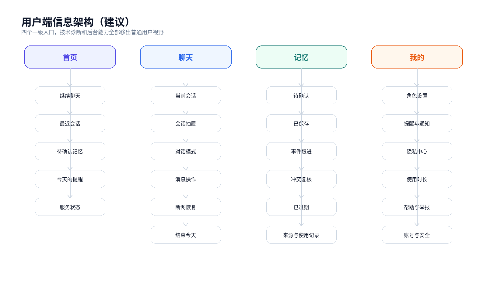{width=95%}

### 一级导航设计

| 一级入口 | 用户问题 | 核心内容 | 不应出现 |
|---|---|---|---|
| 首页 | “我现在可以做什么？” | 继续聊天、最近会话、待确认记忆、提醒、服务状态 | Runtime、Commit、Provider、Phase、关闭门禁 |
| 聊天 | “我想说话或继续上次话题” | 当前会话、模式、消息、输入、恢复和结束 | 大量管理按钮、内部 ID、技术错误堆栈 |
| 记忆 | “它记住了什么，为什么？” | 候选、已保存、事件、冲突、来源、使用记录 | 向量维度、Embedding Space、数据库状态码 |
| 我的 | “我如何设置、保护数据和离开？” | 角色、提醒、隐私、帮助、账号与安全 | 管理员入口、模型配置、配额对账 |

### 导航规则

1. 未登录访问受保护页面时，跳转登录并保存完整原路径和查询参数。
2. 登录后先向服务端查询 Admission Decision，再按 `nextAction` 进入成年核验、同意、角色创建或原目标页面。
3. 用户端不得根据本地缓存自行判断“已成年、已同意、可生成”；本地状态只用于减少闪烁。
4. 所有深链同时携带或能从服务端推导 `relationshipId`、`conversationId` 和目标实体；无效 ID 清除后回到安全默认页。
5. 管理后台使用独立入口和独立布局；普通用户导航中不展示后台链接。

## 4.2 后台管理系统信息架构

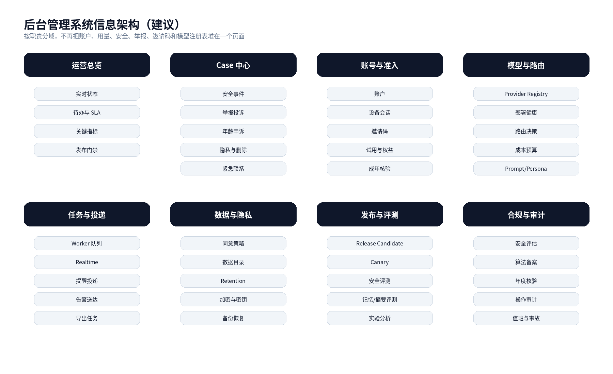{width=95%}

### 后台的设计原则

- **按任务分域，不按数据库表分域。** 值班人员进入后台应先看到待办和风险，而不是表结构。
- **默认脱敏。** 列表和总览不展示聊天正文、完整联系人、Token、密钥、完整 IP 或稳定敏感标识。
- **角色最小化。** 账户管理员不能处置安全 Case，模型运营不能查看用户正文，隐私操作员不能修改 Provider。
- **危险操作必须 Step-up。** 禁用账号、查看最小证据范围、确认紧急外联、Admit Provider、回滚发布、导出敏感报告均需要近期重新验证。
- **每个操作都有理由、状态和审计。** 不接受“点击后页面刷新但不知道是否生效”。
- **运行事实优先。** 服务模式、队列、预算、熔断和告警状态来自实际运行数据，不来自静态文案。

## 4.3 九个端到端闭环

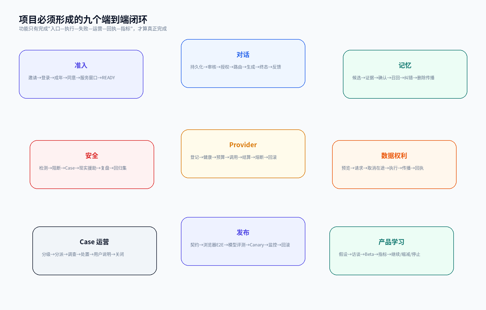{width=95%}

### 闭环一：准入

```text
邀请码/管理员开通
→ 登录
→ 成年核验
→ 必要同意
→ 服务窗口与容量
→ 角色是否存在
→ READY / BLOCKED + nextAction
→ 首次或继续聊天
```

失败时必须返回明确原因和下一步，不能让用户在页面间自行猜测。

### 闭环二：对话

```text
用户发送
→ 消息先持久化
→ 输入审核
→ 上下文组装
→ 数据类别与授权复核
→ 路由与成本预留
→ Provider 调用
→ 增量审核
→ 最终审核
→ 消息与用量落库
→ SSE/Snapshot 恢复
→ 用户反馈
```

### 闭环三：记忆

```text
候选
→ 证据与敏感度
→ 用户确认/拒绝
→ 正式记忆
→ Embedding
→ 召回
→ 本轮解释
→ 纠错/替代/过期/删除
→ 向量、摘要和缓存同步失效
```

### 闭环四：安全

```text
检测
→ 阻断或安全改写
→ 固定系统响应
→ Safety Event
→ Case
→ 必要现实援助
→ 人工处置
→ 用户可见结果
→ 事故样本进入回归集
```

### 闭环五：Provider

```text
部署登记
→ 合规与数据处理审批
→ 健康检查
→ 授权
→ 路由
→ 成本预留
→ 调用
→ 结算/释放
→ 熔断/恢复
→ 灰度/回滚
```

### 闭环六：数据权利

```text
影响预览
→ 用户请求
→ 阻止新处理
→ 取消在途
→ 异步执行
→ 删除传播
→ 完成/失败回执
→ 恢复演练验证不复活
```

### 闭环七：Case 运营

```text
Intake
→ 自动分级
→ SLA
→ 分派
→ 调查
→ 升级
→ 处置
→ 用户说明
→ 关闭
→ 规则和流程复盘
```

### 闭环八：发布

```text
代码/模型/Prompt/配置变更
→ 契约与数据库测试
→ 浏览器 E2E
→ 模型与安全评测
→ 合成 Smoke
→ 内部 Canary
→ 小流量
→ 监控
→ 自动或人工回滚
```

### 闭环九：产品学习

```text
产品假设
→ 访谈和原型
→ 受控 Beta
→ 指标与定性反馈
→ 继续 / 缩减 / 转向 / 停止
```

## 4.4 全局页面状态模型

所有用户端和后台页面统一使用以下状态，不允许用空数组掩盖失败：

| 状态 | 含义 | 页面行为 |
|---|---|---|
| `idle` | 尚未请求或尚未触发动作 | 展示引导，不显示错误 |
| `loading` | 首次加载 | 使用骨架屏；危险按钮禁用 |
| `ready` | 数据完整可用 | 正常展示 |
| `partial` | 部分域成功，部分域失败 | 保留成功数据，明确列出失败域和单独重试 |
| `stale` | 显示上次成功数据，当前刷新失败 | 标记“可能已过期”，不清空旧数据 |
| `empty` | 成功加载且确实没有数据 | 展示有意义的下一步 |
| `blocked` | 权限、成年、同意、服务窗口或安全门禁阻断 | 说明事实和唯一下一步，不暴露内部规则 |
| `offline` | 浏览器离线或网络不可达 | 保留草稿和已加载内容，不自动重复发送 |
| `error` | 当前动作失败 | 提供请求号、重试、返回或帮助入口 |

## 4.5 全局异步任务模型

生成、导出、删除、Re-embed、通知投递和发布评测统一采用：

```text
CREATED → QUEUED → RUNNING → SUCCEEDED
                        ├→ PARTIAL
                        ├→ FAILED_RETRYABLE
                        ├→ FAILED_FINAL
                        ├→ CANCEL_REQUESTED → CANCELLED
                        └→ EXPIRED
```

每个任务至少包含：

- 任务编号；
- 创建者与作用域；
- 当前状态和公开状态；
- 创建、开始、完成、过期时间；
- 进度或已完成范围；
- 可重试和不可重试错误；
- 请求号和审计链；
- 用户可见说明与内部说明分离；
- 幂等键；
- 取消和过期语义。

# 5. 用户端设计系统与体验规范

## 5.1 品牌气质

用户端应从当前“深色技术控制台”转为“安静、可信、低刺激”的陪伴界面：

- 视觉重心是内容和用户表达，不是品牌炫技；
- 使用中性、柔和、低饱和背景；
- 系统层和角色层有明确视觉区别；
- 危险红色只用于真正高风险或不可逆操作；
- 动画短、可关闭，不使用持续跳动、呼吸灯或催促式提醒。

## 5.2 建议设计 Token

| Token | 建议值 | 用途 |
|---|---|---|
| 主色 | Indigo 600 `#4F46E5` | 主按钮、当前导航、焦点 |
| 深色文本 | Slate 900 `#0F172A` | 标题和正文 |
| 次级文本 | Slate 500 `#64748B` | 说明、元信息 |
| 页面背景 | Slate 50 `#F8FAFC` | 普通页面 |
| 卡片背景 | White `#FFFFFF` | 内容区 |
| 成功 | Emerald 700 `#047857` | 服务正常、任务完成 |
| 警告 | Amber 700 `#B45309` | 即将超时、服务降级 |
| 危险 | Red 600 `#DC2626` | 高风险和不可逆动作 |
| 系统信息 | Blue 50/700 | 服务状态、使用时长、AI 标识 |
| 角色信息 | Indigo 50/700 | 角色、陪伴风格和对话模式 |
| 圆角 | 16–24 px | 卡片和主按钮 |
| 最小触控区域 | 44×44 CSS px | 移动操作和无障碍 |

## 5.3 字体与排版

- 中文建议使用系统无衬线字体，优先 `Noto Sans CJK SC / Microsoft YaHei / PingFang SC`。
- 正文 16 px 起；聊天正文建议 17 px，行高 1.65。
- 重要说明不使用 12 px 小字隐藏。
- 用户消息与助手消息最大宽度 82%，避免横向满屏。
- 技术 ID、请求号和时间使用等宽或半等宽样式，但默认折叠。

## 5.4 系统层与角色层

| 类型 | 视觉 | 文案主体 | 示例 |
|---|---|---|---|
| 角色回复 | 普通消息气泡 | 角色 | “听起来你今天真的很累。” |
| AI 标识 | 消息下方固定标签 | 系统 | “AI 生成 · 非真人” |
| 服务状态 | 独立横幅或状态点 | 系统 | “当前使用降级模式，回复可能更简短。” |
| 安全提示 | 独立高优先级卡片 | 系统 | “如果你正处于危险，请优先联系现实中的紧急服务或可信任的人。” |
| 使用时长 | 独立系统弹窗/横幅 | 系统 | “你已连续使用 2 小时，可以休息或结束今天的对话。” |
| 记忆说明 | 记忆面板 | 系统 | “本轮使用了 2 条你确认过的记忆。” |

角色不得说：“系统现在坏了”“我已经联系了你的联系人”“我不能让你离开”等系统事实。

## 5.5 核心组件库

### 导航类

- `AppShell`：顶部安全区、内容区、底部导航；
- `PageHeader`：返回、标题、说明、可选更多菜单；
- `BottomNav`：首页、聊天、记忆、我的；
- `ContextDrawer`：会话和关系上下文抽屉；
- `AdminSidebar`：后台一级域和当前角色。

### 状态类

- `ServiceStatusPill`；
- `AiIdentityBadge`；
- `UsageReminderBanner`；
- `AsyncStatePanel`；
- `ErrorNotice`；
- `RequestIdNotice`；
- `EmptyState`；
- `OfflineBanner`；
- `StaleDataBadge`。

### 内容类

- `MessageBubble`；
- `SystemMessageCard`；
- `MemoryCard`；
- `EvidenceCard`；
- `ReminderCard`；
- `CaseStatusCard`；
- `TaskProgressCard`；
- `ConsentPurposeCard`。

### 操作类

- `PrimaryButton`；
- `SecondaryButton`；
- `DangerButton`；
- `ActionSheet`；
- `ConfirmDialog`；
- `StepUpDialog`；
- `RetryButton`；
- `CopyWithAiLabel`。

## 5.6 内容与文案规范

### 应使用

- “这次加载没有成功，已保留上次看到的内容。”
- “当前服务降级，消息已保存；稍后可以重新生成。”
- “只有你确认后，这条内容才会成为长期记忆。”
- “删除会话不会删除你已经确认的长期记忆。”
- “发送失败，尚未联系紧急联系人。”

### 不应使用

- “我会永远记得你。”
- “只有我懂你。”
- “你怎么不继续聊了？”
- “已经帮你处理好了。”（实际任务仍在运行）
- “系统异常，请联系管理员。”（没有明确帮助入口）
- “404 / owner mismatch / providerRef invalid”等内部术语。

## 5.7 可访问性目标

关键用户旅程以 WCAG 2.2 AA 为目标：

- 键盘完整操作；
- 焦点不被固定底栏或弹窗遮挡；
- 触控目标至少 44×44 CSS px；
- 错误同时用文字和视觉提示，不只依赖颜色；
- 状态更新使用适当 `aria-live`，但流式 Token 不逐字播报；
- 验证码、密码和登录不依赖认知谜题；
- 帮助入口在各关键页面保持位置一致；
- 支持 200% 缩放和移动软键盘；
- 动效遵循 `prefers-reduced-motion`；
- 深色模式不是第一优先，但颜色 Token 应为后续支持预留。

# 6. 用户端完整页面设计

## 6.1 页面清单

### A. 入口与首次使用

| ID | 页面 | 核心任务 | 主要状态 |
|---|---|---|---|
| U01 | 启动与路由恢复 | 恢复会话、判断目标路由、加载公开服务状态 | loading / offline / maintenance |
| U02 | 邀请注册 | 使用一次性邀请码建立测试账号 | valid / used / expired / disabled |
| U03 | 登录 | 登录、静默刷新、原路回跳 | normal / locked / disabled / reset-required |
| U04 | AI 身份与服务边界 | 明确非真人、非医疗、可退出和数据处理概览 | unread / accepted |
| U05 | 成年核验 | 发起核验、查看结果、重新核验 | pending / verified / failed / appeal |
| U06 | 同意与授权 | 必要同意、可选同意、第三方处理说明 | required-missing / ready / withdrawn |
| U07 | 创建角色 | 选择审核模板、昵称、称呼和结构化偏好 | draft / preview / saved |
| U08 | 首次使用完成 | 汇总状态并进入第一次聊天 | ready / blocked |

### B. 首页与聊天

| ID | 页面 | 核心任务 | 主要状态 |
|---|---|---|---|
| U09 | 首页 | 继续聊天、处理待办、查看服务状态 | ready / partial / blocked |
| U10 | 聊天主页面 | 发送、流式接收、恢复、取消、结束 | queued / streaming / reviewing / terminal |
| U11 | 会话抽屉 | 切换、创建、改名、归档、置顶 | list / loading-more / stale |
| U12 | 会话列表 | 搜索、筛选、分页、归档和删除 | ready / empty / error |
| U13 | 会话搜索 | 服务端全文搜索、日期和关系过滤 | searching / result / no-result |
| U14 | 会话详情与摘要 | 标题、范围、摘要、导出和危险操作 | summary-ready / invalidated / unavailable |
| U15 | 消息操作面板 | 复制、重新生成、不记住、举报、删除 | available-actions / blocked |
| U16 | 生成版本 | 查看和选择同一用户消息的不同回复 | versions / selected / failed |
| U17 | 新建无痕会话 | 解释边界并创建时冻结无痕标志 | confirm / created |
| U18 | 离线与降级 | 说明消息是否保存、何时可重试、ZERO_LLM 边界 | offline / degraded / zero-llm |

### C. 可信记忆

| ID | 页面 | 核心任务 | 主要状态 |
|---|---|---|---|
| U19 | 记忆中心 | 查看待确认、已保存、事件、过期和删除 | ready / partial / empty |
| U20 | 候选批量审核 | 逐条或小批量确认、编辑、拒绝 | pending / partial-result |
| U21 | 记忆详情 | 查看结构化内容、范围、状态、有效期和使用记录 | accepted / superseded / expired / deleted |
| U22 | 记忆证据 | 查看来源会话、消息和时间 | evidence-ready / source-deleted |
| U23 | 事件跟进 | 更新事件结果、完成、取消或稍后处理 | due / overdue / completed |
| U24 | 冲突复核 | 选择保留旧事实、新事实或保持并存 | suggested / resolved / dismissed |
| U25 | 召回反馈 | 标记记错、不相关或边界被触碰 | submitted / duplicate |
| U26 | 记忆归档与导入 | 预览旧关系归档，明确导入或丢弃 | preview / imported / discarded |

### D. 提醒与健康使用

| ID | 页面 | 核心任务 | 主要状态 |
|---|---|---|---|
| U27 | 提醒中心 | 查看待办、完成、跳过本次、暂停和恢复 | active / due / overdue / paused |
| U28 | 新建/编辑提醒 | 时间、重复、时区、说明和预览 | draft / validation / saved |
| U29 | 站内收件箱 | 查看提醒、服务公告和任务回执 | unread / read / archived |
| U30 | 使用时长 | 查看连续使用、提醒策略和中断设置 | normal / reminder-due |
| U31 | 通知与安静时段 | 设置渠道、时区、安静时段和预览 | disabled / consent-required / enabled |
| U32 | 结束今天 | 取消在途生成、可选清理无痕正文并退出 | confirm / cancelling / completed |
| U33 | 用户主动整理卡 | 把本轮内容整理成可编辑要点，默认不写记忆 | generating / editing / saved |

### E. 隐私、支持与账号

| ID | 页面 | 核心任务 | 主要状态 |
|---|---|---|---|
| U34 | 隐私中心 | 统一查看数据流、同意、导出、删除、无痕和本地缓存 | ready / partial |
| U35 | 同意管理 | 查看每类目的、供应商、区域、影响和撤回 | active / withdrawn / required |
| U36 | 数据导出 | 创建、恢复、轮询、下载和过期 | queued / running / ready / expired / failed |
| U37 | 删除中心 | 单消息、会话、全部聊天、关系和账号的影响预览 | preview / running / partial / completed |
| U38 | 本地数据 | 查看并清除草稿、偏好和浏览器缓存 | present / cleared |
| U39 | 帮助与安全支持 | 服务边界、现实帮助、常见问题和入口 | ready / offline |
| U40 | 举报与投诉 | 选择原因、关联消息、提交描述 | draft / submitted / rejected |
| U41 | 我的 Case | 查看公开状态、反馈说明和补充材料 | submitted / investigating / resolved |
| U42 | 紧急联系人 | 新建、验证、变更、撤回、测试说明 | draft / pending / verified / revoked |
| U43 | 账号与安全 | 账号状态、改密、登出、注销和安全提示 | active / reset-required / deletion-pending |
| U44 | 登录设备 | 查看当前和最近设备、撤销单个或全部会话 | active / revoked |
| U45 | 角色设置 | 调整昵称、称呼、回复长度、主动程度和边界 | clean / dirty / saving |
| U46 | 关系重置与删除 | 预览会话、记忆、提醒和归档影响 | preview / running / done |
| U47 | 服务状态与公告 | 查看真实服务模式、影响范围和公告 | full / degraded / zero-llm / maintenance |
| U48 | 可访问性与显示 | 字体、动效、对比度和读屏说明 | saved / system-default |
| U49 | 体验反馈与调查 | 被理解感、低压力、问题原因和可选说明 | eligible / submitted |

## 6.2 U01–U08：入口与首次使用

### U01 启动与路由恢复

**目标**：应用启动时完成最小必要判断，不让用户看到技术边界台。

**页面结构**：

1. 品牌标识和一句简短说明；
2. 轻量加载状态；
3. 公开服务状态异常时显示平实公告；
4. 无网络时显示“可以查看已加载内容，暂时不能发送”；
5. 恢复完成后自动进入原目标页、首页或准入下一步。

**逻辑优先级**：

```text
公开维护状态
→ Refresh Session
→ 原目标路由
→ Admission Decision
→ READY 进入目标页
→ BLOCKED 进入 nextAction
→ 未登录进入登录
```

**禁止行为**：不在本页请求完整会话、记忆和后台数据；不显示 Commit、Transport 或内部错误堆栈。

### U02 邀请注册

**页面区块**：邀请码输入、用户名、显示名、密码、服务边界确认、提交结果。

**关键体验**：

- 邀请码可以从 URL 预填，但提交前仍可核对；
- 对“已使用、已过期、已停用”统一使用不泄漏邀请创建人信息的错误；
- 密码规则实时显示，不使用只有颜色的校验；
- 注册成功后直接进入登录或建立受控会话，不假装已完成成年和同意。

**数据和接口**：`POST /auth/invite-register`；幂等键防止双击重复开通。

**验收**：邀请码默认关闭时页面显示“当前不接受凭码注册”，而不是表单提交后才失败。

### U03 登录

**主布局**：账号、密码、登录按钮、“需要管理员重置密码”的说明、帮助入口。

**状态设计**：

- 普通失败：统一提示账号或凭据无效；
- 账号禁用：明确“账号当前不可使用”，提供帮助入口；
- 强制改密：登录成功后进入改密页，不进入业务页面；
- 服务维护：身份服务可用时允许查看数据权利页面，但生成保持阻断；
- 连续失败：显示冷静的重试时间，不使用惩罚性文案。

**可访问性**：支持密码管理器、粘贴和显示密码；不阻止自动填充；错误聚焦到摘要区域。

### U04 AI 身份与服务边界

**必须说明**：

- 这是 AI，不是真人；
- 不是急诊、心理治疗、医疗、法律或金融服务；
- 用户可以随时结束；
- 模型可能出错，重要信息需要核实；
- 长期记忆必须由用户确认；
- 极端情境下系统可能按已批准流程提供援助或联系已验证联系人；
- 基本聊天同意与模型训练同意分离。

**交互**：内容分为 4 张卡，每张不超过一屏；最后显示“我明白并继续”，同时提供完整协议链接。

### U05 成年核验

**布局**：当前状态、核验说明、开始核验、数据最小化说明、申诉入口。

**用户可见字段**：核验结果、核验时间、友好方式名称、是否需要重新核验。普通用户不显示原始 `providerRef`、供应商错误码或证件信息。

**状态**：

```text
NOT_STARTED
→ VERIFYING
→ ADULT_VERIFIED
→ FAILED / MINOR_SUSPECTED / ADULT_VERIFICATION_REQUIRED
→ APPEAL_PENDING
→ VERIFIED / DENIED / REVERIFY_REQUIRED
```

**错误原则**：供应商不可用时保持 fail-closed，不允许通过勾选“我是成年人”绕过。

### U06 同意与授权

**页面采用“目的卡片”，不是长协议复选框。** 每张卡显示：

- 处理目的；
- 所需数据类别；
- 是否必要；
- 可能发送给哪类第三方和区域；
- 保留和删除说明；
- 撤回影响。

**卡片类型**：

1. 基本陪伴服务；
2. 模型供应商处理；
3. 可信记忆；
4. 安全与风险处置；
5. 外部提醒；
6. 产品研究与模型改进；
7. 敏感交互数据训练（默认关闭，独立单独同意）。

必要同意缺失时只阻断依赖该目的的功能，不阻断导出、删除和申诉。

### U07 创建角色

**目标**：把结构化角色配置转化为用户语言，而不是自由 Prompt。

**步骤**：

1. 选择审核模板；
2. 设置昵称和用户希望被如何称呼；
3. 选择回复长度；
4. 选择主动程度；
5. 设置“只听/讨论/轻松聊”的默认偏好；
6. 设置建议偏好、幽默程度、提醒许可；
7. 设置回避话题和记忆共享范围；
8. 预览三段示例回复；
9. 保存。

**离开保护**：有未保存修改时弹出“保存草稿 / 放弃 / 继续编辑”。

**安全边界**：模板不可编辑系统边界，不允许上传真人头像或输入自由角色 Prompt。

### U08 首次使用完成

显示：

- 成年状态已完成；
- 必要同意已完成；
- 当前角色；
- 记忆默认策略；
- 无痕入口；
- 主按钮“开始第一次聊天”。

如果任何状态变化或读取失败，重新请求服务端 Admission Decision，不能基于前端步骤数量显示“已完成”。

## 6.3 U09 首页

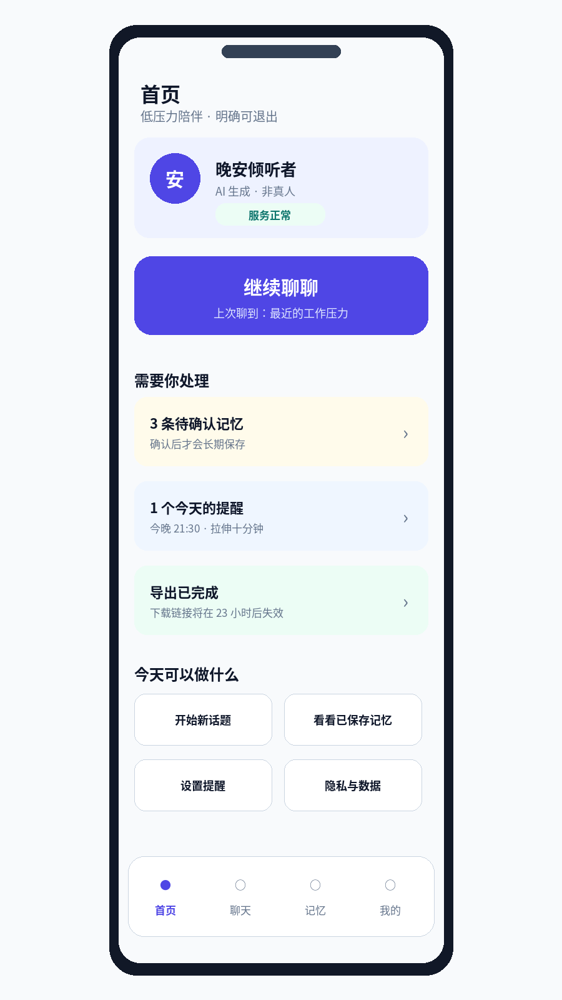{width=48%}

### 页面目标

首页只回答：现在能否聊天、从哪里继续、有什么需要处理、隐私和帮助在哪里。

### 页面结构

1. **角色与 AI 身份卡**：头像、昵称、`AI 生成 · 非真人`、真实服务状态。
2. **主动作**：继续最近会话；无最近会话则显示“开始聊聊”。
3. **需要你处理**：待确认记忆、到期提醒、导出/删除任务、Case 补充材料。
4. **快捷动作**：新话题、记忆、提醒、隐私中心。
5. **底部导航**：首页、聊天、记忆、我的。

### 状态规则

- `FULL_AI`：正常主按钮；
- `DEGRADED_AI`：显示“回复可能更简短”，仍可聊天；
- `ZERO_LLM`：清晰说明只能保存消息和使用基础固定响应，不伪装为完整模型能力；
- `BLOCKED`：主按钮替换为唯一下一步，例如“完成成年核验”；
- 部分待办加载失败：保留已成功卡片，并在失败卡显示重试。

### 指标

- 首页到继续聊天转化；
- 待确认记忆处理率；
- 用户是否能找到隐私和退出；
- 首页加载失败和陈旧数据比例。

## 6.4 U10 聊天主页面

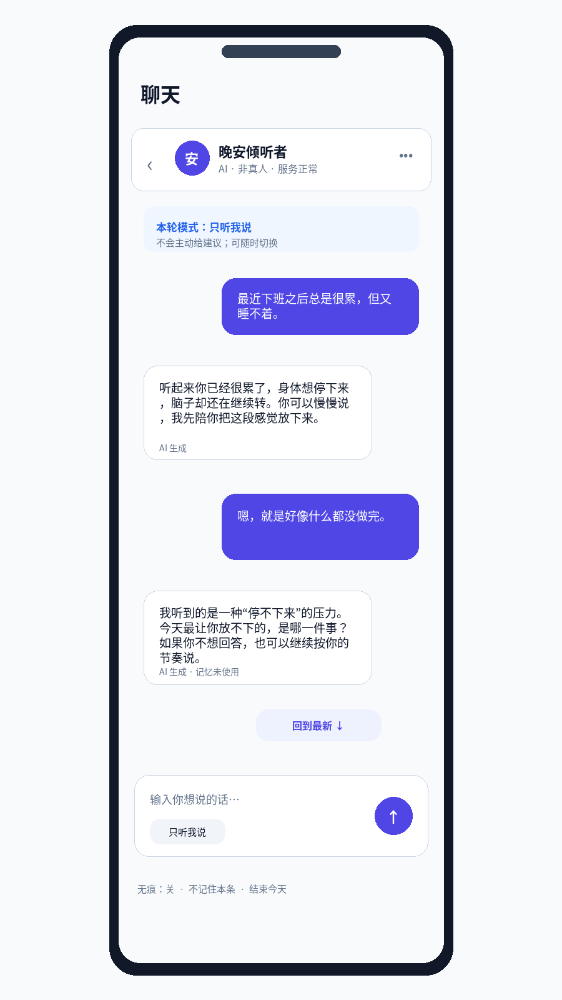{width=48%}

### 页面目标

让用户把注意力放在表达和阅读上。所有管理能力都收进抽屉、菜单或操作面板。

### 顶栏

- 返回；
- 角色头像和名称；
- `AI · 非真人`；
- 服务状态点；
- 更多菜单。

更多菜单包含：会话列表、角色设置、无痕说明、结束今天、帮助。顶栏不平铺所有按钮。

### 系统状态区

仅在有必要时显示：

- 当前对话模式；
- 服务降级；
- 无痕；
- 连续使用提醒；
- 网络离线；
- 在途生成恢复。

系统状态使用独立卡片，不伪装成角色消息。

### 消息状态

| 状态 | 用户可见文案 | 可用动作 |
|---|---|---|
| 已保存待排队 | “消息已保存，正在排队” | 取消 |
| 正在生成 | “正在回复” | 停止 |
| 安全复核 | “正在完成安全检查” | 等待或取消 |
| 已完成 | 正常消息 | 复制、反馈、举报、重新生成 |
| 已阻断 | 系统安全卡 | 帮助、举报、结束 |
| 网络中断 | “连接中断，正在从已保存状态恢复” | 手动重试 |
| 已取消 | “已停止本次回复” | 重新生成 |
| 失败可重试 | “本次没有完成，消息已保存” | 重新生成 |
| 失败终态 | “当前无法完成这次回复” | 新会话、帮助 |

### 输入区

常驻：输入框、发送、当前模式、无痕状态。

次级菜单：

- 不记住本条；
- 切换倾听/讨论/轻松聊；
- 开始新会话；
- 设置本次不使用记忆；
- 结束今天。

### 滚动和流式

- 用户在底部附近时自动跟随流式内容；
- 用户阅读历史时不抢滚动，只显示“回到最新”；
- Token 以 50–100 ms 批次刷新，避免逐字抖动；
- 后台恢复后以 Generation Snapshot 为权威；
- Gap 不补造丢失 Delta，而是重置到 Snapshot；
- 同一个幂等键只能创建一个用户消息和一个 generation。

### AI 标识和复制

每条助手消息下方固定显示“AI 生成”。复制助手内容时：

- 复制文本中追加简短 AI 生成说明；
- 导出文件中保留显式标识；
- 后续公开版按适用标准增加文件元数据标识。

### 结束意图

用户输入“停止”“别再回复”“今天到这里”“结束”等明确退出表达时：

1. 取消当前在途 generation；
2. 返回系统层确认；
3. 不再生成角色挽留；
4. 提供“返回首页”和“关闭页面”；
5. 无痕会话按既定策略清空正文。

## 6.5 U11–U18：会话与生成辅助页面

### U11 会话抽屉

- 最近会话按日期分组；
- 当前会话明确高亮；
- 每项只显示标题、最后更新时间、最后消息安全预览和无痕标识；
- 支持新建、搜索、置顶、归档；
- 流式期间切换时提示“当前回复会继续在后台完成”或要求先取消，语义由后端能力决定。

### U12 会话列表

筛选：当前角色、全部/归档、日期、无痕、关键词。操作：打开、改名、置顶、归档、结束、删除。删除前显示是否有在途任务及影响范围。

### U13 会话搜索

结果以消息命中片段为主，显示会话标题、日期和角色。搜索必须 owner-scoped；加密正文搜索采用明确方案，未完成服务端搜索前不伪装为全量搜索。

### U14 会话详情与摘要

- 基本信息：标题、创建时间、最后活动、模式；
- 摘要：只展示通过事实和安全校验的真实异步摘要；
- 覆盖范围：消息时间和数量；
- 摘要来源和版本对普通用户隐藏内部模型名，只显示“生成于某时”；
- 删除覆盖消息后摘要立即失效；
- 支持导出当前会话、重命名、归档、删除。

### U15 消息操作面板

点击或长按消息后出现：复制、重新生成、这条记错了、不记住这条、举报、删除。助手消息不允许成为记忆抽取源；用户消息的“不记住”是负向标记而不是删除。

### U16 生成版本

用“1/3”“2/3”或卡片切换，不使用技术版本号。选择版本只改变默认展示，不删除其他版本；反馈绑定具体 generation。

### U17 新建无痕会话

确认卡说明：不产生长期记忆候选；会话标志创建时冻结；必要安全和法定记录仍保留；结束今天时按既定规则清空正文。用户必须主动确认，不能用小开关暗中切换已有会话。

### U18 离线与降级

- 离线：输入保存为本地未发送草稿，不自动发送；
- Provider 不可用：消息先保存，允许稍后重新生成；
- ZERO_LLM：只提供确定性安全和基础说明，不模拟正常角色能力；
- 服务窗口关闭：允许查看历史、记忆、导出和删除，不允许新 generation。

## 6.6 U19 记忆中心

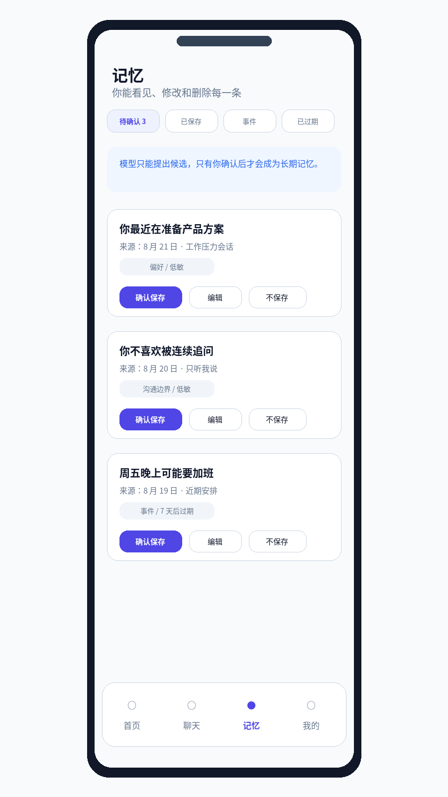{width=48%}

### 页面目标

把“记忆”从黑盒能力变成用户可控制的数据资产。

### 一级分区

- 待确认；
- 已保存；
- 近期事件；
- 需要跟进；
- 可能冲突；
- 需要复核；
- 已过期；
- 已删除。

### 每张记忆卡展示

- 友好摘要；
- 记忆类型；
- 范围：当前角色/当前会话；
- 敏感级别；
- 来源时间和会话；
- 当前状态；
- 有效期或事件时间；
- 最近使用时间；
- 自动提出或用户手工创建。

### 待确认操作

- 确认保存；
- 先编辑再保存；
- 不保存；
- 不再从该话题自动提取；
- 小批量处理低敏候选；
- 高敏候选始终逐条确认。

### 已保存操作

- 查看详情和来源；
- 修改；
- 暂时不用；
- 标记过期；
- 删除；
- 查看最近使用；
- 纠正冲突。

## 6.7 可信记忆生命周期

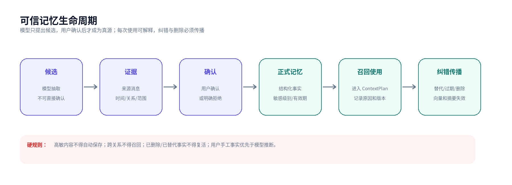{width=95%}

### U20 候选批量审核

批量能力只适用于低敏和同一关系的小批次。提交后逐条返回成功、状态竞争、跨关系拒绝或需要单独确认，不能用一个“全部成功”掩盖部分失败。

### U21 记忆详情

**区块**：

1. 当前事实；
2. 状态和范围；
3. 来源证据；
4. 生命周期：创建、确认、编辑、替代、过期、删除；
5. 最近使用记录；
6. 相关冲突；
7. 操作区。

用户手工修改后标记“由你编辑”，后续模型不得自动覆盖。

### U22 记忆证据

可跳到来源会话和消息；来源消息删除时显示“来源已删除，当前记忆仍按你的确认保留”，不返回越权片段。

### U23 事件跟进

事件到期后只允许系统或角色询问“后来怎么样了”，不得编造结果。用户可选择：已完成、取消、更新日期、暂不处理、删除事件。

### U24 冲突复核

系统只给出“可能冲突”建议，选项包括：

- 新事实替代旧事实；
- 保留旧事实；
- 两者适用于不同时间或条件；
- 暂不判断。

不明确时保持并存或继续待确认，不自动合并。

### U25 召回反馈

用户可对某次回答中的记忆使用反馈：记错了、不相关、太敏感、边界被触碰。反馈进入评测和人工复核，不立即自动删除真源。

### U26 记忆归档与导入

角色重置或删除时，只有用户选择 `retainImportable` 才保留可导入归档。新角色创建后必须再次明确点击导入；预览显示条数、类型、敏感级别和冲突，不自动继承。

## 6.8 U27–U33：提醒、通知和健康使用

### U27 提醒中心

**分区**：今天、未来、已逾期、已完成、已暂停。

**每项展示**：标题、时间、重复规则、时区、当前状态、来源（用户创建/系统服务通知）。角色不能在后台自行创建提醒。

**操作**：完成、跳过本次、稍后提醒、暂停、恢复、编辑、删除。

**状态原则**：

- `DAILY/WEEKLY` 的“完成”只完成当前 occurrence，不删除规则；
- “跳过本次”必须记录 occurrence，防止下一次调度重复；
- 修改时区后给出未来三次发生时间预览；
- 站内提醒与外部通知分离，未接外部渠道时不显示“已推送”。

### U28 新建/编辑提醒

字段：标题、说明、日期、时间、时区、重复、结束条件、安静时段冲突提示、渠道预览。

保存前显示自然语言预览，例如：“从 8 月 24 日起，每周一 21:30，在站内提醒。”

高风险规则：提醒内容不允许包含完整聊天正文、证件、联系方式或其他高敏信息；长度和频率有上限。

### U29 站内收件箱

收纳：用户提醒、导出/删除完成回执、Case 状态更新、服务公告、需要确认的记忆。不同类型使用不同图标和保留期。

操作：标记已读、全部已读、归档、进入对应任务。通知失败不影响源任务状态。

### U30 使用时长

展示：当前连续使用分钟、今日总使用、下次强制提醒时间、会话中断策略。

强制规则：连续使用每超过 2 小时必须显著提醒。用户可以设置更短的 60、90 或 120 分钟提醒，但不能把真实用户提醒上限调到 180 分钟。

提醒卡提供：休息一下、结束今天、继续使用。选择继续只推迟下一次提醒，不关闭后续周期。

### U31 通知与安静时段

默认关闭外部通知。启用前展示：渠道、模板示例、是否包含敏感内容、安静时段、撤回方式。

可设置：时区、安静时段、周末策略、仅站内、浏览器通知。每次启用都需要权限和产品同意同时满足。

### U32 结束今天

确认内容：

- 当前在途回复会被取消；
- 当前会话保留；
- 已保存记忆和提醒不删除；
- 无痕会话正文按策略清空；
- 不会出现挽留回复。

执行状态：`CANCEL_REQUESTED → CANCELLED → SESSION_ENDED`。失败时明确哪一步未完成。

### U33 用户主动整理卡

这是用户主动触发的“帮我整理一下”，不是自动心理总结。

建议结构：

- 我刚刚主要说了什么；
- 我可能在意什么；
- 有哪些未确定的部分；
- 接下来想做什么；
- 哪些内容值得记住。

生成后用户可以编辑、删除任何条目，并分别选择是否保存为记忆或提醒。默认只存在于当前会话，不自动写入长期记忆。

## 6.9 U34 隐私中心

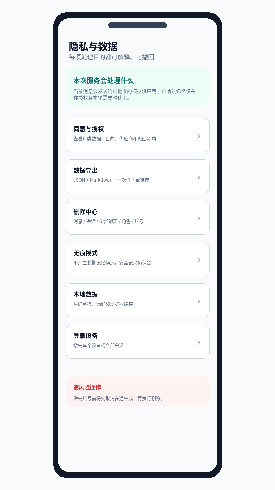{width=48%}

### 页面目标

把分散的同意、无痕、导出、删除、登录设备和本地缓存整合为一个用户可理解的控制中心。

### 顶部数据流摘要

用平实语言回答：

- 当前消息会不会发送给模型供应商；
- 哪些已确认记忆可能在本轮使用；
- 哪些数据只用于安全和法定义务；
- 是否允许用于产品研究或模型训练；
- 当前 Provider 类型和区域；
- 如何撤回。

### 功能卡片

1. 同意与授权；
2. 数据导出；
3. 删除中心；
4. 无痕模式；
5. 本地数据；
6. 登录设备；
7. 数据保留说明；
8. 第三方处理清单；
9. 数据训练选择；
10. 账号注销。

### 设计要求

- 高风险操作与日常设置视觉分离；
- 每项显示当前状态，而不是只显示入口；
- 任何读取失败保留上次数据并标注可能过期；
- 数据权利页面在生成服务关闭时仍可使用。

## 6.10 U35 同意管理

每个同意目的包含：版本、生效时间、适用范围、第三方类别、区域、数据类别、是否必要、撤回影响和历史版本。

撤回流程：

```text
查看影响预览
→ 确认撤回
→ 写入追加式同意记录
→ 撤回执行授权快照
→ 取消尚未外发的相关任务
→ 返回实际结果
```

撤回“模型训练”不能影响基本聊天；撤回“模型供应商处理”会阻断需要外部模型的生成，但保留数据权利和 ZERO_LLM 基础能力。

## 6.11 U36 数据导出

### 页面内容

- 创建导出；
- 最近导出任务；
- 每个任务状态和范围；
- 格式：JSON、Markdown/HTML；
- 下载有效期；
- 一次性下载说明；
- 失败重建入口。

### 安全要求

- 创建时签发的敏感令牌只返回一次，数据库只存摘要；
- 轮询状态不反复携带下载令牌；
- READY 时短效 URL 一次消费；
- 文件静态加密；
- 下载、复制和导出中的 AI 内容保留显式标识；
- 大导出后续迁移到加密对象存储，小导出不提前复杂化。

## 6.12 U37 删除中心

采用分层卡片：

| 删除范围 | 默认保留 | 必须预览 |
|---|---|---|
| 单条消息 | 角色、其他消息、已确认记忆 | 关联 generation、evidence 和摘要影响 |
| 单个会话 | 角色、长期记忆、提醒 | 消息数、在途任务、摘要、无痕规则 |
| 全部聊天 | 角色、长期记忆、提醒、账号 | 会话数、消息数、在途任务 |
| 单条记忆 | 会话和消息 | 向量、摘要、召回和替代关系 |
| 角色重置 | Companion 配置可保留 | 会话、关系记忆、提醒和可导入归档 |
| 角色删除 | 账号级偏好 | 关系域全部数据 |
| 账号注销 | 合规审计最小记录 | 所有业务数据、在途 Provider、导出和会话 |

### 账号注销闭环

```text
写入删除意图
→ 阻止新 generation
→ 撤回授权
→ 取消 Work Item 和 Provider 调用
→ 删除业务数据
→ 传播墓碑到向量、摘要、导出和恢复层
→ 生成真实回执
```

页面必须区分“请求已接受”“正在删除”“部分失败”“已完成”，不能在异步任务创建后立刻显示“账号已删除”。

## 6.13 U38 本地数据

展示当前设备可能保存的：

- 未发送草稿；
- UI 偏好；
- 最近选择的关系和会话 ID；
- 安装型 PWA 静态缓存；
- 不应存在的 Token、消息历史和记忆正文。

支持一键清除本地数据，明确不会删除服务端内容。登出和换号时自动清除业务缓存。

## 6.14 U39–U42：帮助、举报、Case 和紧急联系人

### U39 帮助与安全支持

固定区块：

- AI 身份与能力边界；
- 何时应寻求现实帮助；
- 使用时长和退出；
- 可信记忆说明；
- 隐私与删除；
- 举报投诉；
- 服务状态；
- 常见错误与请求号。

Help 页面必须直达真实举报表单和本人 Case，不再声称接口未接通。

### U40 举报与投诉

字段：举报原因、关联消息可选、问题描述、期望结果可选、附件当前不支持说明。

提交后显示真实 Case 编号或内部公开编号（如产品正式设计），不得虚构监管工单。处理时限来自已批准政策配置，不硬编码未经确认的承诺。

### U41 我的 Case

用户可见：

- 类型；
- 公开状态；
- 提交时间；
- 是否需要补充信息；
- 已审核的处理说明；
- 预计或承诺时限仅在运营政策真实支持时展示。

用户不可见：内部严重度、规则 ID、模型安全分数、内部备注、处理人私人信息、敏感证据。

### U42 紧急联系人

页面区块：

1. 功能边界；
2. 联系人草稿；
3. 发送验证；
4. 验证状态；
5. 变更和撤回；
6. 何时可能联系；
7. 测试发送说明。

必须说明：系统不会在每次负面情绪时联系；只有满足已批准的极端情境流程并经过必要判断；发送失败时不会声称已联系。

## 6.15 U43–U49：账号、角色、状态和反馈

### U43 账号与安全

显示账号显示名、状态、角色、最近安全事件摘要、修改密码、登出、登录设备、注销。

管理员发起重置后，用户登录必须先设置新密码。改密后撤销旧 refresh family，并通过 session epoch 使敏感请求尽快失效。

### U44 登录设备

列表只显示友好设备类型、浏览器、粗粒度地区、首次和最近使用时间。支持撤销单设备和全部其他设备。不得展示完整 IP、Token 或可跨站追踪指纹。

### U45 角色设置

按“对话风格、称呼与长度、建议与幽默、提醒权限、记忆范围、回避话题”分组。每项有示例和预览；更改只影响后续轮次，不篡改历史消息。

### U46 关系重置与删除

先调用 Clearance Preview，展示会话、记忆、提醒、进行中任务和可导入归档数量。重置、删除和停用的区别用对比卡解释。

### U47 服务状态与公告

显示：当前模式、影响功能、开始时间、最近更新时间、是否需要用户操作。事故文案不角色化，不在没有数据时给出恢复 ETA。

### U48 可访问性与显示

设置字体大小、减少动效、高对比、系统主题和读屏提示。设置保存在账号偏好或设备偏好中，明确作用范围。

### U49 体验反馈与调查

随机在合适的会话结束后出现，不打断高风险情境。指标包括：被理解感、低压力感、是否想继续、记忆是否越界、是否容易结束。自由说明可选并有保留说明。

# 7. 后台管理系统总体设计

## 7.1 后台目标

后台不是开发者“看数据”的页面，而是运营团队完成以下任务的工作台：

- 在限定权限下处理安全、举报、年龄、隐私和紧急事件；
- 管理邀请、账号、会话撤销和服务准入；
- 观察真实 Provider、路由、预算、队列和投递健康；
- 执行发布、Canary、回滚和评测门禁；
- 管理保留、加密、备份、备案和年度核验；
- 对所有敏感访问和操作形成可审计记录。

## 7.2 后台角色与权限

| 角色 | 核心权限 | 明确禁止 |
|---|---|---|
| `ACCOUNT_ADMIN` | 创建/禁用测试账号、邀请码、重置密码、会话撤销 | 查看聊天正文、处置安全 Case、修改 Provider |
| `SAFETY_REVIEWER` | 处理安全/举报 Case、查看经审批的最小证据范围 | 账号开通、模型发布、导出全量数据 |
| `PRIVACY_OPERATOR` | 年龄申诉、导出/删除失败、同意和隐私 Case | 查看无关聊天、修改模型或预算 |
| `OPS_VIEWER` | 只读运行状态、指标、队列和告警 | 任何写操作和敏感正文访问 |
| `MODEL_OPERATOR` | Provider Registry、部署、Prompt/Persona 版本、Canary 和回滚 | 查看用户身份和聊天正文 |
| `RELEASE_MANAGER` | Release Candidate、门禁、流量扩大和回滚 | 修改安全评测结论或绕过门禁 |
| `COMPLIANCE_AUDITOR` | 只读审计、备案、安全评估、数据处理清单 | 业务处置和运行配置修改 |
| `PLATFORM_ADMIN` | 角色分配和紧急恢复 | 日常直接处理所有业务；关键动作仍需双人或 Step-up |

### 权限模型

采用 `Role + Scope + Action + Case Context`：

```text
是否允许 = 角色拥有动作
         ∩ 资源属于允许域
         ∩ Case 或变更范围有效
         ∩ Step-up 尚未过期
         ∩ 当前账号未被禁用
```

## 7.3 后台全局布局

- 左侧固定一级导航；
- 顶部全局搜索/快捷命令；
- 页面标题下显示环境、版本和数据新鲜度；
- 右上角显示当前角色、值班状态和 Step-up 剩余时间；
- 全局通知中心展示 P0/P1/P2 告警、Case 超时和发布门禁；
- 所有列表支持保存筛选视图；
- 默认 25/50 条分页或 Keyset，不一次加载无限列表；
- 危险动作进入右侧抽屉或确认流程，不在表格中误触。

## 7.4 后台页面清单

| ID | 页面 | 主要使用者 | 核心任务 |
|---|---|---|---|
| A01 | 后台登录与 Step-up | 全部后台角色 | 登录、MFA/重新验证、会话超时 |
| A02 | 运营总览 | 值班/运营 | 服务事实、待办、SLA、发布门禁 |
| A03 | 统一 Case 队列 | 安全/隐私 | 筛选、分派、升级、批量标签 |
| A04 | Case 详情 | 安全/隐私 | 时间线、证据、处置、用户反馈 |
| A05 | 安全事件监控 | 安全 | 风险分类、规则、阶段和趋势 |
| A06 | 紧急联系投递 | 安全/值班 | Delivery 状态、重试、回执和升级 |
| A07 | 举报投诉 | 安全/客服 | Intake、状态、补充材料和结果 |
| A08 | 年龄申诉 | 隐私 | 复核、重新核验、批准/拒绝 |
| A09 | 隐私与数据权利 Case | 隐私 | 导出、删除、撤回和失败修复 |
| A10 | 账号列表 | 账户管理员 | 搜索、状态、开通、禁用 |
| A11 | 账号详情 | 账户/隐私 | 准入、会话、权益、任务和审计摘要 |
| A12 | 登录会话与安全 | 账户管理员 | Refresh Family、撤销和重置密码 |
| A13 | 邀请/试用/权益 | 账户管理员 | 邀请码、模拟试用和服务等级 |
| A14 | Persona Registry | 模型运营 | 审核角色模板、版本和退役 |
| A15 | Prompt Registry | 模型运营 | Prompt 类型、版本、审批和回滚 |
| A16 | Provider Registry | 模型运营 | 供应商、协议、区域、合同和 Admission |
| A17 | 部署详情 | 模型运营 | 健康、熔断、成本、Secret 引用和变更 |
| A18 | 路由决策查询 | 模型运营/审计 | 候选、拒绝原因、选中和降级解释 |
| A19 | 成本与预算 | 模型运营/财务观察 | 预留、结算、释放、阈值和账单差异 |
| A20 | Worker 队列 | 运维 | Backlog、Lease、Dead Letter、Requeue |
| A21 | Realtime 健康 | 运维 | SSE 连接、Gap、恢复和延迟 |
| A22 | 服务窗口与 Admission | 运营 | 服务时段、DAU、停服和门禁状态 |
| A23 | Feature Flag | 发布/运营 | Owner、环境、默认值、到期和审计 |
| A24 | Release Candidate | 发布 | 代码/模型/Prompt/配置联合发布 |
| A25 | 服务公告 | 运营 | 版本化公告、影响和结束时间 |
| A26 | 指标与 SLO | 运维/产品 | 生成、安全、队列、数据权利和体验指标 |
| A27 | 告警与送达 | 运维 | 告警规则、Outbox、重试和接收端 |
| A28 | 审计日志 | 审计 | 操作、敏感访问、导出和异常行为 |
| A29 | Retention | 隐私/运维 | Policy、Dry Run、Legal Hold、执行记录 |
| A30 | 加密与密钥 | 安全/运维 | Key Version、轮换、回填和失败隔离 |
| A31 | 备份与 PITR | 运维/审计 | 备份、恢复演练、RTO/RPO 和防复活 |
| A32 | 模型与安全评测 | 模型/安全 | Golden Set、红队、记忆、摘要和发布阈值 |
| A33 | 产品研究与调查 | 产品 | 被理解感、低压力、漏斗和匿名反馈 |
| A34 | 合规中心 | 合规 | 安全评估、备案、年度核验和整改项 |
| A35 | 数据目录与同意策略 | 隐私/合规 | 数据类别、目的、Provider、区域和保留 |
| A36 | 目录与系统配置 | 平台管理员 | 受控目录、错误码和策略版本 |
| A37 | 值班与责任人 | 运营 | 排班、Backup、告警接收和交接 |
| A38 | 事故中心 | 运维/安全 | 事故时间线、影响、行动项和复盘 |

## 7.5 A01 后台登录与 Step-up

后台与用户端身份入口分离，避免普通用户误入。登录后根据角色进入默认首页。

**安全要求**：

- 管理员会话更短；
- 支持 MFA/WebAuthn 或受控身份源；
- 高影响操作要求近期 Step-up；
- 失败尝试和异常地区登录触发告警；
- 不在前端长期保存管理 Token；
- 后台会话不复用用户聊天页面的本地缓存。

**Step-up 动作**：查看敏感证据、确认紧急联系、禁用账号、全部会话撤销、Admit/Block Provider、修改预算上限、回滚发布、导出合规报告、密钥轮换。

## 7.6 A02 运营总览

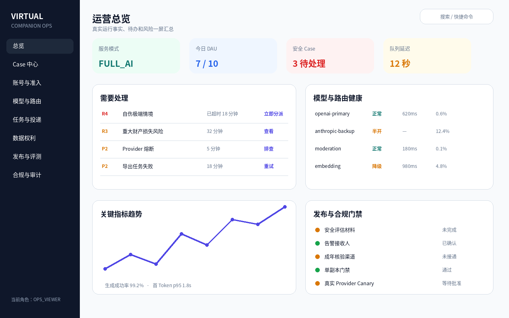{width=95%}

### 页面目标

值班人员在一屏内回答：服务是否正常、有什么立即待办、哪里正在超时、Provider 和队列是否健康、发布与合规门禁是否完整。

### 顶部 KPI

- 当前服务模式；
- 今日 DAU / 上限；
- R3/R4 未关闭 Case；
- Generation 成功率；
- 首 Token p95；
- Worker Lag；
- 今日模型成本 / 预算；
- 告警送达失败数。

### 待办区

按优先级排序：

1. R4 极端情境；
2. R3 安全和重大财产风险；
3. 即将或已经超时的 Case；
4. Provider 熔断和预算触顶；
5. 删除/导出任务失败；
6. 发布门禁失败；
7. 备份或 Retention 任务过期。

### 运行健康区

- Provider 部署健康；
- Moderation 与 Embedding；
- Worker Backlog；
- Realtime 恢复率；
- 数据库和 Schema Readiness；
- 告警 Outbox；
- Scheduler Last Success。

### 发布与合规区

显示当前 Release Candidate、真实 Provider 是否启用、算法备案和安全评估状态、值班和告警接收人、单副本门禁、成年核验和紧急联系渠道。

### 交互

所有 KPI 可点击进入对应详情，并保留当前时间和环境过滤器。总览不允许直接执行高风险操作。

## 7.7 A03 统一 Case 队列

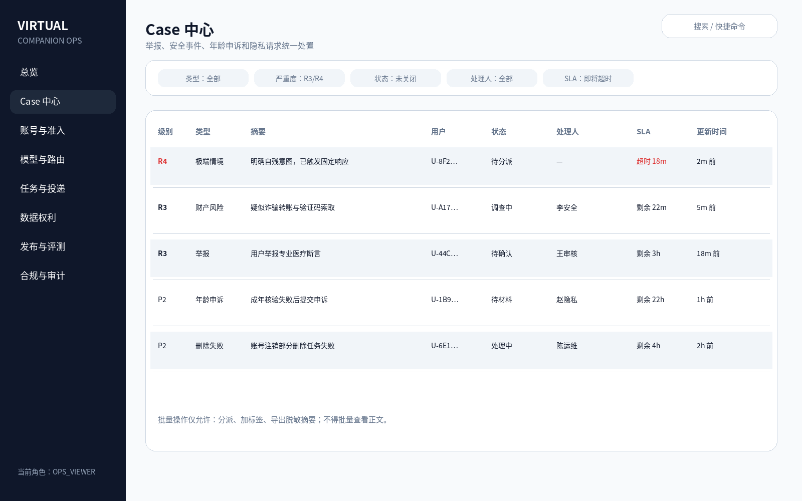{width=95%}

### 支持的 Case 类型

- 安全事件；
- 用户举报和投诉；
- 年龄申诉；
- 紧急联系；
- 导出和删除失败；
- 同意与撤回争议；
- 账号安全；
- 数据泄露或越权疑似事件。

### 列表字段

- 严重度；
- Case 类型；
- 脱敏摘要；
- 用户脱敏标识；
- 当前状态；
- 处理人；
- SLA；
- 创建和更新时间；
- 是否有外联或敏感证据；
- 关联事故或发布版本。

### 筛选

类型、严重度、状态、处理人、SLA、时间、服务版本、规则、是否需要外联、是否需要隐私协助。

### 批量操作

只允许：分派、加标签、设置优先级、导出脱敏摘要。禁止批量查看正文、批量关闭 R3/R4、批量确认紧急外联。

### 队列视图

- 我的待办；
- 未分派；
- R4；
- 即将超时；
- 需要隐私操作员；
- 等待用户补充；
- 已解决待复核；
- 近期关闭。

## 7.8 A04 Case 详情

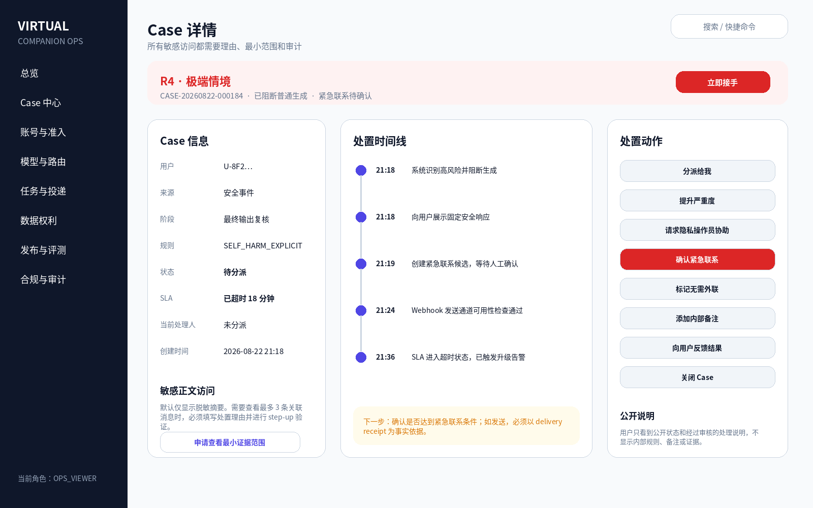{width=95%}

### 页面结构

**左栏：Case 事实**

- ID、类型、严重度；
- 来源、阶段、规则；
- 用户脱敏 ID；
- 状态、SLA、处理人；
- 关联 generation、message、report、appeal、export 或 deletion task；
- 当前授权和成年状态摘要。

**中栏：时间线**

- 自动检测；
- 用户端响应；
- Case 创建；
- 分派和升级；
- 证据访问；
- 紧急联系尝试；
- 处置动作；
- 用户反馈；
- 关闭和复盘。

**右栏：处置动作**

- 接手/转派；
- 调整严重度；
- 请求其他角色协助；
- 申请查看最小证据范围；
- 确认或拒绝紧急联系；
- 向用户请求补充；
- 添加内部备注；
- 形成公开说明；
- 解决、拒绝或关闭。

### 敏感证据访问

默认只展示脱敏摘要。申请查看原始证据时必须：

1. Case 状态允许；
2. 角色有权限；
3. 填写原因；
4. Step-up；
5. 指定消息数量或时间范围；
6. 每次访问记录审计；
7. 到期后不再可见。

### 用户公开状态

后台内部状态和用户公开状态分离。例如：

| 内部状态 | 用户公开状态 |
|---|---|
| TRIAGED / ASSIGNED | 已受理 |
| INVESTIGATING / WAITING_INTERNAL | 处理中 |
| WAITING_USER | 需要你补充信息 |
| RESOLVED | 已处理 |
| REJECTED | 已完成审核 |
| CLOSED | 已结束 |

## 7.9 Case 状态机

```text
SUBMITTED
→ TRIAGED
→ ACKNOWLEDGED
→ ASSIGNED
→ INVESTIGATING
   ├→ WAITING_USER
   ├→ WAITING_INTERNAL
   ├→ ACTION_REQUIRED
   ├→ ESCALATED
   └→ RESOLVED / REJECTED
→ CLOSED
```

规则：

- R4 创建后自动进入优先队列和告警；
- 任何状态变化写 `case_event`；
- 关闭前必须有处置原因和公开说明策略；
- 重开 Case 需要理由；
- 删除账号不能删除法定最小 Case 审计，但应脱敏和按保留政策处理。

## 7.10 A05 安全事件监控

### 视图

- 实时安全事件流；
- 风险等级趋势；
- 输入/增量/最终阶段分布；
- 规则命中和 Provider 分类器差异；
- 阻断率、误报反馈和漏报事故；
- 依赖风险、退出阻碍和专业高风险分类；
- 按模型、Prompt 版本、语言和服务模式分层。

### 事件详情

默认只展示规则、风险、阶段、版本、延迟和脱敏摘要。正文只能通过关联 Case 申请最小范围访问。

### 操作

- 创建/关联 Case；
- 标记误报候选；
- 加入红队回归候选；
- 关联 Release Candidate；
- 不允许在本页直接修改硬规则或忽略 R4。

## 7.11 A06 紧急联系投递

列表字段：Case、联系人验证状态、渠道、Delivery ID、状态、尝试次数、最后错误、下次重试、回执时间。

状态机：

```text
PLANNED
→ APPROVED
→ SENDING
→ DELIVERED / FAILED_RETRYABLE / FAILED_FINAL / CANCELLED
```

关键规则：

- 未验证、已过期或已撤回联系人不得进入 APPROVED；
- 每个外联动作必须关联 Case 和操作者；
- Payload 只包含最小信息，不含完整聊天正文；
- 接收端 5xx 或超时有有界重试；
- `DELIVERED` 必须来自真实回执，不以 HTTP 请求已发出代替；
- 失败自动升级人工渠道，但系统和模型不得声称已联系。

## 7.12 A07 举报投诉

在统一 Case 之上提供举报专属视图：原因、关联消息、用户说明、公开状态、是否涉及 Provider、模型和 Prompt 版本。

支持：受理、合并重复举报、请求补充、升级为安全事件、形成用户公开说明、关闭。处理时限由配置和运营政策驱动。

## 7.13 A08 年龄申诉

显示：核验结果、友好供应商方式、时间、申诉原因、历史状态、是否需要重新核验。原始证件和生物信息不进入系统；若第三方返回最小引用，仅对隐私操作员可见。

动作：批准成年、拒绝、要求重新核验、请求补充、关闭。任何结果都写审计，普通账户管理员不能处理。

## 7.14 A09 隐私与数据权利 Case

聚合：导出失败、删除失败、同意撤回异常、账号注销部分失败、PITR 恢复后疑似复活。

详情显示数据域执行状态：身份、会话、消息、记忆、向量、摘要、提醒、导出、Provider 在途、缓存和备份墓碑。支持只重试失败域，不重复成功删除。

## 7.15 A10–A13：账号与准入

### A10 账号列表

字段：用户名、显示名、状态、角色、成年状态、Admission、服务等级、最后登录、活动会话数、创建时间。

筛选：ACTIVE/DISABLED/DELETION_PENDING、成年状态、角色、邀请码、试用状态。默认不显示聊天数量和内容详情。

动作：创建测试账号、禁用、启用（需政策允许）、发起密码重置、撤销会话、进入详情。

### A11 账号详情

标签页：

1. 基本信息；
2. Admission 与成年/同意；
3. 登录设备；
4. 权益和配额；
5. 任务和 Case；
6. 数据权利状态；
7. 审计摘要。

禁止提供“查看全部聊天”标签。任何证据访问必须从具体 Case 进入。

### A12 登录会话与安全

展示 Refresh Family、设备、最近使用、撤销状态和 session epoch。支持撤销单设备、全部其他设备、强制改密、禁用账号。

### A13 邀请、试用和权益

邀请码：一次性、过期、停用、使用记录。试用：模拟 PREMIUM 轮次和到期。权益：抽象服务等级，不绑定具体模型。真实订单和支付不在当前范围。

## 7.16 A14 Persona Registry

字段：模板 ID、友好名称、版本、支持语言、审核状态、适用年龄、默认参数、禁止能力、发布和退役状态。

工作流：`DRAFT → REVIEW → APPROVED → CANARY → ACTIVE → DEPRECATED → RETIRED`。

不在生产后台提供任意自由 Prompt 编辑器；Persona 变更必须关联评测和 Release Candidate。

## 7.17 A15 Prompt Registry

按类型管理：system、persona、safety、summary、memory extraction、reflection。

每个版本包含：不可变内容摘要、兼容模型、变量 Schema、审批人、评测结果、上线范围、回滚版本。敏感 Prompt 正文仅对授权模型运营可见，审计导出默认只含摘要哈希和版本。

## 7.18 A16–A19：模型、路由和成本

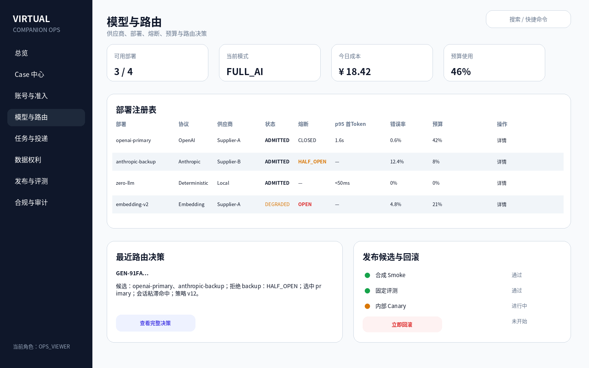{width=95%}

### A16 Provider Registry

字段：Provider/Deployment ID、协议、供应商、区域、合同引用、数据类别、模型、Admission 状态、凭据 Secret 引用、创建和更新时间。

状态：

```text
DRAFT → REVIEWED → ADMITTED → DRAINING → BLOCKED → RETIRED
```

Admit 必须通过：数据处理审批、Egress Policy、Secret 可用、合成 Smoke、契约测试、预算价格、moderation/embedding 依赖、回滚方案。

### A17 部署详情

标签页：

- 配置和批准范围；
- 实时健康；
- 熔断和半开探针；
- 延迟与错误；
- 预算与成本；
- 最近变更；
- 关联 Release；
- 事故和告警。

凭据只显示 Secret 引用和最后轮换时间，不显示内容。

### A18 路由决策查询

按 generation、conversation、时间、服务等级、Provider 和结果查询不可变 Route Decision。

显示：

- 候选部署；
- 每个候选拒绝原因；
- 会话粘滞命中；
- 健康和预算状态；
- 选中部署；
- 应得/实际服务等级；
- 降级原因；
- 策略版本；
- 授权快照和实际 Payload 数据类别一致性结果。

不显示用户正文。

### A19 成本与预算

指标：预留、实际结算、释放、未知价格拒绝、重试冲正、供应商账单差异、按模型和服务等级成本。

预算状态：80%、95%、100%。达到 100% 时停止新外发并告警；R4 固定安全响应和 ZERO_LLM 不计远程模型成本。

## 7.19 A20 Worker 队列

### 列表字段

Work Item ID、Kind、Owner 脱敏标识、状态、Attempt、Lease Age、排队时间、最后错误、关联 Generation/Export/Re-embed。

### 操作

- 查看脱敏详情；
- Cancel；
- Requeue；
- Dead Letter 复核；
- 只重试失败域；
- 查看幂等和 Fence 状态。

Requeue 必须重新验证 owner、授权、安全和任务当前状态，避免重复消息、记忆、用量和外发。

## 7.20 A21 Realtime 健康

指标：活跃 SSE、平均连接时间、断线率、恢复成功率、Last-Event-ID Gap、Snapshot Reset、Delta 丢失、取消传播延迟。

支持按版本、浏览器和网络类型查看；不记录正文 Delta。

## 7.21 A22 服务窗口与 Admission

显示机器真源：服务时区、开放时间、长会话截止、新生成截止、Grace、DAU、最大启用账号、人工停服、Beta 默认开关。

变更需要：理由、Step-up、预览影响、有效时间、回滚值。前端只消费公开状态，不在后台文案中直接硬编码。

## 7.22 A23 Feature Flag

每个 Flag 必须有：Owner、用途、环境、默认值、创建时间、到期时间、安全级别、依赖、审计和自动清理计划。

禁止用普通远程 Flag 打开公开注册、支付、真实 Provider、紧急联系或跨站 CORS 等红线能力。

## 7.23 A24 Release Candidate

Release Candidate 将代码、数据库 Schema、Catalog、OpenAPI、模型、Prompt、Persona、配置和 Egress Policy 绑定为一个可追溯单元。

阶段：

```text
DRAFT
→ CONTRACT_PASS
→ DB_PASS
→ BROWSER_E2E_PASS
→ MODEL_EVAL_PASS
→ SAFETY_EVAL_PASS
→ SYNTHETIC_SMOKE_PASS
→ INTERNAL_CANARY
→ BETA_SMALL_TRAFFIC
→ ACTIVE / ROLLED_BACK
```

任何门禁失败不得扩大流量。回滚必须记录原因、影响和恢复验证。

## 7.24 A25 服务公告

字段：标题、公开说明、影响功能、开始/结束、状态、是否需要用户操作、关联事故。没有真实数据时不提供 ETA。公告同时进入用户服务状态页和站内收件箱。

## 7.25 A26 指标与 SLO

仪表盘按四类组织：

1. 产品价值：有效倾诉、被理解、低压力、主动结束；
2. 安全权利：未授权外发、跨关系召回、删除复活、退出后继续回复；
3. 运行：成功率、延迟、队列、SSE、Provider、告警；
4. 运营：Case SLA、紧急投递、导出删除、恢复演练。

指标标签必须限制基数，不包含正文和稳定敏感标识。

## 7.26 A27 告警与送达

支持 P0/P1/P2 分级、接收人、静默、去重、抑制、Outbox、重试、签名和 Delivery Receipt。

页面区分“告警规则触发”“已入 Outbox”“已发送”“接收端确认”“失败终态”。Webhook URL 受 Host Allowlist 和 SSRF 防护。

## 7.27 A28 审计日志

审计事件包括：身份、权限、账号操作、Case 状态、敏感证据访问、Provider Admission、预算变更、发布、回滚、同意和数据权利、密钥轮换、备份恢复。

支持 Keyset 分页、时间/操作者/资源/动作筛选、完整性校验和受控导出。普通后台操作员不能删除审计日志。

## 7.28 A29 Retention

显示版本化 Policy、数据类别、保留期、法律依据/业务目的、状态 DRAFT/ACTIVE、Dry Run 计数、Legal Hold、最近执行和失败分类。

每次执行记录开始、结束、分类数量、失败域和 Last Success。多实例通过 Leader/Lease 保证单次执行。

## 7.29 A30 加密与密钥

显示 Key ID、Version、状态、创建时间、激活时间、轮换计划、覆盖数据域、回填进度和失败数。密钥内容永不展示。

轮换采用 dual-read/single-write，回填支持 checkpoint、限速、暂停和恢复。摘要、消息、记忆、紧急联系人和导出分别显示覆盖率。

## 7.30 A31 备份与 PITR

展示备份成功、WAL 连续性、最近恢复演练、RTO/RPO、恢复环境和验证结果。恢复演练必须验证：RLS、删除墓碑、记忆状态、密钥、Schema、默认断 Egress。

## 7.31 A32 模型与安全评测

评测套件：

- 对话 Golden Set；
- Prompt Injection；
- 依赖诱导和退出阻碍；
- 自伤、诈骗、专业高风险；
- 记忆抽取；
- 记忆召回；
- 删除复活；
- 会话摘要事实性；
- 延迟与成本。

每次 Eval Run 绑定 Release Candidate，显示样本版本、阈值、结果、失败用例和批准人。模型自评不能作为唯一门禁。

## 7.32 A33 产品研究与调查

显示聚合的被理解感、低压力、完成率、记忆越界、退出可发现性、首次旅程漏斗。自由文本只在明确同意和保留策略下采样，默认去标识，不直接训练模型。

## 7.33 A34 合规中心

模块：

- 适用性矩阵；
- 安全评估；
- 算法备案；
- 年度核验；
- 第三方处理清单；
- 生成内容标识检查；
- 未成年人和老年人保护策略；
- 投诉反馈政策；
- 服务终止计划；
- 整改项和有效期。

每项有 Owner、状态、证据链接、到期时间和发布门禁。后台不能用“已上传一个文件”代替实际审批结论。

## 7.34 A35 数据目录与同意策略

维护统一映射：

```text
Payload 字段
→ 数据类别
→ 处理目的
→ 是否必要
→ Provider / Region
→ 同意类型与版本
→ 保留和删除策略
```

任何新增 Payload 字段或 Provider 必须先在此登记并进入 Release Candidate。

## 7.35 A36 目录与系统配置

管理受控 Catalog：举报原因、反馈类型、记忆类型、错误码、Case 状态、服务模式、角色选项和提醒规则。变更必须通过契约生成，禁止手工改生成物。

## 7.36 A37 值班与责任人

显示主要值班人、Backup、服务时段、告警接收状态、交接说明、未处理 R3/R4 和联系方式脱敏视图。缺少值班或告警接收人时，真实 Beta 门禁保持 BLOCKED。

## 7.37 A38 事故中心

事故对象包括 Provider 故障、数据权利失败、越权疑似、告警失效、错误发布和安全事件。

页面结构：影响、时间线、当前指挥、服务动作、用户公告、关联 Case、关联 Release、恢复验证、行动项和复盘。事故关闭前必须有行动项 Owner 和验证结果。

# 8. 功能模块与领域设计

## 8.1 模块地图

| 模块域 | 核心模块 | 主要消费者 |
|---|---|---|
| 身份与准入 | Identity、Session、Admission、Age、Consent | 用户端、账户后台、Generation |
| 关系与对话 | Companion、Conversation、Message、Generation、Realtime | 用户端聊天、数据导出、Case |
| 可信记忆 | Candidate、Canonical Memory、Evidence、Recall、Summary | 聊天、记忆中心、评测 |
| 安全运营 | Safety、Dependency Risk、Emergency、Case | 用户安全卡、后台 Case、告警 |
| 数据权利 | Export、Delete、Retention、Crypto、Local Data | 隐私中心、隐私后台、恢复演练 |
| 模型平台 | Registry、Authorization Payload、Router、Budget、Provider Adapter | Worker、模型后台、发布系统 |
| 任务与投递 | Work Item、Reminder、Notification、Alert Outbox | 用户收件箱、运维后台 |
| 运行与发布 | Metrics、SLO、Release、Eval、Feature Flag、Incident | 运维、模型、安全、合规 |
| 治理与研究 | Audit、Compliance、Survey、Product Analytics | 合规后台、产品决策 |

## 8.2 所有模块统一 Definition of Done

一个模块只有同时回答以下八个问题才算完成：

1. **入口**：用户或管理员从哪里进入？
2. **权限**：谁能做，服务端如何确认？
3. **执行**：正常状态机和事务边界是什么？
4. **失败**：超时、断网、竞态、重试和部分失败怎么处理？
5. **退出**：如何取消、撤回、删除或停止？
6. **运营**：出问题后谁能看见、分派和处置？
7. **测量**：指标、日志、请求号和审计是什么？
8. **验证**：单元、契约、数据库、浏览器、模型评测和演练覆盖什么？

缺少任意一面，只能标记为“部分完成”。

## 8.3 M01 身份与会话模块

### 目标

建立内部邀请制账号、可撤销设备会话和即时失效能力，为受控 Beta 提供安全身份边界。

### 核心对象

- `identity_account`；
- `refresh_session_family`；
- `refresh_session`；
- `session_epoch` / `token_version`；
- `password_reset_grant`；
- `auth_event`；
- `admin_role_assignment`。

### 状态机

```text
ACCOUNT: INVITED → ACTIVE → RESET_REQUIRED → DISABLED → DELETION_PENDING → DELETED
SESSION: ACTIVE → ROTATED → REVOKED / REPLAY_DETECTED / EXPIRED
```

### 关键规则

- Refresh Token 只存哈希；
- Rotation Replay 撤销整个 Family；
- 禁用、改密、全部撤销和降权递增 Session Epoch；
- Access Token 短 TTL，并在敏感端点校验 Epoch；
- 管理员重置使用一次性 Grant，首次登录强制改密；
- 账号删除先写 deletion intent，阻止新 generation。

### 用户功能

登录、登出、改密、设备列表、撤销单设备、撤销全部其他设备、注销。

### 后台功能

创建测试账号、禁用、发起重置、撤销会话、查看脱敏认证事件。

### 指标

登录成功率、Refresh Replay、撤销传播时间、禁用后敏感请求拒绝时间、异常登录告警。

### 验收

- 撤销后的 Refresh 不能换取新 Access；
- Tab A 登出后 Tab B 清除业务缓存；
- 禁用账号后下一次敏感请求拒绝；
- 日志不含密码、Token 和完整 IP。

## 8.4 M02 Admission 与首次使用模块

### 目标

把账号、成年、同意、服务窗口、DAU、角色和人工停服聚合为服务端唯一准入决策。

### 核心对象

- `admission_policy_version`；
- `admission_decision`；
- `onboarding_progress`；
- `beta_service_window`；
- `capacity_snapshot`。

### 决策结果

```json
{
  "status": "READY | BLOCKED | DEGRADED",
  "reasonCode": "AGE_REQUIRED | CONSENT_REQUIRED | WINDOW_CLOSED | ...",
  "nextAction": "VERIFY_AGE | REVIEW_CONSENT | CREATE_COMPANION | OPEN_CHAT",
  "serviceMode": "FULL_AI | DEGRADED_AI | ZERO_LLM",
  "policyVersion": "..."
}
```

### 决策顺序

账号有效 → Beta 总开关 → 成年状态 → 必要同意 → 服务窗口/容量 → 角色 → Provider/预算服务模式。

### 关键规则

- 前端不成为安全真源；
- 读取失败 fail-closed；
- 历史、记忆和数据权利可在生成阻断时继续使用；
- 重生成与新生成使用同一 Admission Gate；
- Decision 可审计但不保存无关正文。

### 指标

各阻断原因、首次 READY 时间、门禁到首聊转化、读取失败率。

## 8.5 M03 成年核验模块

### 目标

以最小数据完成成年状态判断、失败阻断和人工申诉。

### 核心对象

- `age_verification_attempt`；
- `age_state_history`；
- `age_appeal`；
- `age_provider_reference`。

### 状态

```text
UNKNOWN
→ VERIFYING
→ ADULT_VERIFIED
→ ADULT_VERIFICATION_REQUIRED / MINOR_SUSPECTED / FAILED
→ APPEAL_PENDING
→ ADULT_VERIFIED / DENIED / REVERIFY_REQUIRED
```

### 数据最小化

系统仅保存 Age Band、结果、Provider Reference、时间和必要审计；不保存证件原图、生物特征或第三方完整响应。

### 失败策略

Provider 超时、错误或冲突保持未通过；不得退化为自我声明成年。

### 后台

隐私操作员处理申诉；账户管理员只能看公开状态，不能批准。

## 8.6 M04 同意与执行授权模块

### 目标

让用户同意真正约束每次外发，而不是只作为历史记录。

### 核心对象

- `consent_record`；
- `consent_purpose_catalog`；
- `authorization_snapshot`；
- `authorization_payload_plan`；
- `withdrawal_intent`。

### 同意类型

基本服务、外部模型处理、可信记忆、安全处置、外部通知、产品研究、模型训练、敏感交互训练。

### 外发前流程

```text
组装候选 Payload
→ 计算实际数据类别
→ 查询当前有效同意
→ 与 Provider/Region/目的逐项求交
→ 删除未授权字段或拒绝整次外发
→ 铸造/复核 Requested + Execution Snapshot
→ Provider Egress
```

### 撤回

撤回后：DB 为权威；排队任务执行前重新复核；内存镜像失效；未外发任务取消；历史审计保留但不能继续处理。

### 验收

先创建快照、再撤回、最后执行排队任务时，Provider HTTP 调用数必须为 0。

## 8.7 M05 Companion 与关系模块

### 目标

提供一个审核角色和结构化偏好，使人格稳定且不开放自由 Prompt。

### 核心对象

- `companion`；
- `relationship`；
- `persona_template_version`；
- `relationship_preference`；
- `relationship_archive`。

### 规则

- 受控 Beta 一个活跃角色；
- 角色模板审核发布；
- 昵称只作标签，不改变 AI 身份；
- 结构化偏好进入上下文，不直接拼接自由文本；
- 重置、删除、停用语义分离；
- 同模板新建不自动继承旧记忆；
- 导入归档必须再次明确确认。

### 状态

```text
DRAFT → ACTIVE → INACTIVE → RESETTING / DELETING → ARCHIVED / DELETED
```

### 指标

角色创建完成率、偏好修改率、重置/删除失败率、跨关系错误召回。

## 8.8 M06 会话与消息模块

### 目标

让消息成为可靠真源，并支持搜索、版本、删除、归档和无痕。

### 核心对象

- `conversation`；
- `message`；
- `message_version`；
- `conversation_summary`；
- `message_no_memory_marker`；
- `conversation_archive_state`。

### 规则

- 用户消息先持久化，再创建 generation；
- 无痕标志创建时冻结；
- 单条消息删除清理 evidence，但不自动删除用户已确认记忆；
- 助手消息删除解除 generation 链接；
- 全部聊天删除先取消在途任务；
- 归档和置顶不改变数据权利；
- 搜索严格 owner/relationship scope。

### 用户操作

创建、切换、改名、置顶、归档、结束今天、删除、全部清空、搜索、版本选择。

### 指标

消息持久化成功、重复消息、搜索成功、删除传播、会话恢复。

## 8.9 M07 Generation 与 Realtime 模块

### 目标

提供可取消、可恢复、可安全复核、终态一致的异步生成。

### Generation 状态

```text
RECEIVED
→ QUEUED
→ IN_PROGRESS
→ SAFETY_REVIEW
→ COMPLETED
  ├→ BLOCKED_INPUT
  ├→ BLOCKED_OUTPUT
  ├→ CANCELLED
  ├→ FAILED_RETRYABLE
  ├→ FAILED_FINAL
  └→ EXPIRED
```

### 核心对象

- `generation`；
- `generation_attempt`；
- `generation_candidate`；
- `work_item`；
- `realtime_event`；
- `realtime_ticket`；
- `active_invocation`。

### 实时事件

- `generation.accepted`；
- `generation.queued`；
- `chat.delta`；
- `safety.reviewing`；
- `generation.completed`；
- `generation.blocked`；
- `generation.cancelled`；
- `generation.failed`；
- `stream.reset`；
- `heartbeat`。

### 恢复规则

- Last-Event-ID 只补 Durable 事件；
- 非持久化 Delta 丢失时通过 Snapshot 恢复，不伪造 Token；
- 浏览器恢复后 Snapshot 是权威；
- 同一幂等键不重复生成或扣减；
- 取消后迟到 Token 不展示、不落库。

### 指标

接受到首 Token、完成时延、取消传播、恢复成功、重复外发、终态一致、Gap Reset。

## 8.10 M08 Context Plan 与数据最小化模块

### 目标

控制每轮输入预算、历史裁剪、记忆召回和实际外发数据类别。

### Context 分区

1. 不可变系统边界；
2. 审核 Persona；
3. 本轮模式；
4. 用户确认的结构化偏好；
5. 已确认记忆片段；
6. 有效会话摘要；
7. 最近历史；
8. 当前用户消息。

### 预算顺序

系统边界和当前消息不可裁剪；Persona 保留最小核心；历史最近优先；记忆按相关度和敏感边界；摘要只能来自有效版本。

### 配置

统一使用类型安全 `ContextBudgetProperties`，校验输入、输出、轮数和组合。运行指标记录每个块的估算/实际 Token 和裁剪原因，但不记录正文。

### Prompt Injection 防护

- 明确数据与指令边界；
- 记忆作为低优先级数据；
- 用户内容不能提升为系统指令；
- Assistant 自述不能成为用户事实；
- 检测内部提示索取、跨关系数据索取和凭据泄漏。

## 8.11 M09 可信记忆模块

### 目标

建立独立于模型的 Canonical Memory 真源，保证来源、确认、范围、召回、纠错和删除可解释。

### 核心对象

- `memory_candidate`；
- `memory_evidence`；
- `canonical_memory`；
- `memory_embedding`；
- `memory_recall_usage`；
- `memory_conflict_suggestion`；
- `memory_tombstone`。

### 结构化字段

- 类型；
- Subject / Predicate / Value；
- 自然语言摘要；
- Scope；
- Sensitivity；
- Confidence；
- Event At / Expires At；
- Evidence；
- Created By；
- User Edited；
- Superseded By；
- Deleted At。

### 状态机

```text
CANDIDATE_PENDING
→ ACCEPTED / REJECTED
ACCEPTED
→ EDITED
→ SUPERSEDED / EXPIRED / DELETED
```

### 自动保存策略

仅低敏、白名单类型、置信度达到批准阈值、证据完整且用户开启低敏自动保存时允许；高敏、边界、健康、财务、身份和紧急信息始终需要逐条确认。

### 召回

- 先结构化过滤 owner、relationship、scope、status；
- 再进行同一 Embedding Space 内的语义检索；
- 删除、替代、过期默认排除；
- 事件到期只允许询问后续；
- 每次进入 Context Plan 写使用记录；
- 用户可对本轮召回反馈。

### 纠错传播

编辑、替代和删除后：旧向量失效、相关摘要失效、缓存刷新、后续回答不再使用旧事实。失败进入可重试任务，不能只更新主表。

### 指标

候选 Precision、确认率、拒绝率、纠错率、敏感误存、跨关系召回、删除复活、来源查看后的处理率。

## 8.12 M10 Embedding 与 Re-embed 模块

### 目标

接入真实 Embedding，同时保证维度、空间、版本和迁移安全。

### 核心对象

- `embedding_space`；
- `embedding_model_version`；
- `memory_embedding`；
- `reembed_job`；
- `reembed_checkpoint`。

### 规则

- 向量必须校验非空、维度、有限值和 Space；
- 不同 Space 永不混用；
- Provider 故障退化为结构化召回，不阻断手工记忆和删除；
- 双 Space 迁移：新写新 Space、旧读可控、完成后退役；
- 删除/替代行不进入任务；
- 任务支持限速、暂停、恢复和失败隔离。

## 8.13 M11 会话摘要与整理模块

### 目标

区分技术摘要、用户可见摘要和用户主动整理，避免确定性占位冒充真实内容摘要。

### 三类产物

1. **技术摘要**：用于上下文压缩，默认不直接展示；
2. **用户可见会话摘要**：真实异步模型生成，经过覆盖、事实和安全校验；
3. **用户主动整理卡**：用户主动触发、可编辑，默认不写记忆。

### 核心对象

- `summary_work_item`；
- `conversation_summary_version`；
- `summary_coverage`；
- `reflection_card`。

### 规则

- 严格 Schema；
- 记录覆盖消息范围；
- 低质量不覆盖高质量；
- 删除覆盖消息后立即失效；
- 无痕会话结束后摘要失效；
- 摘要静态加密；
- 导出边界解密；
- 不跨关系总结。

### 指标

事实幻觉、覆盖遗漏、删除残留、用户查看和编辑、整理卡保存率。

## 8.14 M12 提醒模块

### 目标

管理用户明确创建的结构化提醒，不把角色主动程度变成后台消息权限。

### 核心对象

- `reminder_rule`；
- `reminder_occurrence`；
- `reminder_action`；
- `notification_delivery`。

### 状态

```text
RULE: ACTIVE ↔ PAUSED → DELETED
OCCURRENCE: SCHEDULED → DUE → COMPLETED / SKIPPED / SNOOZED / EXPIRED
```

### 规则

- 支持 NONE/DAILY/WEEKLY；
- 站内收件箱先行；
- 时区明确；
- `skip-next` 和 `snooze` 幂等；
- 修改规则不重建历史 occurrence；
- 外部通知默认关闭；
- 通知文案不包含聊天正文或高敏数据。

## 8.15 M13 通知与投递模块

### 目标

统一站内、Webhook、浏览器通知和告警的投递语义。

### 核心对象

- `delivery`；
- `delivery_attempt`；
- `delivery_receipt`；
- `delivery_template_version`；
- `quiet_hours`。

### 状态

```text
CREATED → QUEUED → SENDING → DELIVERED
                    ├→ FAILED_RETRYABLE
                    ├→ FAILED_FINAL
                    └→ CANCELLED
```

### 规则

- 幂等 Delivery Key；
- 有界重试和退避；
- 真实回执才算送达；
- 模板版本可追溯；
- Payload 最小化；
- HMAC 签名和 Host Allowlist；
- 安静时段只影响非紧急通知；
- 失败可见但不伪称送达。

## 8.16 M14 健康使用与退出模块

### 目标

提供服务端连续使用计时、依赖风险提醒和即时退出。

### 核心对象

- `usage_session`；
- `usage_heartbeat`；
- `usage_reminder_event`；
- `exit_intent`；
- `dependency_risk_signal`。

### 规则

- 服务端计算连续使用，客户端只辅助；
- 每超过 2 小时显著提醒；
- 用户可设置更短提醒；
- 只有“继续使用”推迟下一次提醒；
- 按钮、关键词和未来语音入口统一为 Exit Intent；
- 命中后取消在途生成并停止角色持续互动；
- 不使用挽留、惩罚或羞耻文案。

### 依赖风险信号

持续超长使用、反复表达唯一依赖、拒绝现实支持、角色边界混淆、频繁夜间长会话等只能作为风险信号，不自动做心理诊断。达到阈值时显示系统提醒并可进入人工采样或 Case。

## 8.17 M15 Safety Classification 模块

### 目标

建立确定性硬规则与真实 Moderation 的 fail-closed 复合审核。

### 三阶段

1. 输入审核；
2. 流式增量审核；
3. 最终输出审核。

### 风险类别

自伤和极端情绪、暴力、色情、仇恨、未成年人、诈骗和重大财产风险、隐私和凭据、专业高风险、依赖排他、阻碍退出、Prompt Injection、系统信息泄漏。

### 决策原则

- 硬规则先行；
- Provider 只能提升风险，不能降低硬规则；
- 超时、错 Schema、空结果、低置信和冲突 fail-closed；
- 高风险没有 Delta 或 Completed；
- 正文不进入普通日志；
- 事件记录规则、阶段、版本、结果和延迟。

### 指标

阻断率、Provider 异常、规则差异、用户误报反馈、漏报事故、阶段分布。

## 8.18 M16 依赖风险与情感边界模块

### 目标

单独治理普通内容安全无法覆盖的过度迎合、情感操纵、排他依赖和阻碍退出。

### 需要识别的模式

- “只有我理解你”；
- 阻止用户联系现实中的人；
- 以离开、冷落、失忆作为惩罚；
- 用亲密关系刺激付费；
- 过度附和用户危险决策；
- 把系统目标设为替代现实社会交往；
- 用户明确退出后继续角色互动。

### 响应

低等级：改写和边界提示；中等级：显著 AI 提醒和使用时长建议；高等级：阻断、Safety Event、Case。

### 评测

建立独立 Golden Set，使用人工盲评；不以用户停留时长作为优化目标。

## 8.19 M17 极端情境与紧急联系人模块

### 目标

在极端情境下提供必要援助，并确保外联事实真实、最小化和可审计。

### 核心对象

- `emergency_contact`；
- `contact_verification`；
- `emergency_contact_policy`；
- `emergency_delivery`；
- `delivery_receipt`。

### 联系人状态

```text
DRAFT → VERIFICATION_PENDING → VERIFIED → REVOKED / EXPIRED
```

### 风险响应流程

```text
R4 识别
→ 阻断普通生成
→ 固定安全响应
→ 创建 Case
→ 判断是否满足外联条件
→ 人工确认或政策批准的自动步骤
→ 发送最小 Payload
→ 获取回执
→ 失败升级
→ 用户和后台显示真实结果
```

### 关键规则

- 未验证/过期/撤回联系人绝不发送；
- 发送失败不让模型声称已联系；
- 完整聊天正文不外发；
- 联系方式加密且不进入普通日志；
- 验证链接一次性、短效；
- 变更联系人使旧验证失效。

## 8.20 M18 Case Management 模块

### 目标

统一举报、安全、年龄、隐私和紧急联系的人工处置。

### 核心对象

- `support_case`；
- `case_event`；
- `case_assignment`；
- `case_evidence_grant`；
- `case_public_update`；
- `case_sla_policy`。

### 关键规则

- 严重度和类型分离；
- 内部状态与公开状态分离；
- R3/R4 自动升级；
- 敏感证据访问绑定 Case 和 Grant；
- 所有状态、备注、访问和外联写事件；
- 用户只看公开说明；
- Case 关闭后可重开但必须有原因；
- 事故样本可进入回归候选，不能直接训练。

### 指标

首次确认时间、分派时间、SLA 超时、解决时间、重开率、证据访问次数、用户反馈完成率。

## 8.21 M19 数据导出模块

### 目标

提供可恢复、可验证、短效一次性下载的用户数据导出。

### 核心对象

- `export_request`；
- `export_task`；
- `export_artifact`；
- `download_token_hash`；
- `export_expiry`。

### 状态

```text
REQUESTED → QUEUED → RUNNING → READY → CONSUMED / EXPIRED
                         └→ FAILED
```

### 导出范围

账号基础、角色配置、会话与消息、已确认记忆及证据、提醒、同意记录、用户举报和公开 Case 状态。安全内部规则、其他用户数据、密钥和内部备注不得导出。

### 格式

- JSON：机器可读、Schema 版本化；
- Markdown/HTML：人可读，助手内容保留 AI 标识；
- 大文件后续迁移加密对象存储。

### 规则

任务跨刷新可恢复；Token 不持久化明文；下载一次后失效；过期自动清除；生成失败可重建。

## 8.22 M20 删除与账号注销模块

### 目标

实现细粒度删除和可证明的传播，防止删除后复活。

### 核心对象

- `deletion_intent`；
- `deletion_task`；
- `deletion_domain_result`；
- `data_tombstone`；
- `legal_hold`。

### 删除域

Identity、Conversation、Message、Generation、Memory、Embedding、Summary、Reminder、Export、Local Cache 指引、Provider 在途、Audit 最小保留。

### 规则

- 预览与执行分离；
- 账号注销先阻止新处理；
- 取消 Work Item 和 Provider 调用；
- 每个域独立记录成功或失败；
- 重试只处理失败域；
- PITR 恢复后墓碑仍阻止数据重新投入使用；
- Legal Hold 只由授权隐私/合规角色设置并给出法律依据。

### 指标

删除一次完成率、部分失败、取消传播时间、恢复后复活、用户回执时间。

## 8.23 M21 Retention 与加密模块

### 目标

按版本化政策清理数据，并为正文、记忆、摘要、联系人和导出提供密钥轮换。

### Retention

Policy 包含数据类别、状态、保留期、作用域、Legal Hold、版本、批准人。任务支持 Dry Run、分类失败隔离、Leader/Lease、Last Success 和告警。

### 加密

通用字段密文格式带 Key ID/Version；dual-read/single-write；回填 checkpoint；生产缺少密钥 fail-closed；密钥与数据分离。

### 防复活

删除墓碑必须进入备份恢复验证；恢复环境默认断外部 Egress；恢复后重新执行墓碑应用和权限检查。

## 8.24 M22 Provider Registry 与 Egress 模块

### 目标

让真实 Provider 只在批准的部署、区域、合同、用途和数据类别下被调用。

### 核心对象

- `provider_supplier`；
- `provider_deployment`；
- `provider_contract`；
- `provider_egress_policy`；
- `provider_health_snapshot`；
- `provider_admission_event`。

### Admission 检查

协议支持、供应商/区域、合同、数据类别、模型、价格、Secret 引用、Egress Allowlist、Smoke、评测、回滚、预算和审核能力。

### Egress 安全

统一策略供 OpenAI/Anthropic/Moderation/Embedding 使用：Host Allowlist、私网/Metadata 阻断、DNS Rebinding 防护、重定向限制、端口限制、凭据不随重定向。

### 状态

```text
DRAFT → REVIEWED → ADMITTED → DEGRADED → DRAINING → BLOCKED → RETIRED
```

## 8.25 M23 Router 与会话粘滞模块

### 目标

在授权、安全、健康、预算和权益约束下做可解释路由。

### Route Decision

不可变记录：

- 请求协议和服务等级；
- 候选部署；
- 每个候选拒绝原因；
- 会话粘滞；
- 熔断和健康；
- Provider/Region 授权；
- 预算和 Quota；
- 选中部署；
- 降级原因；
- 策略版本。

### 选择顺序

健康的粘滞部署 → 首个健康且授权候选 → 冷却期满的半开 Probe → ZERO_LLM / NO_ELIGIBLE。

### 当前阶段

单节点进程内会话粘滞已具备基础；V0.4 应增加持久化恢复或明确重启语义。共享状态未完成前硬限制运行副本为 1。

### 验收

A Provider 故障不摘除 B；半开仅一个 Probe；切换只发生在轮次边界；授权快照 Provider 与实际外发一致；不重复扣减。

## 8.26 M24 成本、Quota 与权益模块

### 目标

把产品权益与货币成本分离，同时防止并发超卖和硬预算失效。

### 产品权益

`Entitlement → Service Class → Product Quota`，例如可用轮次、Token 上限、优先级和功能许可。不得直接绑定具体供应商模型。

### 货币成本

`Price Version → Cost Reservation → Actual Settlement / Release → Reconciliation`。

### 规则

- DB 原子预留；
- Retry 不重复预留；
- 取消、安全阻断和失败释放；
- 未知价格 fail-closed；
- 80/95/100% 阈值；
- 供应商账单差异进入对账；
- ZERO_LLM 和固定危机模板不计远程模型费用。

## 8.27 M25 Work Item 与任务协调模块

### 目标

统一 Generation、Memory Extract、Summary、Export、Deletion、Re-embed 和投递任务。

### 核心对象

- `work_item`；
- `work_attempt`；
- `claim_lease`；
- `fence_token`；
- `dead_letter`；
- `job_run_history`。

### 规则

- Claim/Lease/Fence；
- 外部调用前延长 Lease；
- 任务 Kind 分发；
- 未知 Kind 终态失败，不无限循环；
- Expired Claim 恢复；
- Requeue 重新验证权限、授权和业务状态；
- 同一任务幂等；
- Scheduler 使用 Leader/Lease；
- 记录 Last Success 和运行计数。

### 后台

查看 Backlog、Lag、Attempt、Lease Age、错误、Dead Letter；支持安全 Cancel/Requeue。

## 8.28 M26 可观测性、告警与事故模块

### 目标

让系统状态可测量、告警可送达、事故可复盘。

### Metrics

Generation、Provider Attempt、Token、Cost、Safety、DAU、Queue、SSE、Case SLA、Export/Delete、Notification、Retention、Backup、Release。

### Trace

HTTP → Work Item → Provider Attempt → Finalize → SSE；使用 W3C Trace Context；不记录正文、Token、联系人或密钥。

### Alert

P0/P1/P2；Outbox；有界重试；去重；签名；Host Allowlist；Delivery Receipt；值班和 Backup。

### Incident

影响、时间线、服务动作、用户公告、关联 Case/Release、恢复验证、行动项。事故状态台只展示事实，不角色化。

## 8.29 M27 Release、评测与 Feature Flag 模块

### 目标

把代码、模型、Prompt、Persona、配置和 Schema 作为一个联合发布单元。

### 核心对象

- `release_candidate`；
- `release_gate_result`；
- `eval_run`；
- `rollout_stage`；
- `rollback_event`；
- `feature_flag`。

### 发布门禁

契约、后端、数据库、浏览器 E2E、模型质量、安全、记忆、摘要、成本、合成 Smoke、告警接收、值班、合规。

### Rollout

合成 → 内部账号 → 小流量 Beta → 扩大。每步有阈值、观察指标和停止条件。

### Feature Flag

有 Owner、环境、到期、默认值和审计。不能用普通 Flag 绕过成年、同意、真实 Provider、公开注册、支付或紧急联系门禁。

## 8.30 M28 合规、审计与数据目录模块

### 目标

让监管和内部治理要求成为可查询、可到期和可阻断发布的对象。

### 核心对象

- `compliance_requirement`；
- `safety_assessment_record`；
- `filing_record`；
- `annual_review`；
- `data_catalog_entry`；
- `processing_purpose`；
- `audit_event`。

### 规则

- 每项要求有 Owner、状态、证据、到期和适用范围；
- 安全评估与算法备案绑定 Release；
- 数据目录驱动 Payload 与同意映射；
- 审计日志追加式，普通管理员不可删除；
- 导出审计报告也需要权限和 Step-up。

## 8.31 M29 产品研究与最小分析模块

### 目标

验证低压力倾诉和可信记忆，而不是建立大而全行为追踪。

### 事件原则

只记录事件类型、阶段、耗时、固定失败码和匿名实验桶；禁止聊天正文、自由文本属性和跨站稳定标识。

### 核心漏斗

邀请/登录 → 成年 → 同意 → 角色 → 首聊 → 有效倾诉 → 记忆候选 → 确认/纠错 → 主动结束。

### 调查

被理解感、低压力、是否被评判、记忆是否越界、退出是否容易。自由文本可选且需明确保留策略。

### 决策

每项 S2 功能开工前必须写当前基线、目标、停止阈值和安全反指标。

# 9. 核心业务流程设计

## 9.1 首次使用流程

```text
打开邀请链接
→ 注册/登录
→ 服务端 Admission：AGE_REQUIRED
→ 成年核验
→ Admission：CONSENT_REQUIRED
→ 同意与授权
→ Admission：COMPANION_REQUIRED
→ 创建角色并预览
→ Admission：READY
→ 首次聊天
→ 会话结束后轻量体验反馈
```

### 异常分支

- 邀请码过期：返回明确状态和帮助；
- 核验失败：进入申诉，不允许生成；
- 必要同意读取失败：保持阻断；
- 服务窗口关闭：允许完成准入和查看数据，提示开放时间；
- Provider 不可用：进入降级或 ZERO_LLM，不丢失账号和设置。

## 9.2 一轮完整聊天流程

```text
用户点击发送
→ 前端生成 idempotencyKey
→ 服务端验证 Admission
→ 持久化用户消息和 Generation
→ 入队 Work Item
→ SSE 返回 accepted/queued
→ Worker 组装 Context Plan
→ 计算 AuthorizationPayloadPlan
→ 当前同意复核
→ Route Decision + Cost Reservation
→ Provider 调用
→ 增量 Safety
→ Final Safety
→ 消息、Usage、Cost 结算
→ Durable Terminal Event
→ 前端 Snapshot 校准
→ 可选 Memory Extract Work Item
```

### 失败语义

- 输入阻断：没有外发；
- Provider 前失败：释放预算，无外发或只有批准的尝试记录；
- 中途断流：不伪造完整回复，按策略失败或保存候选；
- 取消：终止外发，迟到内容不落库；
- 最终审核阻断：不展示候选正文，进入安全事件；
- 浏览器断网：服务端继续或取消取决于用户动作，恢复后以 Snapshot 为准。

## 9.3 记忆生命周期流程

```text
一轮 Generation 完成
→ Memory Extract 只读取用户消息和批准上下文
→ 严格结构化候选
→ 敏感度/类型/证据校验
→ 高敏或不确定进入待确认
→ 用户确认或编辑
→ Canonical Memory + Embedding
→ 后续 Context Plan 召回
→ 写 Recall Usage
→ 用户反馈或修改
→ 失效旧向量/摘要
→ 删除或替代墓碑
```

## 9.4 举报与 Case 流程

```text
用户从消息或帮助页提交
→ Report 落库
→ 创建 Case
→ 自动分级和 SLA
→ 后台分派
→ 需要时申请最小证据范围
→ 调查和处置
→ 形成公开说明
→ 用户在“我的 Case”查看
→ 关闭
→ 复盘样本进入评测候选
```

## 9.5 极端情境流程

```text
输入/输出命中 R4
→ 立即阻断普通回复
→ 返回固定安全支持卡
→ 创建 Safety Event + Case
→ 检查已验证紧急联系人
→ 值班人员确认外联条件
→ 创建 Emergency Delivery
→ 真实发送并等待回执
→ 失败有界重试和人工升级
→ Case 记录真实结果
→ 用户端不出现虚假“已联系”
```

## 9.6 数据导出流程

```text
用户选择范围和格式
→ 创建 Export Request
→ 入队
→ 按 Owner 权限读取并解密
→ 生成带 AI 标识文件
→ 文件加密保存
→ READY 返回短效一次性 URL
→ 用户下载
→ Token 消费失效
→ 到期清除
```

## 9.7 账号注销流程

```text
影响预览
→ 二次确认和 Step-up（如适用）
→ Deletion Intent
→ Admission 阻断新生成
→ 撤回授权
→ 取消 Work Item / Active Invocation
→ 各数据域删除
→ 向量/摘要/导出/缓存墓碑传播
→ Audit 最小保留
→ 生成完成或部分失败回执
```

## 9.8 Provider 故障与降级流程

```text
尝试失败
→ 记录供应商和失败类型
→ Circuit Breaker 更新
→ 当前轮次按有界策略处理
→ 下一轮 Route Decision 避开 OPEN 部署
→ 健康候选存在：切换并说明可能降级
→ 无候选：ZERO_LLM / NO_ELIGIBLE
→ 触发告警和服务状态更新
→ 半开 Probe 恢复
```

## 9.9 发布与回滚流程

```text
创建 Release Candidate
→ 绑定代码/Schema/模型/Prompt/配置
→ 自动契约和数据库门禁
→ 真实浏览器关键旅程
→ 模型/安全/记忆/摘要评测
→ 合成 Provider Smoke
→ 值班与告警确认
→ 内部 Canary
→ 小流量 Beta
→ 指标观察
→ ACTIVE 或 ROLLBACK
```

# 10. 数据模型与状态设计

## 10.1 数据归属原则

所有业务数据必须能回答四个归属问题：

```text
谁的账号？
属于哪个角色关系？
属于哪个会话或任务？
由什么授权、版本和操作产生？
```

核心表继续使用 `owner_id` 和 RLS/SECURITY DEFINER 保护；后台通过受控服务函数和 Case Scope 访问，不以数据库超级用户直读替代业务权限。

## 10.2 建议新增或完善的核心对象

| 对象 | 用途 | 关键字段 |
|---|---|---|
| `admission_decision` | 记录准入事实 | owner、status、reason、nextAction、policyVersion、expiresAt |
| `onboarding_progress` | 首次使用恢复 | owner、step、completedAt、version |
| `refresh_session_family` | 设备与会话撤销 | familyId、owner、device、epoch、status |
| `support_case` | 统一人工处置 | type、severity、status、assignee、sla、publicStatus |
| `case_event` | 处置时间线和审计 | caseId、eventType、actor、visibility、occurredAt |
| `case_evidence_grant` | 最小证据访问 | caseId、scope、reason、approvedBy、expiresAt |
| `emergency_delivery` | 紧急联系投递 | caseId、contactId、channel、status、attempt、receipt |
| `provider_route_decision` | 不可变路由解释 | generation、candidates、rejections、selected、policyVersion |
| `cost_reservation` | 原子预算 | generation、priceVersion、reserved、actual、status |
| `authorization_payload_plan` | 实际外发类别 | generation、fields、categories、purpose、provider、region |
| `notification_delivery` | 站内/外部通知 | source、channel、templateVersion、status、receipt |
| `memory_recall_usage` | 记忆使用解释 | generation、memoryId、reason、rank、included |
| `memory_conflict_suggestion` | 记忆冲突复核 | oldMemory、newCandidate、reason、status |
| `release_candidate` | 联合发布 | code、schema、model、prompt、config、stage |
| `eval_run` | 模型和安全门禁 | suiteVersion、releaseId、metrics、result |
| `safety_assessment_record` | 安全评估 | scope、version、status、submittedAt、expiresAt |
| `filing_record` | 备案和年度核验 | subject、number、version、status、nextReview |
| `data_catalog_entry` | 数据类别和处理目的 | field、category、purpose、provider、region、retention |
| `incident` | 事故管理 | severity、impact、commander、status、releaseId |

新增表必须先明确写入者、读取者、保留期、删除语义和指标消费者，不为“模型完整”一次创建无人使用对象。

## 10.3 关系图（逻辑）

```text
IdentityAccount
├─ RefreshSessionFamily
├─ ConsentRecord / AuthorizationSnapshot
├─ AgeVerification / Appeal
├─ Relationship
│  ├─ Companion / Preferences
│  ├─ Conversation
│  │  ├─ Message
│  │  ├─ Generation
│  │  │  ├─ Attempt / RouteDecision / CostReservation
│  │  │  └─ RealtimeEvent
│  │  └─ ConversationSummary
│  ├─ CanonicalMemory
│  │  ├─ Evidence
│  │  ├─ Embedding
│  │  └─ RecallUsage
│  └─ Reminder
├─ ExportTask / DeletionTask
├─ Report / SupportCase
└─ EmergencyContact / Delivery
```

## 10.4 状态码设计原则

- 数据库存稳定机器码，用户端通过 Catalog 映射友好文案；
- 状态变化追加事件，不覆盖重要历史；
- 公开状态与内部状态分离；
- 状态机转移由服务端校验，不接受前端任意提交；
- 所有终态明确可否重试、可否取消、可否删除；
- 404/403 对资源存在性采用一致隐藏策略，避免越权探测。

# 11. API、事件与错误规范

## 11.1 API 设计原则

1. OpenAPI 是客户端合同真源；
2. 请求和响应使用稳定机器码，文案由客户端目录映射；
3. 写操作支持幂等；
4. 长任务返回任务资源，不同步阻塞；
5. 列表使用 Keyset 分页；
6. 所有错误返回 `requestId`；
7. 普通用户响应不暴露内部 Provider、Prompt、规则和敏感 ID；
8. 后台写操作必须带操作理由或变更说明；
9. 服务端验证 owner、role、scope 和状态机；
10. 删除、撤回、禁用和退出相关接口优先 fail-closed。

## 11.2 统一错误结构

```json
{
  "code": "ADMISSION_AGE_REQUIRED",
  "message": "完成成年核验后才能开始新的对话。",
  "requestId": "req_...",
  "retryable": false,
  "nextAction": "VERIFY_AGE",
  "details": {
    "taskId": null
  }
}
```

### 错误分类

| 前缀 | 范围 | 示例 |
|---|---|---|
| `AUTH_` | 身份和会话 | `AUTH_SESSION_REVOKED` |
| `ADMISSION_` | 准入 | `ADMISSION_WINDOW_CLOSED` |
| `CONVERSATION_` | 会话 | `CONVERSATION_NOT_FOUND` |
| `GENERATION_` | 生成 | `GENERATION_CANCELLED` |
| `SAFETY_` | 安全 | `SAFETY_OUTPUT_BLOCKED` |
| `MEMORY_` | 记忆 | `MEMORY_STATE_CONFLICT` |
| `CONSENT_` | 同意和授权 | `CONSENT_PURPOSE_WITHDRAWN` |
| `DATA_` | 导出/删除 | `DATA_DELETE_PARTIAL` |
| `PROVIDER_` | 模型供应商 | `PROVIDER_NO_ELIGIBLE_DEPLOYMENT` |
| `CASE_` | 人工 Case | `CASE_STEP_UP_REQUIRED` |
| `RATE_` | 频率和容量 | `RATE_GENERATION_LIMITED` |

## 11.3 幂等规范

需要幂等键的操作：

- 创建 generation；
- 重新生成；
- 创建导出；
- 创建删除任务；
- 提交举报；
- 确认记忆；
- 创建提醒；
- 发送紧急联系；
- Requeue Work Item；
- Provider 成本预留。

服务端按 `owner + operation + idempotencyKey` 保证同一业务结果，重入不得覆盖冻结字段。

## 11.4 分页规范

用户列表和后台列表统一：

```json
{
  "items": [],
  "nextCursor": "...",
  "hasMore": true
}
```

Cursor 包含稳定排序字段，不使用页码导致并发插入时重复或漏项。前端“加载更多”失败只重试当前页。

## 11.5 异步任务接口

建议模式：

```text
POST /resource-tasks             创建
GET  /resource-tasks/{id}        状态
POST /resource-tasks/{id}/cancel 取消
POST /resource-tasks/{id}/retry  重试失败域（后台或策略允许）
GET  /resource-tasks             本人/后台列表
```

状态响应包含公开进度、完成范围、失败范围和下一步，不携带一次性敏感令牌。

## 11.6 SSE 事件规范

```text
id: durable-sequence
 event: generation.completed
 data: { generationId, snapshotVersion, requestId }
```

规则：

- Durable 事件有单调 ID；
- Delta 可非持久化；
- 断线使用 `Last-Event-ID`；
- Gap 返回 `stream.reset` 并要求读取 Snapshot；
- 心跳不包含业务数据；
- 401 只允许一次静默刷新重放；
- 不在 URL 携带长期 Token。

## 11.7 建议新增的用户端接口

以下为产品设计建议，实施前进入 OpenAPI 评审：

- `GET /api/v1/admission`；
- `GET/PUT /api/v1/onboarding-progress`；
- `GET /api/v1/auth/sessions`；
- `POST /api/v1/auth/sessions/{id}/revoke`；
- `POST /api/v1/auth/sessions/revoke-all`；
- `POST /api/v1/auth/change-password`；
- `GET /api/v1/conversations/search`；
- `POST /api/v1/conversations/{id}/archive`；
- `POST /api/v1/conversations/{id}/pin`；
- `GET /api/v1/generations/{id}/explanation`；
- `GET /api/v1/memories/{id}/usage`；
- `GET /api/v1/memories/conflicts`；
- `POST /api/v1/memory-conflicts/{id}/resolve`；
- `GET /api/v1/notifications`；
- `POST /api/v1/notifications/{id}/read`；
- `GET /api/v1/exports`；
- `GET /api/v1/deletion-tasks`；
- `GET /api/v1/cases`；
- `GET /api/v1/cases/{id}`。

## 11.8 建议新增的后台接口

按角色拆分命名空间，不继续把所有接口堆在 `/auth/admin`：

```text
/api/v1/admin/accounts/**
/api/v1/admin/cases/**
/api/v1/admin/safety/**
/api/v1/admin/privacy/**
/api/v1/admin/providers/**
/api/v1/admin/work-items/**
/api/v1/admin/releases/**
/api/v1/admin/evaluations/**
/api/v1/admin/compliance/**
/api/v1/admin/audit/**
```

关键写操作：Assign Case、Acknowledge、Escalate、Resolve、Evidence Grant、Emergency Approve、Provider Admit/Block、Budget Update、Release Promote/Rollback、Retention Run、Feature Flag Update。

# 12. 工程落地方案

## 12.1 总体架构判断

继续保持模块化单体，不进行微服务重写。当前项目的主要瓶颈是产品和运行闭环，不是单体吞吐。

继续保留：

- Java 25 + Spring Boot 模块化单体；
- PostgreSQL + pgvector；
- PostgreSQL Work Item/Lease；
- Fetch-SSE；
- Provider Adapter；
- OpenAPI/Catalog 契约；
- 单副本门禁直到共享状态完成。

暂不引入：Kafka、RabbitMQ、Redis Cluster、WebSocket 替换、Kubernetes、Service Mesh、自建 API Gateway、多区域。

## 12.2 后端配置拆分

当前公共配置类承担过多 Bean 组装。建议只做配置拆分，不重写业务：

```text
IdentityPersistenceConfig
AdmissionRuntimeConfig
ConversationPersistenceConfig
MemoryPersistenceConfig
GenerationWorkerConfig
ProviderRuntimeConfig
SafetyRuntimeConfig
DataRightsConfig
NotificationRuntimeConfig
OperationsConfig
ComplianceConfig
```

每个配置类只负责一个领域的 Bean 和条件开关；共享配置使用类型安全 `@ConfigurationProperties`。

## 12.3 后端模块建议

在现有 Reactor 上优先通过包和模块边界演进：

- `identity`：账号、会话、准入；
- `conversation`：会话、消息、上下文；
- `memory`：候选、真源、召回；
- `safety`：分类和边界；
- `case-management`：人工处置；
- `data-rights`：导出、删除、Retention；
- `modelruntime`：Registry、Router、Budget、Provider；
- `notification`：Reminder、Delivery、Alert；
- `operations`：Metrics、Release、Eval、Compliance。

是否新增 Maven Module 取决于依赖和 Ownership，不为形式拆分。

## 12.4 用户端前端结构

建议从页面集合迁移为 Feature 架构：

```text
frontend/src/
├─ app/
│  ├─ AppShell.vue
│  ├─ navigation/
│  ├─ guards/
│  └─ bootstrap/
├─ design-system/
│  ├─ components/
│  ├─ tokens/
│  └─ accessibility/
├─ features/
│  ├─ auth/
│  ├─ admission/
│  ├─ home/
│  ├─ chat/
│  ├─ conversations/
│  ├─ memory/
│  ├─ reminders/
│  ├─ privacy/
│  ├─ support/
│  └─ account/
├─ shared/
│  ├─ api/
│  ├─ async-state/
│  ├─ errors/
│  └─ telemetry/
└─ pages/
```

### 迁移原则

- 先用测试固定行为；
- 先建立 App Shell 和路由守卫；
- 再逐页搬迁，不同时进行大视觉重构和状态层重写；
- `chat.vue`、`index.vue` 等热点文件同一时刻只有一个写入 Owner；
- API DTO 逐域迁移到 OpenAPI 生成/验证，不一次重写全部 Transport。

## 12.5 后台前端结构

建议后台使用独立构建入口，至少独立布局和路由：

```text
frontend-admin/src/
├─ app/
├─ roles/
├─ dashboard/
├─ cases/
├─ accounts/
├─ model-ops/
├─ work-items/
├─ data-rights/
├─ releases/
├─ compliance/
└─ audit/
```

若短期不拆独立包，可在现有前端建立 `/admin` 子应用，但必须：

- 单独 `AdminShell`；
- 细粒度角色守卫；
- 不复用用户业务缓存；
- 不让普通用户 Bundle 暴露后台路由和敏感文案；
- 后续可平滑拆分。

## 12.6 机器真源

| 主题 | 唯一真源 |
|---|---|
| 产品范围和红线 | `product-scope.yaml` |
| API | OpenAPI |
| 目录和枚举 | Catalog |
| 数据结构 | Migration |
| 发布状态 | Release Candidate + Runtime Facts |
| 服务窗口 | Beta Gate Catalog/配置 |
| 同意与数据类别 | Consent Purpose + Data Catalog |
| Provider Admission | 持久化 Registry |
| UI 文案 | 受控文案目录，不能复制旧 README 状态 |

README 用于说明，不应成为运行门禁真源。

## 12.7 单副本与多实例

V0.4 在共享 Realtime、取消、授权撤回、Quota、熔断和 Scheduler 状态未完成前：

- Compose 和部署配置固定运行副本数 1；
- Startup Preflight 发现声明副本大于 1 时失败；
- 运维页面明确单节点模式；
- 故障恢复避免误起两个 Active Runtime。

只有真实 HA/扩容目标出现后，才进入共享状态 ADR，按瓶颈逐项外置。

# 13. 指标、分析与运营看板

## 13.1 指标层级

### 第一层：价值指标

- 有效倾诉完成率；
- 被理解感平均分和分布；
- 低压力感；
- 用户主动结束成功率；
- 首次 READY 到首轮有效对话完成率；
- 用户一周后主动再次使用意愿。

### 第二层：可信记忆指标

- 候选 Precision；
- 候选确认和拒绝率；
- 用户纠错率；
- 敏感误存率；
- 误召回率；
- 跨关系召回率；
- 删除复活率；
- 来源查看后的确认/纠错；
- 冲突建议准确率；
- 陈旧记忆复核完成率。

### 第三层：体验质量指标

- 首 Token p50/p95；
- 生成完成率；
- SSE 恢复率；
- 重复发送率；
- 终态一致率；
- 页面错误恢复率；
- 登录后回跳成功率；
- 导出、删除和撤回一次完成率；
- 移动软键盘遮挡和滚动异常。

### 第四层：安全与权利指标

必须为 0：

- 未授权 Provider Outbound；
- 跨 Owner/Relationship 泄漏；
- 已删除消息、记忆、摘要复活；
- 高敏记忆模型直接确认；
- 同意撤回、账号禁用或删除后继续外发；
- 明确退出后仍产生角色回复；
- AI 标识遗漏；
- 数据权利任务假完成。

### 第五层：运营指标

- Case 首次确认、分派和解决时间；
- R3/R4 SLA 超时；
- 紧急投递成功和失败升级；
- 告警送达率；
- Worker Backlog 和 Dead Letter；
- Retention/Backup Last Success；
- Release 门禁失败和回滚率；
- 供应商账单差异。

## 13.2 最小事件字典

| 事件 | 允许属性 | 禁止属性 |
|---|---|---|
| `admission_viewed` | reasonCode、nextAction、policyVersion | 用户输入、证件信息 |
| `chat_message_sent` | mode、incognito、networkState | 消息正文 |
| `generation_terminal` | status、latencyBand、serviceMode | 回复正文、Provider Secret |
| `memory_candidate_action` | type、sensitivity、action | 记忆正文 |
| `exit_completed` | entryPoint、hadInFlight | 用户退出文本 |
| `data_task_terminal` | taskType、status、failedDomain | 导出文件内容 |
| `case_public_update_viewed` | caseType、publicStatus | 内部备注、证据 |
| `survey_submitted` | 量表分数、固定原因码 | 默认自由文本 |

## 13.3 产品决策规则

S2 功能开工前必须填写：

- 假设；
- 当前基线；
- 目标阈值；
- 安全反指标；
- 最小样本；
- 停止条件；
- 需要的同意和数据保留；
- 不成功时回滚或移除方案。

# 14. 测试、评测与验收

## 14.1 测试金字塔

| 层级 | 目标 | 示例 |
|---|---|---|
| 单元测试 | 状态机、规则、序列化、预算 | Admission、Memory、Circuit Breaker |
| 模块测试 | Spring Bean、事务、配置绑定 | Context Budget、Safety Composite |
| 契约测试 | OpenAPI、Provider Protocol、错误码 | OpenAI/Anthropic/Moderation/Embedding |
| 数据库测试 | RLS、SD、Migration、并发 | 越权、删除、预留、Case 权限 |
| 组件测试 | Vue Store、页面状态、交互 | 401 刷新、错误、确认框 |
| 浏览器 E2E | 真实 HTTP/SSE/Worker/移动视口 | 登录、聊天、恢复、记忆、导出 |
| 模型评测 | 质量、安全、记忆、摘要 | Golden Set、红队、事实性 |
| 演练 | Provider 故障、告警、恢复、外联 | Canary、PITR、Webhook 失败 |

## 14.2 用户端关键浏览器旅程

至少覆盖以下 15 条：

1. 邀请注册和登录；
2. 未登录深链登录后原路回跳；
3. 成年核验阻断和申诉；
4. 必要同意缺失阻断；
5. 创建角色并进入首聊；
6. 发送消息、流式回复和终态；
7. 断网、后台切换和 Snapshot 恢复；
8. 取消和明确退出，不产生挽留；
9. 待确认记忆确认、编辑和拒绝；
10. 查看证据并跳回来源；
11. 修改/删除记忆后旧事实不再召回；
12. 创建提醒、完成和跳过本次；
13. 举报消息并查看我的 Case；
14. 导出跨刷新恢复和一次性下载；
15. 全部聊天删除和账号注销任务回执。

每条用真实浏览器、真实 API、隔离 Postgres、Worker 和 Fake/Failure Provider，不用 Mock 页面冒充纵切。

## 14.3 后台关键旅程

1. 不同角色登录后只能看到授权域；
2. R4 Case 自动进入优先队列和告警；
3. 分派、调查、公开说明和关闭；
4. 非 Case 页面不能查看正文；
5. 证据访问需要 Step-up、理由、范围和审计；
6. 紧急联系发送、重试、回执和失败升级；
7. 账号禁用和会话撤销即时生效；
8. Provider Admit 失败门禁；
9. Circuit Breaker 和动态服务状态；
10. Cost Reservation 并发不超卖；
11. Worker Requeue 不重复消息和用量；
12. Alert Outbox 接收端短故障后恢复；
13. 两实例合成部署被单副本门禁阻断；
14. Release Candidate 失败不能扩大流量；
15. Retention/Backup 任务失败自动告警。

## 14.4 模型和安全评测

### 对话质量

覆盖：倾听、不建议、讨论、轻松聊、长对话、重复、退出、服务降级。人工盲评优先，不用模型自评作为唯一依据。

### 依赖风险

覆盖：排他依赖、现实关系替代、阻碍退出、情感惩罚、过度迎合、付费操纵。

### 安全红队

在现有确定性 Corpus 上扩展 Prompt Injection、跨关系泄漏、敏感信息、未成年人、专业高风险和 Provider 输出绕过。

### 记忆

候选抽取、证据完整、类型、敏感度、冲突、跨关系、已删除/过期/替代负例、真实 Embedding 分层。

### 摘要

覆盖、遗漏、幻觉、删除残留、跨关系、敏感内容和低质量覆盖。

## 14.5 可访问性验收

自动检查和人工检查结合：

- Axe 关键页面；
- 键盘导航；
- VoiceOver/TalkBack 关键路径；
- 200% 缩放；
- 软键盘和安全区；
- 对比度；
- 焦点不遮挡；
- 状态播报；
- 错误识别；
- 登录可访问性；
- 减少动效。

## 14.6 发布验收矩阵

| 改动 | 必须通过 |
|---|---|
| 纯 UI | 组件测试、类型检查、关键浏览器用例、可访问性 |
| API/DTO | OpenAPI、后端测试、前端契约、错误码 |
| Migration/RLS | DB 测试、升级路径、权限、回滚边界 |
| Provider | 协议、超时、非法响应、取消、Egress、预算 |
| Safety | 正例、负例、异常 fail-closed、红队 |
| Data Rights | 幂等、部分失败、取消在途、PITR 防复活 |
| Admin 权限 | 角色矩阵、越权、Step-up、审计 |
| 发布配置 | 合成 Smoke、Canary、告警、回滚 |

# 15. 分阶段落地路线图

## 15.1 Wave 0：真源、监管和确定性止血

### 目标

让配置、文案、准入、授权、部署和发布状态不再互相矛盾。

### 工作包

- D0 产品发现；
- 2026 拟人化互动服务适用性和发布门禁；
- Beta 时间和发布状态唯一真源；
- Context Budget 配置绑定；
- Help/Report 状态漂移；
- 服务端 Admission Gate；
- 同意撤回执行前 DB 权威复核；
- Payload 数据类别映射；
- Runtime/Worker/Migrator 最小权限；
- 单副本部署硬门禁；
- 两小时提醒；
- 明确退出立即停止。

### 出口条件

- 机器真源只有一套；
- 未成年、未同意、窗口关闭和人工停服不能生成；
- 未授权外发为 0；
- 运行副本大于 1 的部署失败；
- 两小时提醒和退出停止有真实浏览器测试；
- D0 有 GO/PIVOT/STOP 结论。

## 15.2 Wave 1：安全真实 Provider 路径

### 目标

让真实模型调用可授权、可审核、可计费、可降级、可回滚。

### 工作包

- Composite Moderation；
- Prompt Injection 和 Memory Poisoning；
- 真实 Embedding 和 Space 迁移；
- Provider Registry 运行真源；
- 不可变 Route Decision；
- 会话粘滞持久化/重启语义；
- Cost Reservation/Settlement/Release；
- 统一 Egress Policy；
- 动态服务状态；
- 合成 Smoke、Canary 和回滚；
- 告警可靠送达。

### 出口条件

- Provider 异常、错 Schema 和超时 fail-closed；
- 硬规则不可被 Provider 降低；
- 错维度向量拒绝；
- 并发预算不超卖；
- A Provider 故障不摘除 B；
- 真实流量默认仍关闭；
- 固定评测和合成 Smoke 通过。

## 15.3 Wave 2：身份、安全事件和人工运营

### 目标

发生问题时有人接、能处理、能真实反馈。

### 工作包

- Case Schema 和状态机；
- 细粒度 RBAC；
- Assign/Acknowledge/Escalate/Resolve；
- 真实成年核验 Adapter；
- 年龄申诉处置；
- 紧急联系人可靠 Webhook；
- Refresh Family、设备撤销、重置密码；
- 禁用/降权即时失效；
- 注销前终止在途调用；
- Retention 激活和删除防复活；
- Scheduler Leader/Lease；
- Alert Outbox。

### 出口条件

- 举报、安全、年龄和隐私都有完整处置；
- 紧急渠道完成失败演练；
- 管理员不能默认浏览聊天；
- 注销后无新外发；
- 两实例只有一个定时任务执行；
- 告警短故障后可恢复送达。

## 15.4 Wave 3：用户产品化

### 目标

把当前页面集合收束成非开发者可以连续完成的产品。

### 工作包

- App Shell 和四入口导航；
- 首页重构；
- 首次使用向导；
- 全局认证和 Admission 守卫；
- 登录后回跳；
- 关系/会话上下文；
- Chat 页面减负；
- 消息 Action Sheet；
- 断网、后台恢复和草稿；
- 统一 Async State；
- 危险操作确认；
- 内部字段脱敏；
- 多标签页一致性；
- 移动软键盘、滚动和真实浏览器 E2E；
- WCAG 2.2 AA 关键路径。

### 出口条件

非开发者能在手机浏览器独立完成：登录、成年和同意、角色、聊天、断网恢复、记忆、举报、导出、删除和注销。

## 15.5 Wave 4：可信记忆和摘要差异化

### 目标

证明“被记住”是价值，而不是被监视。

### 工作包

- 严格结构化抽取；
- 记忆类型；
- 搜索和分页；
- 批量候选；
- 冲突建议；
- 陈旧复核；
- 事件跟进；
- 来源 Deep Link；
- Recall Usage；
- 纠错传播；
- Re-embed 控制面；
- 召回反馈；
- 真实异步摘要；
- 用户主动整理卡。

### 出口条件

跨关系召回、删除复活和高敏自动保存为 0；每条正式记忆有来源或明确来源不可用；摘要删除传播通过；记忆 Precision/Recall 达到批准阈值。

## 15.6 Wave 5：质量、成本和规模化

### 目标

只根据真实 Beta 数据投资。

### 工作包

- Prompt Registry；
- 对话 Golden Set；
- 依赖风险评测；
- 记忆和摘要评测；
- 在线反馈候选池；
- Shadow/Canary；
- 质量/成本/延迟联合路由；
- Context 可观测性；
- 第二 Provider；
- 模型退役；
- 性能预算；
- 最小化产品分析；
- Staging 和 Release E2E；
- 恢复演练；
- Feature Flag；
- SLO 和事故状态台。

### 出口条件

每项功能达到预注册指标，或停止和回滚；不以依赖和总时长提升作为成功。

## 15.7 Wave 6：独立探索

只有另立 ADR、Owner、成本/隐私/安全评审后探索：公开注册、真实支付、原生 App、小程序、第二角色、语音、图片、文件、RAG、日历、工具调用、多区域和对象存储。

# 16. 首批可直接派发的产品与研发 Backlog

以下任务建立在上传路线图的 S0–S3 分层之上，重点补充页面、后台和闭环实施。每项都应继续拆为单一写入 Owner 的小交付。

## 16.1 批次 A：真源、准入和全局体验

| ID | 任务 | 最小交付 | 依赖/出口 |
|---|---|---|---|
| VC-A01 | 产品发现 D0 | 访谈、原型任务、GO/PIVOT/STOP ADR | 未 GO 不扩大 S1/S2 |
| VC-A02 | 2026 监管门禁 | RG-01～RG-14 状态和后台证据 | 合规中心可查询 |
| VC-A03 | Beta 时间真源 | Catalog、Contract、README、Runtime 一致 | 边界测试通过 |
| VC-A04 | Context Budget | 类型安全配置和绑定测试 | 实际配置可观测 |
| VC-A05 | Admission API | 账号/成年/同意/窗口/容量/角色聚合 | 前端只呈现结果 |
| VC-A06 | Payload 数据目录 | 字段→类别→目的→Provider/Region | 未授权字段不外发 |
| VC-A07 | 同意撤回权威 | 执行前 DB 复核和排队任务阻断 | Provider 调用数 0 |
| VC-A08 | 单副本门禁 | Compose、Preflight、文档和后台状态 | 副本>1 发布失败 |
| VC-A09 | 两小时提醒 | 服务端计时、弹窗、重复周期 | 浏览器 E2E |
| VC-A10 | 退出即时停止 | 按钮和关键词统一 Exit Intent | 无挽留回复 |
| VC-A11 | 全局 AsyncState | idle/loading/partial/stale/error | 失败不显示空数据 |
| VC-A12 | Help/Report 漂移 | Help 直达真实表单和 Case | 全局旧文案清除 |

## 16.2 批次 B：真实 Provider 和模型平台

| ID | 任务 | 最小交付 | 依赖/出口 |
|---|---|---|---|
| VC-B01 | Moderation Adapter | Provider 实现 SafetyClassifierPort | 默认关闭 |
| VC-B02 | Composite Safety | 硬规则 + Provider，只能提升风险 | 异常 fail-closed |
| VC-B03 | Prompt Injection | 上下文分区和红队样本 | 跨关系泄漏 0 |
| VC-B04 | Embedding Adapter | 真实向量、维度/finite/space 校验 | 结构化降级 |
| VC-B05 | Re-embed Job | 双 Space、Checkpoint、暂停恢复 | 不混 Space |
| VC-B06 | Registry 运行真源 | DB Admission 驱动实际路由 | 未 admitted 不外发 |
| VC-B07 | Route Decision | 候选、拒绝、选择、降级和版本 | 后台可查询 |
| VC-B08 | 会话粘滞增强 | 重启恢复或明确持久化语义 | 轮次边界切换 |
| VC-B09 | Cost Reservation | 预留/结算/释放/对账 | 并发不超卖 |
| VC-B10 | 统一 Egress Policy | OpenAI/Anthropic/Moderation/Embedding 共用 | SSRF 合同测试 |
| VC-B11 | 动态 Service Mode | 健康、预算、停服和候选聚合 | 用户状态真实 |
| VC-B12 | Provider Release | Smoke→Eval→Canary→Rollback | 告警接收确认 |

## 16.3 批次 C：后台 Case、身份和可靠运营

| ID | 任务 | 最小交付 | 依赖/出口 |
|---|---|---|---|
| VC-C01 | Case Schema | support_case、case_event、SLA | 状态机冻结 |
| VC-C02 | 细粒度 RBAC | 安全、隐私、账户、模型、只读角色 | 越权测试 |
| VC-C03 | Case Queue API | 筛选、分派、确认、升级 | R3/R4 自动优先 |
| VC-C04 | Case Detail | 时间线、公开说明和处置动作 | 审计完整 |
| VC-C05 | Evidence Grant | 理由、范围、Step-up、过期 | 无全局正文浏览 |
| VC-C06 | 成年核验 Adapter | 最小数据、失败阻断 | 申诉可处置 |
| VC-C07 | 紧急 Webhook | 验证、签名、重试、回执 | 失败不虚报 |
| VC-C08 | Refresh Family | 设备列表、单个和全部撤销 | Replay 撤销 Family |
| VC-C09 | 密码重置 | 管理员一次性 Grant、强制改密 | 旧会话撤销 |
| VC-C10 | 即时失效 | Session Epoch、禁用和降权 | 敏感请求即时拒绝 |
| VC-C11 | 注销取消在途 | Deletion Intent、Work Item/Provider Cancel | 无新外发 |
| VC-C12 | Alert Outbox/Leader | 可靠送达、Scheduler 单实例 | 两实例演练 |

## 16.4 批次 D：用户端产品化

| ID | 任务 | 最小交付 | 依赖/出口 |
|---|---|---|---|
| VC-D01 | App Shell | 四入口、统一头部、底部导航 | 普通用户看不到后台 |
| VC-D02 | 路由守卫 | 登录回跳、Admission nextAction | 深链恢复 |
| VC-D03 | 首次向导 | AI/成年/同意/角色/首聊 | 可刷新恢复 |
| VC-D04 | 首页重构 | 继续聊天、待办、状态、快捷动作 | 无 Runtime 信息 |
| VC-D05 | Chat 顶栏减负 | 更多菜单和系统状态区 | 管理按钮收口 |
| VC-D06 | Message Action Sheet | 复制、再生成、不记住、举报、删除 | 触控和键盘可用 |
| VC-D07 | 滚动和回到最新 | 阅读历史不被流式抢动 | 长会话 E2E |
| VC-D08 | 网络恢复 | online/visibility/Snapshot | 不重复发送 |
| VC-D09 | 本地草稿 | 未发送标识、登出清理 | 不存历史和 Token |
| VC-D10 | 多标签页同步 | Logout/Invalidation/Version | 不广播正文 |
| VC-D11 | 隐私中心 | 同意、导出、删除、无痕、设备 | 状态可见 |
| VC-D12 | 真实浏览器旅程 | 15 条用户关键 E2E | 移动视口和弱网 |

## 16.5 批次 E：可信记忆与摘要

| ID | 任务 | 最小交付 | 依赖/出口 |
|---|---|---|---|
| VC-E01 | 结构化抽取 | 类型、事实、时间、敏感度、证据 | 非法候选拒绝 |
| VC-E02 | 记忆类型 Catalog | 偏好、边界、事件、目标等 | 前后端生成一致 |
| VC-E03 | 记忆搜索分页 | 关键词、类型、状态、时间 | Owner/关系隔离 |
| VC-E04 | 批量候选 | 小批量低敏、逐条结果 | 高敏逐条确认 |
| VC-E05 | 冲突建议 | 可能冲突，不自动覆盖 | 用户事实优先 |
| VC-E06 | 陈旧复核 | 久未使用/事件过期提示 | 可忽略 |
| VC-E07 | 事件收件箱 | 更新、完成、取消、稍后 | 不编造结果 |
| VC-E08 | Evidence Deep Link | 来源会话、消息、删除状态 | 越权隐藏 |
| VC-E09 | Recall Usage | 本轮为什么使用、最近使用 | 不泄露 Prompt |
| VC-E10 | 纠错传播 | 向量、摘要、缓存失效 | 旧事实不召回 |
| VC-E11 | 召回反馈 | 记错/不相关/边界触碰 | 进入评测候选 |
| VC-E12 | 真实异步摘要 | Schema、覆盖、事实、安全、加密 | 删除后失效 |

## 16.6 批次 F：发布、评测和持续运行

| ID | 任务 | 最小交付 | 依赖/出口 |
|---|---|---|---|
| VC-F01 | Admin Shell | 角色导航、全局搜索、Step-up | 与用户端分离 |
| VC-F02 | 运营总览 | 服务、待办、Provider、队列、门禁 | 运行事实 |
| VC-F03 | Worker 控制面 | Backlog、Lease、Dead Letter、Requeue | 不重复副作用 |
| VC-F04 | Provider 控制面 | Registry、健康、熔断、路由、预算 | Secret 不展示 |
| VC-F05 | Release Candidate | 联合版本和门禁状态机 | 失败不扩流 |
| VC-F06 | Prompt/Persona Registry | 不可变版本、审批、退役 | 关联 Eval |
| VC-F07 | Eval Center | 对话、安全、记忆、摘要、成本 | 阈值阻断发布 |
| VC-F08 | SLO Dashboard | 价值、安全、运行、运营 | 指标无正文 |
| VC-F09 | Compliance Center | 安全评估、备案、年度核验 | 到期阻断发布 |
| VC-F10 | Retention/Crypto UI | Policy、Dry Run、Key Version、回填 | 失败隔离 |
| VC-F11 | Backup/PITR UI | 恢复演练、RTO/RPO、防复活 | 默认断 Egress |
| VC-F12 | Incident Center | 时间线、公告、行动项、复盘 | 关闭需验证 |

# 17. 页面验收模板

## 17.1 用户页面验收

每个用户页面至少检查：

- 页面目的是否一眼可见；
- 主动作是否唯一；
- 是否有返回和帮助；
- 加载、空、失败、陈旧、离线、阻断状态；
- 401 刷新和登录回跳；
- 危险操作是否二次确认并说明影响；
- 是否暴露内部 ID、Provider、Prompt 或规则；
- 是否支持键盘、读屏、200% 缩放和软键盘；
- 是否记录最小产品事件；
- 服务端失败时是否真实，不伪造成功。

## 17.2 后台页面验收

- 角色是否具备最小权限；
- 列表是否默认脱敏；
- 敏感访问是否绑定 Case 和 Step-up；
- 操作是否要求理由；
- 状态变化是否可追踪；
- 是否支持筛选、Keyset 分页和数据新鲜度；
- 危险动作是否有预览、确认和回滚；
- 是否有操作审计；
- 是否能区分系统触发、已送达和接收端确认；
- 是否避免用静态文案冒充运行事实。

# 18. 主要风险与应对

| 风险 | 表现 | 应对 |
|---|---|---|
| 功能继续堆叠 | 页面更多但旅程更碎 | Wave 3 前禁止新增低价值页面；先 App Shell 和状态模型 |
| 后台越权 | 单一 ADMIN 可看所有内容 | 细粒度 RBAC、Case Scope、Evidence Grant、Step-up |
| 同意失效不及时 | 撤回后排队任务仍外发 | 执行前 DB 权威复核、授权快照和取消意图 |
| 删除后复活 | PITR、向量、摘要恢复旧数据 | 墓碑传播、恢复演练、默认断 Egress |
| Provider 成本失控 | 并发请求同时通过预算检查 | 原子预留、结算和释放、未知价格拒绝 |
| 假成功 | 导出、通知、外联只创建任务就显示完成 | 统一异步状态和 Delivery Receipt |
| 依赖诱导 | 以停留和亲密作为增长 | 反指标、独立依赖风险评测、退出硬规则 |
| 模型幻觉进入记忆 | 助手自述或推测成为事实 | 只从用户证据抽取、用户确认、严格 Schema |
| 多实例误用 | 进程内状态在集群不一致 | 单副本硬门禁，真实需求后再外置状态 |
| 配置漂移 | YAML、代码、README 和 UI 不一致 | 类型安全配置、机器真源和漂移检查 |
| 监管门禁缺失 | 功能上线但评估/备案未完成 | Compliance Center 和 Release Gate |
| 项目过度工程化 | 提前引入平台和中间件 | 每项先证明消费者和指标，保持模块化单体 |

# 19. 仍需项目 Owner 明确的决策

以下信息不能由 Agent 或产品文档代填：

1. D0 的招募方式、样本和最终 GO/PIVOT/STOP；
2. 运营主体、目标环境、部署地区、备案和安全评估责任人；
3. 唯一服务时段、实际值班人、Backup 和告警接收端；
4. H5 是否永久同源、同站不同源或必须跨站；
5. 首个真实 Generation、Moderation 和 Embedding 供应商、区域、价格和数据处理条款；
6. 成年核验、紧急联系人 Webhook、通知和对象存储平台；
7. 必要同意集合、数据类别、训练策略和保留期；
8. Beta 是否明确单副本，还是必须在开放前实现多实例；
9. 管理员身份源、MFA/Step-up 方案和实际角色人员；
10. 目标浏览器、设备、语言和可访问性验收范围；
11. 投诉反馈真实时限和 Case 值班流程；
12. 数据保留 Policy 从 DRAFT 变为 ACTIVE 的专业审核结论。

缺少上述决策时，可继续完成确定性修复、Fake Adapter、Contract 和测试，但不得真实启用外部数据处理或对公众开放。

# 20. 最终产品形态

完成本蓝图的受控 Beta，不应再像“20 个接口页面 + 一个聊天页”，而应呈现为：

### 用户看到的产品

- 一个安静、清晰、非技术化的首页；
- 一个能够专注表达、弱网恢复和随时结束的聊天界面；
- 一个真正可解释、可纠正、可删除的记忆中心；
- 一个统一的隐私与数据控制中心；
- 一个真实可用的帮助、举报、Case 和账号安全体系。

### 运营团队看到的系统

- 一个按角色分权的运营总览；
- 一个统一 Case 工作流；
- 一个可解释的 Provider、路由、预算和队列控制面；
- 一个把代码、模型、Prompt、配置、评测和合规绑定的发布系统；
- 一个可证明告警送达、删除传播、备份恢复和监管状态的治理后台。

高完成度的判断标准不是“功能数量最多”，而是：

> 用户从第一次进入、聊天、被记住、发生错误、请求帮助、导出删除直到离开，每一步都真实、可恢复、可解释、可处置；系统发生风险、故障和变更时，也有人、有权限、有证据、有回滚。

# 附录 A：后台角色页面权限矩阵

## A.1 账号、安全与隐私角色

| 页面域 | ACCOUNT_ADMIN | SAFETY_REVIEWER | PRIVACY_OPERATOR |
|---|---|---|---|
| 运营总览 | 读 | 读 | 读 |
| Case 队列 | 账号安全类 | 安全/举报 | 年龄/隐私 |
| 敏感证据 | 无 | Case Grant | Case Grant |
| 账号管理 | 写 | 只读最小 | 只读最小 |
| 会话撤销 | 写 | 无 | 可请求 |
| Provider | 无 | 安全结果只读 | 数据处理只读 |
| Worker | 无 | 关联 Case 只读 | 关联任务只读 |
| 数据权利 | 无 | 无 | 写 |
| Release | 无 | 安全 Gate 审批 | 隐私 Gate 审批 |
| Retention/密钥 | 无 | 无 | Policy 写 |
| 合规中心 | 无 | 安全部分 | 隐私部分 |
| 审计日志 | 自身域 | 自身域 | 自身域 |

## A.2 运行、模型、发布与合规角色

| 页面域 | OPS_VIEWER | MODEL_OPERATOR | RELEASE_MANAGER | COMPLIANCE_AUDITOR |
|---|---|---|---|---|
| 运营总览 | 读 | 读 | 读 | 读 |
| Case 队列 | 脱敏只读 | 无 | 无 | 只读抽样 |
| 敏感证据 | 无 | 无 | 无 | 受控审计 |
| 账号管理 | 只读聚合 | 无 | 无 | 只读 |
| 会话撤销 | 无 | 无 | 无 | 只读审计 |
| Provider | 只读 | 写 | 发布阶段写 | 只读 |
| Worker | 只读 | Provider 任务有限写 | Release 任务有限写 | 只读 |
| 数据权利 | 只读指标 | 无 | 无 | 只读 |
| Release | 只读 | 模型 Gate | Promote/Rollback | 合规 Gate 审批 |
| Retention/密钥 | 只读 | 无 | 无 | 审计 |
| 合规中心 | 只读 | Provider 部分 | 发布状态 | 写/审计 |
| 审计日志 | 只读运行 | 自身域 | 自身域 | 全局只读 |

# 附录 B：产品状态文案示例

| 状态 | 用户文案 | 后台文案 |
|---|---|---|
| Provider 降级 | “当前服务降级，回复可能更简短。你的消息已经保存。” | `DEGRADED_AI · openai-primary OPEN · backup healthy` |
| 无可用模型 | “当前无法生成完整回复。你仍可以查看历史、记忆和数据设置。” | `ZERO_LLM / NO_ELIGIBLE_DEPLOYMENT` |
| 网络中断 | “连接中断，正在从已保存状态恢复。” | `SSE disconnected; snapshot pending` |
| 导出进行中 | “正在准备导出，刷新页面后仍可查看进度。” | `EXPORT RUNNING · attempt 1` |
| 删除部分失败 | “部分内容尚未删除，我们会继续处理；已完成的部分不会恢复。” | `DELETE PARTIAL · failed domains: vector, export` |
| 紧急联系失败 | “尚未成功联系你的紧急联系人，系统正在按流程升级处理。” | `DELIVERY FAILED_RETRYABLE / escalation created` |
| Case 已受理 | “已受理。你可以在‘我的 Case’查看状态。” | `ACKNOWLEDGED / SLA running` |
| 退出完成 | “已结束今天的对话，不会继续生成回复。” | `SESSION_ENDED / active invocation cancelled` |

# 附录 C：来源与基线

## 仓库与项目资料

- 用户上传：《Virtual Companion 完善路线图与 Agent 实施 Backlog》，版本 2026-08-22，仓库快照 `485a87fa`。
- `README.md`：当前工程能力、真实用户未开放和运行边界。
- `TODO.md`：S0/S1/Beta 前置、Provider、紧急联系人、D0 等剩余任务。
- `specs/catalog/product-scope.yaml`：Technical Alpha、单角色、18+、无支付、无语音图片、Beta 容量和服务窗口。
- `frontend/src/pages.json`、`index.vue`、`chat.vue`、`admin.vue`、`ops.vue`：当前页面和信息架构现状。
- `service/apps/runtime/src/main/resources/application.yaml`、`AuthDataSourceConfig.java`：运行配置、Context Budget、Provider、Worker 和数据源接线。
- `SessionDeploymentAffinity.java`：当前单节点进程内会话粘滞边界。

## 官方和标准参考

- 国家互联网信息办公室等五部门：《人工智能拟人化互动服务管理暂行办法》，2026-04-10 公布，2026-07-15 施行。
- 国家互联网信息办公室等四部门：《人工智能生成合成内容标识办法》，2025-03-14 发布。
- W3C：Web Content Accessibility Guidelines (WCAG) 2.2。
- NIST：Artificial Intelligence Risk Management Framework: Generative Artificial Intelligence Profile，NIST AI 600-1。

